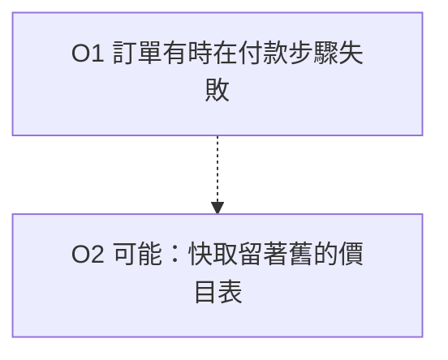

# 理解階梯

> **語言**: [English](../../../../skills/comprehension-ladder/SKILL.md) | 繁體中文 | [简体中文](../../../zh-CN/skills/comprehension-ladder/SKILL.md)

**版本**: 1.0.0 | **最後更新**: 2026-10-05 | **適用**: Claude Code Skills

把一段難懂的 AI 輸出換成較好懂的形式。形式會變，事實不會變。

## 目的

現在慢的不是拿到答案，而是看懂答案並判斷它。本技能幫忙這一步。它拿一份原文，最多做出三種形式，每一種叫一「階」。

本技能的文字依 [ai-response-navigation](../../core/ai-response-navigation.md) 第 12 條（受控語言）寫成。它自己也遵守自己的防護。

## 階梯

階梯正好有三階。每一階都從同一份大綱產生（見[大綱](#大綱)）。任何一階都不得在大綱之外加東西。

| 階 | 形式 | 適合 | 產出 |
|----|------|------|------|
| 1 | 受控文字 | 任何原文。永遠是第一階 | 短句或編號列，放在對話或檔案裡 |
| 2 | Mermaid 圖 | 有流程、先後順序、多個角色，或 3 個以上選項的原文 | 一個 Mermaid 程式碼區塊，外加一份畫不出來的項目文字清單 |
| 3 | 單檔 HTML 解說頁 | 需要探索或核准的讀者 | 一個可離線開啟的 `.html` 檔 |

先問使用者要哪幾階。使用者沒說，就先做第 1 階，再提議另外兩階。

沒有影片階。影片需要語音服務，而且會把原文送給第三方。

## 三條防護

這三條防護**必須**遵守。破壞任何一條的那一階，就還沒做完。不得交出去。

| 編號 | 防護 | 等級 |
|------|------|------|
| G1 | `no-new-facts`：不加原文沒有的事實 | **必須（Required）** |
| G2 | `keep-hedges`：保留每一個不確定語氣。不得把不確定的說法改成確定 | **必須（Required）** |
| G3 | `trace-and-gaps`：每一項都附「對應原文哪一段」與「沒涵蓋什麼」 | **必須（Required）** |

G2 與 [ai-response-navigation](../../core/ai-response-navigation.md) 的 12.1 條是同一條規則。這裡把它用在本技能的三階。

### G1 `no-new-facts`（必須）

每一階的每一個說法都必須來自原文。不要加原因、數字、名字、日期或「已確認」。不要加你知道、但原文沒寫的背景。

**正例**——原文寫：「訂單有時會在付款步驟失敗。」

```text
O1  訂單有時會在付款步驟失敗。
```

**反例**——同一份原文：

```text
O1  訂單會在付款步驟失敗。這也會讓退款壞掉。
```

「退款」是新增的事實。「有時」也不見了，所以 G2 同時被破壞。

### G2 `keep-hedges`（必須）

不確定語氣告訴讀者，一個說法可以信到什麼程度。例如：可能、推斷、大概、尚未確認、might、could、probably。它是資訊，不是贅字。

- 原文寫「可能」，這一階就寫「可能」。
- 圖裡也要保留。不確定的項目用虛線畫，標籤裡留下那個詞。
- HTML 裡也要保留。不確定的項目要顯示看得見的「尚未確認」標記。
- 只有在原文自己說這個說法已經驗證時，才可以拿掉不確定語氣。這時要寫出檢查了什麼。

**正例**——原文寫：「原因可能是快取留著舊的價目表。」

```text
O2  原因可能是快取留著舊的價目表。   [hedge: 可能]
```

**反例**——同一份原文：

```text
O2  原因是快取留著舊的價目表。
```

反例比較短，也比較好讀。但它與原文不符。讀的人若憑這一行核准修復，就被誤導了。

### G3 `trace-and-gaps`（必須）

每一項都帶兩個註記：

- **對應原文**：這一項出自原文的哪個位置。用段落與句子編號，或檔名與行號，再加一段 12 個詞以內的引文（中文約 20 字以內）。
- **沒涵蓋**：這一項沒說到什麼，或它證明不了什麼。原文沒有更多內容時，寫「原文沒有更多內容」。

最後一項之後，加一份清單，叫做**這份大綱沒有收的部分**。它列出原文中所有沒變成項目的部分。

**正例**

```text
O3  我們尚未在測試環境重現這個問題。
    對應原文：第 1 段第 3 句——「尚未在測試環境重現」
    沒涵蓋：為什麼沒有重現。原文沒有給理由。
```

**反例**

```text
O3  這個問題已在測試環境重現。
    對應原文：那份報告。
```

「那份報告」沒有指向某個位置。這個說法也與原文相反。而且沒有「沒涵蓋」註記。

## 大綱

大綱是唯一共用的事實來源。先做大綱，再做任何一階。不要直接從原文寫某一階。

每個大綱項目有一個編號和一個種類。

| 種類 | 意思 |
|------|------|
| `claim` | 原文提出的說法 |
| `mechanism` | 一個步驟、一個原因，或兩件事之間的關聯 |
| `uncertainty` | 原文說不知道或尚未確認的事 |
| `example` | 原文拿來說明某個說法的案例 |

每個項目寫成這個樣子：

```text
O<編號> | 種類 | 文字 | hedge: <原文的不確定用詞，或 none>
  對應原文：<位置> — 「<引文，12 個詞以內>」
  沒涵蓋：<這一項沒說到的事>
```

依原文的順序編號。編號不得重複使用。三階都用同一組編號。

## 工作流程

### 步驟 1——讀原文

讀完整份原文。原文是檔案，就讀那個檔案。讀完之前，不要開始做大綱。

### 步驟 2——建立大綱

抽出項目。一項一個事實。每個不確定用詞都要原樣抄下。

### 步驟 3——為每一項標出處

為每一項寫「對應原文」與「沒涵蓋」。再寫「這份大綱沒有收的部分」清單。

### 步驟 4——把大綱給使用者看

項目超過 5 個，或使用者要求時，就把大綱給使用者看。讓使用者刪除或修正項目。使用者否決的大綱，不要拿去做任何一階。

### 步驟 5——做出各階

使用者要哪幾階，就做哪幾階。照下面各階的規則做。

#### 第 1 階：受控文字

照 [ai-response-navigation](../../core/ai-response-navigation.md) 的 12.2 條：

- 一句一件事。英文約 15 到 25 個詞，中文約 25 到 40 個字。
- 一物一名。不要為了文采換名稱。
- 寫清楚誰做什麼。
- 一步一動作。流程寫成編號列表。
- 少用分號。
- 數字要帶單位。

每一行開頭保留項目編號，讀的人才找得到它在大綱裡的位置。

#### 第 2 階：Mermaid 圖

1. 步驟與因果用 `flowchart TD`。角色與交接用 `flowchart LR`。
2. 每個 `mechanism` 項目畫一個節點。用項目編號當節點編號。
3. 節點標籤取自項目文字。標籤裡要留下不確定用詞。
4. 不確定的項目畫成虛線節點或虛線邊（`-.->`）。
5. 不要畫沒有大綱編號的節點。
6. 在圖的下面，用文字列出你沒有畫的每一項，並各附一個理由。



#### 第 3 階：單檔 HTML 解說頁

頁面必須是一個檔案。必須能離線開啟。不得從網路載入任何東西。

頁面**必須**符合：

- 所有 CSS 都放在一個 `<style>` 元素裡。
- 所有指令碼（若有）都放在一個內嵌的 `<script>` 元素裡。關掉指令碼，頁面仍要能用。
- `src`、`href`、`action`、`@import`、`url()` 裡不得有 `http://`、`https://` 或 `//` 開頭的網址。只允許頁內的 `#` 錨點連結。
- 不得有 `<link>` 元素。不得有網路字型、CDN 或外部圖片。
- 不得呼叫 `fetch`、`XMLHttpRequest`、`WebSocket` 或 `import()`。
- 不要載入 Mermaid 函式庫。把圖畫成內嵌 SVG，或畫成有樣式的清單。
- 原文中 HTML 會當成標記的字元，都要跳脫。

頁面依序包含：

1. 標題，加一句話說明原文是什麼。
2. 圖（若使用者要了第 2 階）。
3. 每個大綱項目一張卡片。卡片顯示編號、文字、有不確定語氣時的「尚未確認」標記、對應原文，以及沒涵蓋註記。
4. 「這份大綱沒有收的部分」清單。

最小骨架：

```html
<!doctype html>
<html lang="zh-Hant">
<head>
<meta charset="utf-8">
<meta name="viewport" content="width=device-width, initial-scale=1">
<title>解說頁：原文的簡短名稱</title>
<style>
  body { font: 16px/1.6 system-ui, sans-serif; max-width: 46rem; margin: 2rem auto; padding: 0 1rem; }
  .card { border: 1px solid #8884; border-radius: 8px; padding: .75rem 1rem; margin: .75rem 0; }
  .badge { background: #fd0; color: #000; border-radius: 4px; padding: 0 .4rem; font-size: .85em; }
</style>
</head>
<body>
<h1>解說頁</h1>
<p>一句話：原文是什麼。</p>
<section class="card" id="O2">
  <strong>O2</strong> 原因可能是快取留著舊的價目表。
  <span class="badge">尚未確認：可能</span>
  <p><em>對應原文：</em>第 1 段第 2 句</p>
  <p><em>沒涵蓋：</em>是哪一個快取。原文沒有說。</p>
</section>
</body>
</html>
```

### 步驟 6——交出之前先檢查

五項檢查都要跑。有一項沒過，就修好那一階，再跑一次。

1. **數量**：每一階的項目數，等於大綱的項目數，減去你列為「沒有畫」的項目。原文有 5 個步驟，每一階就是 5 個步驟。不是 4，也不是 6。
2. **沒有新項目**：每一階的每個項目都有大綱編號。找找看有沒有項目沒有編號。
3. **不確定語氣比對**：`hedge:` 不是 `none` 的每一項，每一階都要有同一個不確定用詞。比對的是該階與原文。任何語言都做得到。
4. **出處**：每一項都有指向某個位置的「對應原文」，也有「沒涵蓋」註記。
5. **離線**（只用於第 3 階）：在檔案裡搜尋 `http`、`//`、`<link`、`fetch(` 與 `XMLHttpRequest`。每一項搜尋，除了你從原文引用的文字，都必須是零命中。

### 步驟 7——回報

結尾放這張表。沒有這張表，不要交出任何一階。

| 項目 | 第 1 階 | 第 2 階 | 第 3 階 | 保留不確定語氣 | 對應原文 | 沒涵蓋 |
|------|---------|---------|---------|----------------|----------|--------|
| O1 | 有 | 有 | 有 | 不適用 | 第 1 段第 1 句 | 「有時」的頻率 |

有任何一項防護檢查沒過、又修不好，就說是哪一項、為什麼。不要回報成功。

## 什麼時候不要用

- 原文不到約 150 字。用 [ai-response-navigation](../../core/ai-response-navigation.md) 的 12.2 條改寫，並保留不確定語氣。不要做各階。
- 讀者是專家，需要密度高的原形。
- 任務是找出新的事實。本技能不做這件事。

## 衡量它有沒有幫助

本技能還沒有被證明有幫助。[eval-cases.md](eval-cases.md) 有 5 段原文，各附理解題與標準答案，並附一套跑法，會產出兩個數字：前後的答對率，以及防護違反次數。實跑需要模型呼叫，目前還沒做。實跑完成之前，不要宣稱本技能有效。

## 相關

- [ai-response-navigation](../../core/ai-response-navigation.md)：第 12 條，受控語言。12.1 條是防護 G2 的基礎。
- [documentation-guide](../documentation-guide/SKILL.md)：Mermaid 圖在專案文件中該放哪裡。
- [brainstorm-assistant](../brainstorm-assistant/SKILL.md)：相反方向，還沒有原文時用。

## 版本歷史

| 版本 | 日期 | 變更 |
|------|------|------|
| 1.0.0 | 2026-10-05 | 首次發佈。從同一份大綱做出三階。三條必須遵守的防護。評估案例。落實 dev-platform XSPEC-450 / DEC-125 D4。 |
