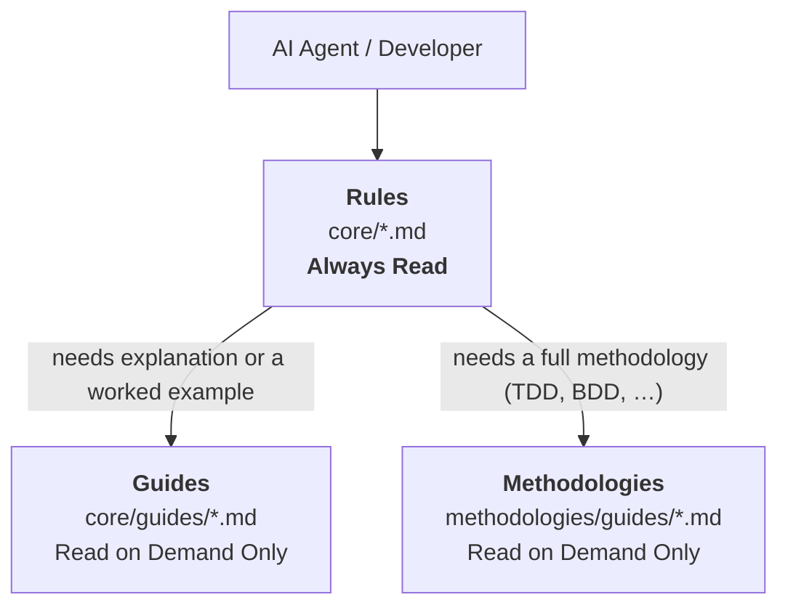

# Universal Development Standards

[](https://www.npmjs.com/package/universal-dev-standards)
[](LICENSE)
[](https://nodejs.org/)

> **Language**: English | [繁體中文](locales/zh-TW/README.md) | [简体中文](locales/zh-CN/README.md)

**Version**: 6.1.1 | **Released**: 2026-07-18 | **License**: [Dual License](LICENSE) (CC BY 4.0 + MIT)

Language-agnostic, framework-agnostic development standards for software projects. Ensure consistency, quality, and maintainability across diverse technology stacks with AI-native workflows.

---

## 🚀 Quick Start

### Install via npm (Recommended)

```bash
# Install globally (stable)
npm install -g universal-dev-standards

# Initialize your project
uds init
```

> Looking for beta or RC versions? See [Pre-release Versions](docs/PRE-RELEASE.md).

### Or use npx (No installation required)

```bash
npx universal-dev-standards init
```

> **Note**: Copying standards alone won't enable AI assistance. Use `uds init` to automatically configure your AI tool or manually reference standards in your tool's configuration file.

### 🗺️ What's Next?

| I want to... | Command |
| :--- | :--- |
| **Understand an existing codebase** | `/discover` |
| **Build a new feature with specs** | `/sdd` |
| **Work with legacy code** | `/reverse` |
| **Choose a development methodology** | `/methodology` |
| **Make a clean commit** | `/commit` |

> **Tip**: Type `/dev-workflow` for a complete guide to all development phases and available commands.
>
> See also: [Daily Workflow Guide](adoption/DAILY-WORKFLOW-GUIDE.md)

### 📚 Documentation

| I want to... | Document |
|---|---|
| **New to UDS?** Set up in 5 minutes | [docs/user/GETTING-STARTED.md](docs/user/GETTING-STARTED.md) |
| Browse all 55 skills by Tier & Category | [docs/user/SKILLS-INDEX.md](docs/user/SKILLS-INDEX.md) |
| See all slash commands | [docs/user/COMMANDS-INDEX.md](docs/user/COMMANDS-INDEX.md) |
| Quick reference card | [docs/user/CHEATSHEET.md](docs/user/CHEATSHEET.md) |
| Common questions | [docs/user/FAQ.md](docs/user/FAQ.md) |
| Troubleshoot problems | [docs/user/TROUBLESHOOTING.md](docs/user/TROUBLESHOOTING.md) |
| Understand UDS terminology | [docs/user/GLOSSARY.md](docs/user/GLOSSARY.md) |

---

## ✨ Features

<!-- UDS_STATS_TABLE_START -->
| Category | Count | Description |
|----------|-------|-------------|
| **Core Standards** | 149 | Universal development guidelines |
| **AI Skills** | 55 | Interactive skills |
| **Slash Commands** | 51 | Quick actions |
| **CLI Commands** | 21 | Project setup & maintenance |
<!-- UDS_STATS_TABLE_END -->

> **What's New in 5.0?** See [Pre-release Notes](docs/PRE-RELEASE.md) for details on new features.

---

## 🏗️ Architecture

UDS content is organised along **two independent axes**. They answer different questions, and
conflating them is the most common way to misread the layout — so they are stated separately.

### Axis 1 — Depth: how much must always be loaded

This axis is a **behavioural contract**: it tells an AI agent what to read up front and what to
leave until asked. It is the axis that matters for context cost.



| Layer | Location | Contains | AI behaviour |
| :--- | :--- | :--- | :--- |
| **Rules** | `core/*.md` | Actionable rules, checklists, thresholds | **Always Read** |
| **Guides** | `core/guides/*.md` | Explanations, tutorials, examples | Read on Demand Only |
| **Methodologies** | `methodologies/guides/*.md` | Full methodology guides | Read on Demand Only |

### Axis 2 — Format: how the same standard is encoded

This axis carries **no depth claim**. A standard's `.ai.yaml` and `.md` forms are two encodings
of the same material, chosen by who is reading.

| Aspect | `ai/standards/*.ai.yaml` | `core/*.md` |
| :--- | :--- | :--- |
| **Encoding** | Structured YAML | Prose Markdown |
| **Best for** | Deterministic machine lookup | Human reading and review |
| **Relative size** | ~69% of the Markdown form — a reformat, not a compaction tier<sup>†</sup> | baseline |

<sup>†</sup> Measured 2026-07-23 across the 135 standards that have both forms: 872,380 bytes of
YAML against 1,271,471 bytes of Markdown. Reproduce with the commands in
[Content Architecture §7](docs/reference/CONTENT-ARCHITECTURE.md#7-how-to-re-measure).

> 📐 The depth contract, where it is enforced across integrations, and the measured gap between
> the contract and the current tree are documented in
> **[docs/reference/CONTENT-ARCHITECTURE.md](docs/reference/CONTENT-ARCHITECTURE.md)**.

---

## 🤖 AI Tool Support

UDS ships integrations for **11 live tools. 0 of them are behaviourally verified.**

Those are two different numbers on purpose. **Status** says how complete the integration
*we wrote* is. **Verified** says whether anyone has confirmed the tool actually reads it and
behaves accordingly — by running probes and recording the output. Until today the second
question had never been asked, so no answer to it can be assumed. See
[XSPEC-357](https://github.com/AsiaOstrich/dev-platform) for the probe design and the
verification queue (Antigravity → Codex → Claude Code → the rest).

| AI Tool | Status | Verified | Skills | Slash Commands | Configuration |
| :--- | :--- | :---: | :---: | :---: | :--- |
| **Claude Code** | ✅ Complete | 🔬 —<sup>◆</sup> | **55** | **51** | `CLAUDE.md` |
| **OpenCode** | ✅ Complete | 🔬 — | **55** | **51** | `AGENTS.md` |
| **Cursor** | ✅ Complete | 🔬 — | **Core** | **Simulated** | `.cursorrules` |
| **Roo Code** | ✅ Complete | 🔬 — | **Core** | **Workflow** | `.roo/rules/` |
| **Cline** | 🔶 Partial | 🔬 — | **Core** | **Workflow** | `.clinerules` |
| **Windsurf** | 🔶 Partial | 🔬 — | **Core** | **Rulebook** | `.windsurfrules` |
| **GitHub Copilot** | 🔶 Partial | 🔬 — | **Core** | **Prompts** | `.github/copilot-instructions.md` |
| **OpenAI Codex** | 🔶 Partial | 🔬 — | **Core** | — | `AGENTS.md` |
| **Aider** | 🔶 Partial | 🔬 — | — | — | `AGENTS.md` |
| **Continue.dev** | 🔶 Partial | 🔬 — | — | — | `.continue/config.json` |
| **Google Antigravity** | ⚠️ Minimal | 🔬 — | —<sup>‡</sup> | — | `.antigravity/rules.md` |
| **Gemini CLI** | ⛔ Discontinued<sup>†</sup> | — | — | — | `GEMINI.md` (frozen) |

> **Status Legend** (how complete the integration we wrote is):
> ✅ Complete | 🔶 Partial | ⚠️ Minimal | ⏳ Planned | ⛔ Discontinued
>
> **Verified Legend** (whether a probe run confirmed the tool behaves accordingly):
> ✅ *date* verified | 🔬 — not yet verified | ⌛ expired | ❌ failed

<sup>◆</sup> Claude Code is in daily production use by the maintainer, which is why the
integration is the most complete — but **daily use is not a recorded verification**, and a
tool cannot be the judge of itself. It sits in the queue like everything else.

<sup>†</sup> Google sunset Gemini CLI on **2026-06-18** (announced at I/O 2026-05-19, 30-day
migration window), succeeded by Antigravity CLI. The `integrations/gemini-cli/` and `.gemini/`
trees are **frozen** — kept for reference, excluded from sync checks, and no longer maintained.
See [`.gemini/DEPRECATED.md`](.gemini/DEPRECATED.md).

<sup>‡</sup> Antigravity supports skills, but the correct install path is **not yet verified**
against a real Antigravity CLI. Two candidates conflict: `~/.gemini/antigravity-cli/plugins/<name>/skills/`
(official plugin docs) and `.agent/skills/` (UDS's own 2026-02 spec, written in the Gemini CLI era).
`uds init` therefore does **not** install skills for this target until one is confirmed — an
unverified path fails silently, which is worse than not installing.

---

## 📦 Installation Methods

### CLI Tool (Primary)

**npm (Recommended)**
```bash
npm install -g universal-dev-standards
uds init        # Interactive initialization
uds check       # Check adoption status
uds update      # Update to latest version
uds config      # Manage preferences (language, mode)
uds uninstall   # Remove standards from project
```

---

## ⚙️ Configuration

Use `uds config` to manage your preferences:

| Parameter | Command | Description |
| :--- | :--- | :--- |
| **Commit Language** | `uds config --lang zh-TW` | Set preferred language for AI commits |
| **Standards** | `uds init` | Install all available standards |
| **Tool Mode** | `uds config --mode skills` | Choose between Skills, Standards, or Both |

---

## 👥 Contributing

1. **Suggest Improvements**: Open an issue with problem and solution.
2. **Add Examples**: Submit real-world usage examples.
3. **Extend Standards**: Contribute language/framework extensions.

See [CONTRIBUTING.md](CONTRIBUTING.md) for detailed guidelines.

---

## 📄 License

| Component | License |
| :--- | :--- |
| **Documentation** | [CC BY 4.0](https://creativecommons.org/licenses/by/4.0/) |
| **CLI Tool** | [MIT](cli/LICENSE) |

## Acknowledgments

UDS draws architectural inspiration from these outstanding open-source projects:

| Project | Inspiration | License |
|---------|------------|---------|
| [Superpowers](https://github.com/obra/superpowers) | Systematic debugging, agent dispatch, verification evidence | MIT |
| [GSD](https://github.com/gsd-build/get-shit-done) | Structured task definition, traceability matrix, verification loop cap | MIT |
| [PAUL](https://github.com/ChristopherKahler/paul) | Plan-Apply-Unify loop, acceptance-driven development | MIT |
| [CARL](https://github.com/ChristopherKahler/carl) | Context-aware loading, dynamic rule injection | MIT |
| [CrewAI](https://github.com/crewAIInc/crewAI) | Multi-agent communication protocol, context budget tracking | MIT |
| [LangGraph](https://github.com/langchain-ai/langgraph) | Workflow state protocol, HITL interrupt checkpoints | MIT |
| [OpenHands](https://github.com/All-Hands-AI/OpenHands) | Event sourcing, action-observation stream patterns | MIT |
| [DSPy](https://github.com/stanfordnlp/dspy) | Agent signatures, structured I/O contracts | MIT |

> **Note**: UDS adopts concepts and methodologies only — no source code from these projects is included.

---

**Maintained with ❤️ by the open-source community**
