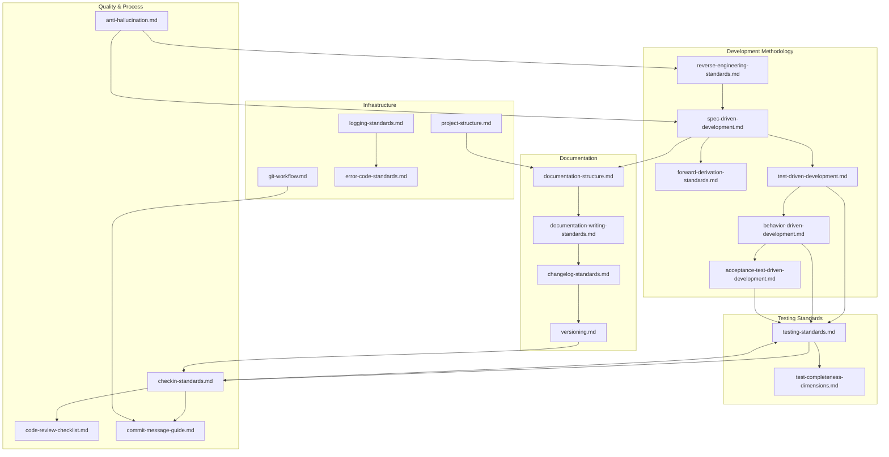

# Standards to Skills Mapping Matrix

This document provides a comprehensive mapping between core standards and their implementations across different AI tools.

## Standards Relationship Diagram

**How to Read This Diagram**:
- Arrows show dependency/reference relationships
- Start with your task type to find relevant standards
- Follow arrows to discover related standards

## Coverage Summary

| Category | Core Standards | AI Standards | Claude Code Skills | Other AI Tools |
|----------|---------------|--------------|-------------------|----------------|
| Development | 14 | 16 | 10 | 4 |
| Testing | 2 | 7 | 2 | 4 |
| Documentation | 2 | 4 | 1 | 4 |
| Process | 4 | 4 | 4 | 4 |

**Total**: 16 core standards → 16 AI standards → 15 Claude Code skills → 4 AI tool integrations

## Core Standards Matrix

| Core Standard | AI Standard | Claude Code Skill | Cursor | Windsurf | Cline | Copilot |
|---------------|-------------|-------------------|--------|----------|-------|---------|
| anti-hallucination.md | ✅ | ai-collaboration-standards | ✅ | ✅ | ✅ | ✅ |
| commit-message-guide.md | ✅ commit-message.ai.yaml | commit-standards | ✅ | ✅ | ✅ | ✅ |
| code-review-guide.md | ✅ code-review.ai.yaml | code-review-assistant | ✅ | ✅ | ✅ | ✅ |
| git-workflow.md | ✅ git-workflow.ai.yaml | git-workflow-guide | ✅ | ✅ | ✅ | ✅ |
| testing-standards.md | ✅ testing.ai.yaml | testing-guide | ✅ | ✅ | ✅ | ✅ |
| versioning.md | ✅ | release-standards | ✅ | ✅ | ✅ | ✅ |
| changelog-standards.md | ✅ changelog.ai.yaml | release-standards | ✅ | ✅ | ✅ | ✅ |
| documentation-structure.md | ✅ documentation-structure.ai.yaml | documentation-guide | ✅ | ✅ | ✅ | ✅ |
| requirements-template.md | ✅ | requirement-assistant | ✅ | ✅ | ✅ | ✅ |
| project-structure.md | ✅ project-structure.ai.yaml | project-structure-guide | ✅ | ✅ | ✅ | ✅ |
| test-completeness-dimensions.md | ✅ | testing-guide | ✅ | ✅ | ✅ | ✅ |
| api-documentation-standards.md | ✅ | documentation-guide | ✅ | ✅ | ✅ | ✅ |
| logging-standards.md | ✅ logging.ai.yaml | logging-guide | ✅ | ✅ | ✅ | ✅ |
| error-code-standards.md | ✅ error-codes.ai.yaml | error-code-guide | ✅ | ✅ | ✅ | ✅ |
| test-driven-development.md | ✅ | tdd-assistant | ✅ | ✅ | ✅ | ✅ |
| spec-driven-development.md | ✅ | spec-driven-dev | ✅ | ✅ | ✅ | ✅ |

Legend: ✅ = Implemented | - = Not applicable as standalone skill

## AI Options Coverage

### Testing Options

| Option | AI Standard | Languages/Frameworks |
|--------|-------------|---------------------|
| Unit Testing | ✅ unit-testing.ai.yaml | All |
| Integration Testing | ✅ integration-testing.ai.yaml | All |
| System Testing | ✅ system-testing.ai.yaml | All |
| E2E Testing | ✅ e2e-testing.ai.yaml | All |
| Security Testing | ✅ security-testing.ai.yaml | All |
| Performance Testing | ✅ performance-testing.ai.yaml | All |
| Contract Testing | ✅ contract-testing.ai.yaml | Microservices |
| ISTQB Framework | ✅ istqb-framework.ai.yaml | Enterprise |
| Industry Pyramid | ✅ industry-pyramid.ai.yaml | Agile |

### Project Structure Options

| Language | AI Standard | Frameworks |
|----------|-------------|------------|
| Node.js | ✅ nodejs.ai.yaml | Express, NestJS, Next.js |
| Python | ✅ python.ai.yaml | Django, Flask, FastAPI |
| Java | ✅ java.ai.yaml | Spring Boot, Maven |
| .NET | ✅ dotnet.ai.yaml | ASP.NET Core |
| Go | ✅ go.ai.yaml | Standard layout |
| Rust | ✅ rust.ai.yaml | Binary, Library, Workspace |
| Kotlin | ✅ kotlin.ai.yaml | Gradle, Android, KMP |
| PHP | ✅ php.ai.yaml | Laravel, Symfony |
| Ruby | ✅ ruby.ai.yaml | Rails, Sinatra, Gem |
| Swift | ✅ swift.ai.yaml | SPM, iOS, Vapor |

### Git Workflow Options

| Workflow | AI Standard | Best For |
|----------|-------------|----------|
| GitHub Flow | ✅ github-flow.ai.yaml | Small teams, CI/CD |
| Git Flow | ✅ git-flow.ai.yaml | Scheduled releases |
| Trunk-Based | ✅ trunk-based.ai.yaml | High deployment frequency |
| GitLab Flow | ✅ gitlab-flow.ai.yaml | Environment branches |

### Changelog Options

| Style | AI Standard | Best For |
|-------|-------------|----------|
| Keep a Changelog | ✅ keep-a-changelog.ai.yaml | Manual curation |
| Auto-generated | ✅ auto-generated.ai.yaml | CI/CD automation |

### Code Review Options

| Approach | AI Standard | Best For |
|----------|-------------|----------|
| PR Review | ✅ pr-review.ai.yaml | Async teams |
| Pair Programming | ✅ pair-programming.ai.yaml | Real-time collaboration |
| Automated Review | ✅ automated-review.ai.yaml | CI/CD integration |

### Documentation Options

| Style | AI Standard | Best For |
|-------|-------------|----------|
| Markdown Docs | ✅ markdown-docs.ai.yaml | Code repositories |
| API Docs | ✅ api-docs.ai.yaml | REST/GraphQL APIs |
| Wiki Style | ✅ wiki-style.ai.yaml | Knowledge bases |

## Claude Code Skills Detail

| Skill | Directory | Files | User Invocable |
|-------|-----------|-------|----------------|
| AI Collaboration Standards | ai-collaboration-standards/ | SKILL.md, anti-hallucination.md, certainty-labels.md | ✅ |
| Changelog Guide | changelog-guide/ | SKILL.md | ✅ |
| Code Review Assistant | code-review-assistant/ | SKILL.md, checkin-checklist.md, review-checklist.md | ✅ |
| Commit Standards | commit-standards/ | SKILL.md, conventional-commits.md, language-options.md | ✅ |
| Documentation Guide | documentation-guide/ | SKILL.md, documentation-structure.md, readme-template.md | ✅ |
| Error Code Guide | error-code-guide/ | SKILL.md | ✅ |
| Git Workflow Guide | git-workflow-guide/ | SKILL.md, branch-naming.md, git-workflow.md | ✅ |
| Logging Guide | logging-guide/ | SKILL.md | ✅ |
| Project Structure Guide | project-structure-guide/ | SKILL.md, language-patterns.md | ✅ |
| Release Standards | release-standards/ | SKILL.md, changelog-format.md, semantic-versioning.md, release-workflow.md | ✅ |
| Requirement Assistant | requirement-assistant/ | SKILL.md, requirement-checklist.md, requirement-writing.md | ✅ |
| Spec-Driven Dev | spec-driven-dev/ | SKILL.md | ✅ |
| TDD Assistant | tdd-assistant/ | SKILL.md, tdd-workflow.md, language-examples.md | ✅ |
| Test Coverage Assistant | test-coverage-assistant/ | SKILL.md | ✅ |
| Testing Guide | testing-guide/ | SKILL.md, testing-pyramid.md | ✅ |

## Localization Coverage

| Language | Core | AI Standards | AI Options | Skills |
|----------|------|--------------|------------|--------|
| English | 16/16 | 16/16 | 35/35 | 15/15 |
| 繁體中文 (zh-TW) | 16/16 | 16/16 | 35/35 | 15/15 |
| 简体中文 (zh-CN) | 5/16 | 0/16 | 0/35 | 0/15 |

## AI Tool Integrations

| Tool | File | Format | Status |
|------|------|--------|--------|
| Claude Code | skills/claude-code/**/*.md | SKILL.md | ✅ Complete |
| Cursor | skills/cursor/.cursorrules | Rules file | ✅ Complete |
| Windsurf | skills/windsurf/.windsurfrules | Rules file | ✅ Complete |
| Cline | skills/cline/.clinerules | Rules file | ✅ Complete |
| GitHub Copilot | skills/copilot/copilot-instructions.md | Markdown | ✅ Complete |

## Statistics

### By Category

| Category | Count |
|----------|-------|
| Core Standards (Markdown) | 16 |
| AI Standards (YAML) | 16 |
| AI Options (YAML) | 35 |
| Claude Code Skills | 15 |
| AI Tool Integrations | 4 |
| Supported Languages | 10 |
| Localizations | 3 |

### File Types

| Extension | Count | Purpose |
|-----------|-------|---------|
| .md | ~60 | Human-readable docs |
| .ai.yaml | ~50 | AI-optimized standards |
| .cursorrules | 1 | Cursor rules |
| .windsurfrules | 1 | Windsurf rules |
| .clinerules | 1 | Cline rules |

## Version History

| Version | Date | Changes |
|---------|------|---------|
| 1.1.0 | 2026-01-07 | Add TDD standard and tdd-assistant skill, update to 15 skills |
| 1.0.0 | 2025-12-30 | Initial mapping matrix |
