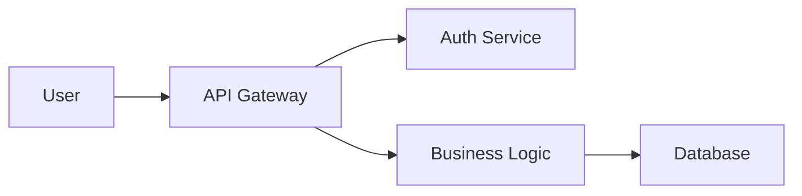
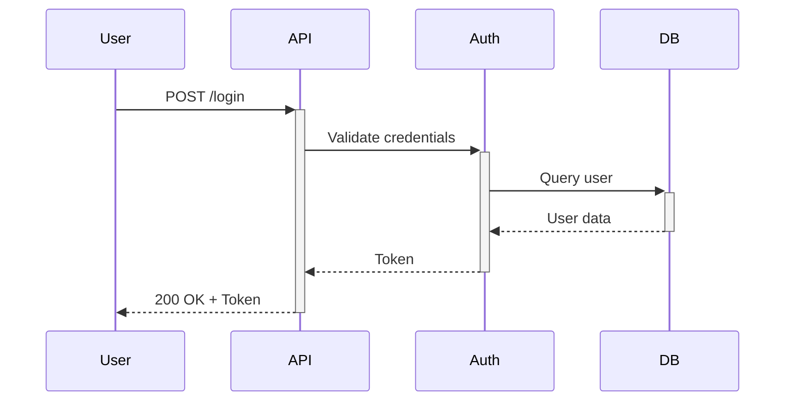

# Documentation Structure Standard

> **Language**: English | [繁體中文](../locales/zh-TW/core/documentation-structure.md)

**Version**: 1.5.0
**Last Updated**: 2026-03-17
**Applicability**: All software projects requiring documentation
**Scope**: partial
**Industry Standards**: None (Industry convention)
**References**: [diataxis.fr](https://diataxis.fr/)

---

## Purpose

This standard defines a consistent documentation structure for software projects, ensuring information is organized, discoverable, and maintainable.

---

## Documentation Classification (Diátaxis)

All documentation should be classified into one of four types based on the [Diátaxis framework](https://diataxis.fr/). This explicit classification helps readers find the right document and helps writers focus on the correct content.

### The Four Document Types

| Type | Purpose | User Need | Orientation | Example |
|------|---------|-----------|-------------|---------|
| **Tutorial** | Learning-oriented | "I want to learn" | Practical steps | Getting started guide, first project walkthrough |
| **How-to** | Task-oriented | "I want to accomplish X" | Practical steps | Deployment guide, migration checklist |
| **Reference** | Information-oriented | "I need to look up Y" | Theoretical knowledge | API reference, configuration parameters |
| **Explanation** | Understanding-oriented | "I want to understand why" | Theoretical knowledge | Architecture overview, ADR, design rationale |

### Document Type Header

Add a `Document Type` field to document headers for explicit classification:

```markdown
**Document Type**: Tutorial | How-to | Reference | Explanation
```

### Mapping to Standard Documents

| Standard Document | Diátaxis Type | Rationale |
|-------------------|---------------|-----------|
| README.md | Tutorial / How-to | Quick start orientation |
| getting-started.md | Tutorial | Step-by-step learning |
| ARCHITECTURE.md | Explanation | Understanding system design |
| API Reference | Reference | Looking up endpoints |
| DEPLOYMENT.md | How-to | Task: deploy the system |
| MIGRATION.md | How-to | Task: migrate the system |
| ADR/ | Explanation | Understanding decisions |
| troubleshooting.md | How-to | Task: fix a problem |
| CHANGELOG.md | Reference | Looking up change history |
| Flow documentation | Reference / Explanation | Understanding data flows |

---

## LLM Discovery Files

Projects that publish documentation for external consumption should consider providing LLM-optimized discovery files, similar to `robots.txt` for search engines.

### llms.txt Standard

The `llms.txt` file (placed at the project or site root) provides a structured index for LLM-based retrieval systems.

**Format**:

```markdown
# Project Name

> Brief one-line description of the project.

## Documentation

- [Getting Started](docs/getting-started.md): Tutorial for new users
- [API Reference](docs/api-reference.md): Complete REST API documentation
- [Architecture](docs/architecture.md): System design and component overview

## Optional

- [CHANGELOG](CHANGELOG.md): Version history
- [Contributing](CONTRIBUTING.md): Contribution guidelines
```

### When to Create llms.txt

| Scenario | Create llms.txt? | Rationale |
|----------|:-----------------:|-----------|
| Public open source project | ✅ Yes | Helps AI tools discover and index docs |
| Public API with external consumers | ✅ Yes | Enables AI-assisted API integration |
| Internal company project | ⚪ Optional | Useful if using internal AI tools |
| Private/personal project | ❌ No | No external consumers |

### Placement

```
project-root/
├── llms.txt                     # LLM discovery file
├── llms-full.txt                # Optional: full concatenated docs
├── README.md
└── docs/
```

- `llms.txt`: Structured index with links and descriptions
- `llms-full.txt` (optional): Full documentation concatenated into a single file for complete context ingestion

---

## Standard Documentation Structure

```
project-root/
├── README.md                    # Project overview (REQUIRED)
├── CONTRIBUTING.md              # Contribution guidelines
├── CHANGELOG.md                 # Version history
├── LICENSE                      # License file
├── .claude/ or .standards/      # Development standards
│   ├── anti-hallucination.md
│   ├── checkin-standards.md
│   ├── commit-guide.md
│   └── ...
├── docs/                        # Detailed documentation
│   ├── index.md                 # Documentation index
│   ├── getting-started.md       # Quick start guide
│   ├── architecture.md          # System architecture
│   ├── api-reference.md         # API documentation
│   ├── deployment.md            # Deployment guide
│   ├── troubleshooting.md       # Common issues
│   ├── specs/                   # Specification documents
│   │   ├── README.md            # Specification index
│   │   ├── system/              # System design specifications
│   │   │   └── *.md             # High-level architecture designs
│   │   └── {component}/         # Component-specific specifications
│   │       ├── design/          # Design specifications
│   │       └── {module}/        # Implementation specifications
│   ├── flows/                   # Flow documentation
│   │   ├── README.md            # Flow index (REQUIRED when >5 flows)
│   │   ├── templates/
│   │   │   └── flow-template.md
│   │   └── {module}/
│   │       └── {module}-flow.md
│   ├── ADR/                     # Architecture Decision Records
│   │   ├── README.md
│   │   └── NNN-title.md
│   └── diagrams/                # Architecture diagrams
│       ├── system-overview.mmd
│       ├── data-flow.mmd
│       └── README.md
└── examples/                    # Code examples
    ├── basic-usage/
    ├── advanced-usage/
    └── README.md
```

---

## File Naming Conventions

### Root Directory Files

Root-level documentation files should use **UPPERCASE** naming for GitHub/GitLab auto-recognition:

| File | Naming | Reason |
|------|--------|--------|
| `README.md` | UPPERCASE | GitHub/GitLab auto-displays on repo page |
| `CONTRIBUTING.md` | UPPERCASE | GitHub auto-links in PR creation |
| `CHANGELOG.md` | UPPERCASE | Keep a Changelog convention |
| `LICENSE` | UPPERCASE (no extension) | GitHub auto-detects license type |
| `CODE_OF_CONDUCT.md` | UPPERCASE | GitHub community standard |
| `SECURITY.md` | UPPERCASE | GitHub security advisory standard |

### docs/ Directory Files

All files within `docs/` should use **lowercase-kebab-case** for URL friendliness:

✅ **Correct**:
```
docs/
├── index.md
├── getting-started.md
├── api-reference.md
└── user-guide.md
```

❌ **Incorrect**:
```
docs/
├── INDEX.md           # Inconsistent casing
├── GettingStarted.md  # PascalCase not URL-friendly
├── API_Reference.md   # snake_case inconsistent
└── User Guide.md      # Spaces cause URL issues
```

**Rationale**:
- Lowercase avoids case-sensitivity issues across OS (Windows vs Linux)
- Kebab-case produces clean URLs: `docs/getting-started` vs `docs/GettingStarted`
- Consistent naming improves discoverability and automation

---

## Document Requirements Matrix

> **See Also**: For the complete document requirements matrix with detailed content requirements and project type descriptions, see [documentation-writing-standards.md](documentation-writing-standards.md#document-requirements-matrix).

This standard defines WHERE documents go (file structure). The writing standards define WHAT each document should contain.

**Quick Reference** (for full matrix, see writing standards):

| Document | Primary Location |
|----------|------------------|
| README.md | Project root |
| ARCHITECTURE.md | `docs/` |
| API.md | `docs/` |
| DATABASE.md | `docs/` |
| DEPLOYMENT.md | `docs/` |
| MIGRATION.md | `docs/` |
| ADR/ | `docs/adr/` |
| CHANGELOG.md | Project root |
| flows/ | `docs/flows/` |

---

## Cross-Reference Standards (NEW)

### Why Cross-References Matter

Isolated documents create navigation problems. Cross-references enable:
- Contextual discovery
- Reduced duplication
- Consistent information

### Required Cross-Reference Matrix

When adding new documents, update related documents' reference sections:

| When Adding... | Must Update |
|----------------|-------------|
| `flows/*.md` | ARCHITECTURE.md, index.md, related API.md / DATABASE.md |
| `ADR/*.md` | index.md, ARCHITECTURE.md, MIGRATION.md |
| Any new document | docs/index.md |

### Link Direction Principles

1. **Upward Links**: Flow docs should link to ARCHITECTURE.md (overall view)
2. **Horizontal Links**: Related flows should link to each other (e.g., sms-flow → credit-flow)
3. **Downward Links**: Architecture docs should link to flow index

### References Section Format

Every document should end with a References section:

```markdown
## References

- [ARCHITECTURE.md](../ARCHITECTURE.md) - System architecture
- [Related Flow](flows/xxx-flow.md) - Related flow documentation
- [API Reference](api-reference.md) - API specifications
```

---

## Flow Documentation (NEW)

### Purpose

Flow documentation describes dynamic system behavior—how data flows between components during specific operations.

### When to Create Flow Documentation

| Priority | Flow Type | Criteria | Examples |
|:--------:|-----------|----------|----------|
| **P0** | Financial | Involves billing, credits, refunds | Credit deduction, fee calculation |
| **P0** | Integration | External system API interaction | SSO login, gateway integration |
| **P1** | Core Business | Main functional flows | Message sending, report queries |
| **P2** | Batch Processing | Background services, scheduled jobs | Daemon services, cleanup jobs |
| **P3** | Management | Admin and maintenance functions | Account management, system config |

### Flow Documentation Structure

```
docs/flows/
├── README.md               # Flow index (REQUIRED when >5 flows)
├── templates/
│   └── flow-template.md    # Standard template
└── {module}/
    └── {module}-flow.md
```

### flows/README.md Requirements

When you have more than 5 flow documents, `flows/README.md` is **required** and must include:

| Section | Description | Required |
|---------|-------------|:--------:|
| System Architecture Overview | ASCII or Mermaid diagram | ✅ |
| Flow Document List | With status (✅ Complete / 🚧 In Progress / ⏳ Planned) | ✅ |
| Module Relationship Diagram | Mermaid flowchart showing module interactions | ✅ |
| Status Code Reference | Centralized definitions to avoid duplication | ⚪ |
| Directory Structure | File organization | ✅ |

### Flow Document Required Sections

| Section | Description | Required |
|---------|-------------|:--------:|
| Overview | Purpose, scope, pre/post conditions | ✅ |
| Triggers | What initiates this flow | ✅ |
| Components | Component list, relationships, code links | ✅ |
| Flow Diagram | Sequence diagram for main flow | ✅ |
| Step Details | Input/output/code location per step | ✅ |
| Error Handling | Error codes, retry mechanisms | ✅ |
| Data Changes | Affected tables + DFD diagram | ✅ |
| Performance | TPS, response time, bottlenecks | ⚪ |
| Monitoring | Log points, metrics | ⚪ |
| References | Links to API.md, DATABASE.md | ✅ |

### Centralized Status Code Management

**Problem**: Status codes scattered across flow documents become inconsistent.

**Solution**:

1. **Define centrally** in `flows/README.md` or `DATABASE.md`
2. **Reference in flow docs**: List only relevant codes, with note:
   > Complete definitions at [flows/README.md](../README.md)
3. **Version control**: Status code changes must be recorded in CHANGELOG.md

**Status Code Definition Format**:

```markdown
### Status Codes

| Code | Name | Description | Used By |
|------|------|-------------|---------|
| 0000 | Success | Operation successful | All modules |
| 9997 | AuthFailed | Authentication failed | API, WebService |
| 9998 | NotFound | Resource not found | All modules |
```

---

## Specification Documentation

### Purpose

Specification documents define the design and implementation details **before** coding. They differ from regular documentation:

| Type | Purpose | Audience | When Written | Location |
|------|---------|----------|--------------|----------|
| **Specification** | Define WHAT to build and HOW | Developers | Before implementation | `docs/specs/` |
| **Documentation** | Explain WHAT was built | Users, Developers | After implementation | `docs/` |

### Specification Directory Structure

```
docs/specs/
├── README.md               # Specification index (REQUIRED)
├── system/                 # System-level design specifications
│   └── {feature}.md        # High-level architecture designs
└── {component}/            # Component-specific specifications
    ├── design/             # Design specifications (pre-implementation)
    ├── shared/             # Cross-module shared specifications
    └── {module}/           # Implementation specifications
```

### Specification Types

| Level | Description | Example | Location |
|-------|-------------|---------|----------|
| **System Spec** | Cross-cutting architecture | agents-workflows-system.md | `specs/system/` |
| **Design Spec** | Component design decisions | ui-language-option.md | `specs/{component}/design/` |
| **Implementation Spec** | Module implementation details | init/00-init-overview.md | `specs/{component}/{module}/` |
| **Shared Spec** | Cross-module utilities | manifest-schema.md | `specs/{component}/shared/` |

### When to Create Specifications

| Scenario | Create Spec? | Type |
|----------|--------------|------|
| New feature with multiple components | Yes | System or Design |
| New CLI command | Yes | Implementation |
| Cross-cutting utility | Yes | Shared |
| Bug fix | No | - |
| Refactoring (same behavior) | No | - |

### Specification File Format

Every specification document should include:

```markdown
# Feature Name Specification

**Feature ID**: COMPONENT-FEATURE-NNN
**Version**: 1.0.0
**Last Updated**: YYYY-MM-DD
**Status**: Draft | In Review | Approved | Implemented

## Overview
[Brief description of what this specification covers]

## Acceptance Criteria
[AC-1, AC-2, ... with Given-When-Then format]

## Technical Design
[Implementation details]

## References
[Related specs and documentation]
```

### specs/README.md Requirements

The specification index (`specs/README.md`) must include:

| Section | Description | Required |
|---------|-------------|:--------:|
| Directory Structure | Specification tree diagram | ✅ |
| System Specifications | List with descriptions and status | ✅ |
| Component Specifications | Organized by component | ✅ |
| Specification Types | Type definitions and locations | ⚪ |
| Related Documentation | Links to docs/ | ✅ |

---

## Index Document Standards

### docs/index.md Required Sections

| Section | Description | Required |
|---------|-------------|:--------:|
| Directory Structure | Document tree (ASCII or table) | ✅ |
| By Role | Developer/Reviewer/Admin/QA perspectives | ⚪ |
| By Topic | Architecture/API/Database/Flows/Migration/ADR | ✅ |
| Flow Documentation | flows/ directory index | ✅ (when flows exist) |
| External Resources | Related tech doc links | ⚪ |
| Maintenance Guide | Update principles, contribution guidelines | ⚪ |
| Last Updated | Index maintenance date | ✅ |

### Index Template

```markdown
# Documentation Index

## Directory Structure
[Document tree diagram]

## By Topic

### Architecture
- [architecture.md](architecture.md) - System architecture
- [ADR/](ADR/) - Architecture Decision Records

### Flow Documentation
Located in `flows/`, full index at [flows/README.md](flows/README.md):

| Module | Document | Description |
|--------|----------|-------------|
| SMS | [sms-flow.md](flows/sms/sms-flow.md) | Message sending flow |
| Auth | [auth-flow.md](flows/auth/auth-flow.md) | Authentication flow |

---
*Last Updated: YYYY-MM-DD*
```

---

## CHANGELOG Documentation Integration (NEW)

### When to Record Document Changes

| Change Type | Record In | Example |
|-------------|-----------|---------|
| New document | Added | New flow documentation `docs/flows/xxx.md` |
| Major update | Changed | Updated `docs/API.md` with v2 API specs |
| Restructure | Changed | Reorganized `docs/` directory structure |
| Deprecated | Deprecated | `docs/old-api.md` marked as deprecated |
| Removed | Removed | Removed outdated `docs/legacy.md` |

### When NOT to Record

- Typo fixes
- Formatting adjustments (indentation, spacing)
- Link repairs
- Date stamp updates

### Recording Format

```markdown
## [Unreleased]

### Added
- New flow documentation (Mermaid sequence/flowchart/DFD)
  - `docs/flows/README.md` - Flow index with module relationship diagram
  - `docs/flows/sms/sms-flow.md` - SMS sending flow

### Changed
- Updated existing documents with flow references
  - `docs/ARCHITECTURE.md` - Added flow index link in references
  - `docs/index.md` - Added flow documentation section
```

---

## Core Documentation Files

### 1. README.md (REQUIRED)

**Purpose**: First impression, quick overview

**Template**:
```markdown
# Project Name

Brief one-liner description

## Features

- Feature 1
- Feature 2
- Feature 3

## Quick Start

```bash
# Installation
npm install your-package

# Usage
npm start
```

## Documentation

See [docs/](docs/) for full documentation.

## Contributing

See [CONTRIBUTING.md](CONTRIBUTING.md).

## License

[License Name](LICENSE)
```

**Must Include**:
- [ ] Project name and description
- [ ] Quick start / installation
- [ ] Link to full docs
- [ ] License information

---

### 2. CONTRIBUTING.md (Recommended)

**Purpose**: How to contribute to the project

**Template**:
```markdown
# Contributing Guidelines

## Development Setup

```bash
git clone https://github.com/org/repo
cd repo
npm install
```

## Workflow

1. Fork the repository
2. Create feature branch: `git checkout -b feature/my-feature`
3. Commit changes: `git commit -m "feat: add feature"`
4. Push branch: `git push origin feature/my-feature`
5. Create pull request

## Coding Standards

- Follow [.claude/csharp-style.md](.claude/csharp-style.md)
- Run `npm run lint` before committing
- Ensure tests pass: `npm test`

## Commit Message Format

See [.claude/commit-guide.md](.claude/commit-guide.md)

## Code Review Process

See [.claude/code-review-checklist.md](.claude/code-review-checklist.md)
```

**Must Include**:
- [ ] Development setup instructions
- [ ] Contribution workflow
- [ ] Coding standards reference
- [ ] Testing requirements

---

### 3. CHANGELOG.md (Recommended)

**Purpose**: Track changes between versions

**Format**: Follow [Keep a Changelog](https://keepachangelog.com/)

```markdown
# Changelog

## [Unreleased]

### Added
- New feature X

### Fixed
- Bug fix Y

## [1.2.0] - 2025-11-12

### Added
- OAuth2 authentication support

### Changed
- Updated API response format

### Deprecated
- Old API endpoint (will be removed in v2.0)

## [1.1.0] - 2025-10-01

### Added
- Email notification system

[Unreleased]: https://github.com/org/repo/compare/v1.2.0...HEAD
[1.2.0]: https://github.com/org/repo/compare/v1.1.0...v1.2.0
[1.1.0]: https://github.com/org/repo/releases/tag/v1.1.0
```

---

### 4. LICENSE (REQUIRED for open source)

**Common Licenses**:
- MIT: Permissive
- Apache 2.0: Permissive with patent grant
- GPL v3: Copyleft
- BSD: Permissive
- CC BY 4.0: Documentation/content

---

## Document Version Alignment

### Principle

**Document version MUST align with software version.**

The version number in a document represents "applicable to software version X.Y.Z", not an independent document revision number.

### Rationale

| Approach | Problems |
|----------|----------|
| Independent doc version | Requires tracking "which doc version maps to which software version"; confusing |
| **Aligned version** ✓ | Clear: doc v1.2.0 = applies to software v1.2.0 |

### Document Header Template

```markdown
# Document Title

**Applicable Version**: 1.2.0    ← Aligned with software version
**Document Type**: [Guide/Reference/Specification]
**Target Audience**: [Developers/Operators/Users]
**Last Updated**: 2025-12-11     ← Date of last edit

---
```

### Field Definitions

| Field | Required | Description |
|-------|----------|-------------|
| Applicable Version | ✅ Yes | The software version this document applies to |
| Document Type | Recommended | Category: Guide, Reference, Specification, Tutorial |
| Target Audience | Recommended | Intended readers |
| Last Updated | ✅ Yes | Date of last edit |

### When to Update Version

| Scenario | Action |
|----------|--------|
| Software releases new version with feature changes | Update doc version to match |
| Minor doc typo fix (no software change) | Keep version, update Last Updated date only |
| Doc updated for upcoming release | Use new version number |

### Examples

✅ **Correct**:
```markdown
# Upgrade Guide

**Applicable Version**: 1.2.0
**Last Updated**: 2025-12-11
```
This means: "Use this guide when upgrading to v1.2.0"

❌ **Incorrect**:
```markdown
# Upgrade Guide

**Version**: 1.1        ← Ambiguous: document revision or software version?
**Updated**: 2025-12-11
```

---

## Detailed Documentation (`docs/`)

### docs/index.md

**Purpose**: Navigation hub for all documentation

**Template**:
```markdown
# Documentation Index

## By Role

### For Users
- [Getting Started](getting-started.md)
- [User Guide](user-guide.md)
- [FAQ](faq.md)

### For Developers
- [Architecture](architecture.md)
- [API Reference](api-reference.md)
- [Development Guide](development-guide.md)

### For Operators
- [Deployment Guide](deployment.md)
- [Configuration](configuration.md)
- [Troubleshooting](troubleshooting.md)

## By Topic

### Authentication
- [Architecture](architecture.md#authentication)
- [API Endpoints](api-reference.md#authentication)

### Database
- [Schema](architecture.md#database-schema)
- [Migrations](development-guide.md#database-migrations)

### Flow Documentation
See [flows/README.md](flows/README.md) for complete index.

## Quick Links

- [GitHub Repository](https://github.com/org/repo)
- [Issue Tracker](https://github.com/org/repo/issues)
- [Changelog](../CHANGELOG.md)
```

---

### docs/getting-started.md

**Purpose**: Quick start for new users

**Structure**:
1. Prerequisites
2. Installation
3. Basic Configuration
4. First Example
5. Next Steps

---

### docs/architecture.md

**Purpose**: System design and technical architecture

**Structure**:
1. Overview
2. System Components
3. Data Flow
4. Design Decisions
5. Technology Stack
6. Security Architecture
7. Performance Considerations

**Include Diagrams**:
- System overview diagram
- Component diagram
- Data flow diagram
- Deployment diagram

**Must Include in References**:
- Link to `flows/README.md` for detailed flow documentation

---

### docs/api-reference.md

**Purpose**: Complete API documentation

**Structure**:
1. API Overview
2. Authentication
3. Endpoints (grouped by resource)
4. Request/Response Examples
5. Error Codes
6. Rate Limiting

**Endpoint Template**:
```markdown
## POST /api/users/authenticate

Authenticates a user and returns access token.

### Request

**Headers**:
```
Content-Type: application/json
```

**Body**:
```json
{
  "username": "string",
  "password": "string"
}
```

### Response

**Success (200 OK)**:
```json
{
  "accessToken": "string",
  "expiresIn": 3600
}
```

**Error (401 Unauthorized)**:
```json
{
  "error": "INVALID_CREDENTIALS",
  "message": "Invalid username or password"
}
```

### Examples

```bash
curl -X POST https://api.example.com/api/users/authenticate \
  -H "Content-Type: application/json" \
  -d '{"username":"user@example.com","password":"secret"}'
```
```

**Must Include in References**:
- Link to relevant flow documentation (e.g., `flows/auth/auth-flow.md`)

---

### docs/deployment.md

**Purpose**: How to deploy the application

**Structure**:
1. Prerequisites
2. Environment Setup
3. Configuration
4. Deployment Steps
5. Verification
6. Rollback Procedure
7. Monitoring

**Must Include in References**:
- Link to relevant daemon/service flow documentation

---

### docs/troubleshooting.md

**Purpose**: Common problems and solutions

**Structure**:
```markdown
# Troubleshooting Guide

## Installation Issues

### Problem: npm install fails with EACCES error

**Symptoms**:
```
Error: EACCES: permission denied
```

**Solution**:
```bash
sudo chown -R $(whoami) ~/.npm
npm install
```

---

## Runtime Issues

### Problem: Application crashes with "Cannot find module"

**Symptoms**:
- Error: Cannot find module 'express'
- Application exits immediately

**Solution**:
1. Check node_modules exists
2. Run `npm install`
3. Verify package.json dependencies

**Prevention**:
- Always run `npm install` after pulling changes
- Commit package-lock.json to version control
```

---

## Diagram Documentation

### Flows vs Diagrams Separation

Understanding the distinction between `flows/` and `diagrams/` directories:

- **`docs/diagrams/`**: Static architecture diagrams (DFD, ER, C4 Model, Deployment, Class diagrams)
- **`docs/flows/`**: Dynamic flow documentation (Sequence Diagrams, API call flows, Job scheduling flows)

| Type | Description | Directory | Examples |
|------|-------------|-----------|----------|
| **Flow** | Dynamic behavior: how data flows, step sequences | `docs/flows/` | Sequence diagrams, API call flows, job scheduling |
| **Diagram** | Static structure: system composition, relationships, data models | `docs/diagrams/` | DFD, ER diagrams, C4 architecture, deployment diagrams |

**Rationale**:
- Clear separation reduces confusion about where to place new documentation
- Static diagrams rarely change; dynamic flows may update with feature changes
- Different audiences: diagrams for architects, flows for developers and operators

### Recommended Tools

- **Mermaid**: Text-based diagrams (GitHub/GitLab native support)
- **PlantUML**: UML diagrams from text
- **Draw.io / Excalidraw**: Visual diagram editors
- **ASCII Art**: Simple text diagrams

### Mermaid Examples

**System Flow**:


**Sequence Diagram**:


### DFD (Data Flow Diagram) Standards

Flow documents should include DFD diagrams:

| DFD Level | Description | Required |
|-----------|-------------|:--------:|
| Context Diagram | System and external entity relationships | ✅ |
| Level 0 DFD | Main processes and data stores | ✅ |
| Level 1 DFD | Expanded sub-processes | ⚪ (based on complexity) |
| Physical DFD | Implementation mapping (technology stack, DB tables, API endpoints) | ⚪ (advanced) |

**Logical vs Physical DFD**:

| Type | Describes | Audience | Example Content |
|------|-----------|----------|-----------------|
| **Logical DFD** (Level 0/1) | WHAT the system does (business processes) | Business analysts, PMs, new developers | Process names, data flows, business rules |
| **Physical DFD** | HOW it's implemented (technology details) | Operations engineers, DBAs, system integrators | Database tables, API endpoints, file paths, config parameters |

**DFD Symbol Standards (Mermaid)**:

| Symbol | Represents | Mermaid Syntax |
|--------|------------|----------------|
| Rectangle | External Entity | `[Name]` |
| Double Circle | Process | `((ID<br/>Name))` |
| Cylinder | Data Store | `[(D# Name)]` |
| Solid Arrow | Data Flow | `-->｜label｜` |
| Dashed Arrow | Error/Exception | `-.->｜label｜` |

**DFD Color Standards**:

| Color | Usage | Mermaid Style |
|-------|-------|---------------|
| 🟦 Blue | External Entity | `fill:#e3f2fd,stroke:#1976d2` |
| 🟩 Green | Primary Data Table | `fill:#c8e6c9,stroke:#388e3c` |
| 🟨 Yellow | Cache/Tracking Data | `fill:#fff9c4,stroke:#f9a825` |
| 🟧 Orange | Updated Data | `fill:#ffccbc,stroke:#e64a19` |

---

## Code Examples (`examples/`)

### Structure

```
examples/
├── README.md                   # Overview of examples
├── basic-usage/
│   ├── simple-auth.js         # Simple authentication example
│   ├── README.md              # Explanation
│   └── package.json           # Dependencies
├── advanced-usage/
│   ├── custom-auth.js         # Advanced authentication
│   ├── README.md
│   └── package.json
└── integration-tests/
    └── ...
```

### Example README Template

```markdown
# Basic Usage Examples

## Simple Authentication

Demonstrates basic user authentication flow.

### Prerequisites

- Node.js 18+
- npm 9+

### Setup

```bash
cd examples/basic-usage
npm install
```

### Run

```bash
node simple-auth.js
```

### Expected Output

```
User authenticated successfully!
Token: eyJhbGc...
```

### Code Walkthrough

```javascript
// 1. Import library
const { AuthClient } = require('your-lib');

// 2. Create client
const client = new AuthClient({
  apiUrl: 'https://api.example.com'
});

// 3. Authenticate
const token = await client.authenticate('user', 'pass');
console.log('Token:', token);
```
```

---

## Documentation Maintenance

### Documentation Updates Checklist

When making code changes, update documentation:

- [ ] **README.md** if:
  - Installation process changed
  - Quick start example changed
  - New major feature added

- [ ] **API Reference** if:
  - API endpoints added/changed/removed
  - Request/response format changed
  - New error codes introduced

- [ ] **Architecture Docs** if:
  - System design changed
  - New components added
  - Technology stack changed

- [ ] **Flow Documentation** if:
  - Business logic changed
  - New integration added
  - Data flow modified

- [ ] **CHANGELOG.md** (always):
  - Add entry for every release
  - Document breaking changes
  - List new features and fixes
  - **Record documentation additions/changes**

- [ ] **Cross-References**:
  - Update related documents' reference sections
  - Update index.md if new documents added

---

## Documentation Quality Standards

### Readability

- [ ] Clear, concise language
- [ ] Short paragraphs (≤5 sentences)
- [ ] Active voice preferred
- [ ] Technical jargon explained

### Accuracy

- [ ] Code examples tested and working
- [ ] Screenshots/diagrams up-to-date
- [ ] Version numbers correct
- [ ] Links not broken

### Completeness

- [ ] Prerequisites listed
- [ ] All steps documented
- [ ] Expected outcomes described
- [ ] Troubleshooting included

### Cross-Referencing

- [ ] Related documents linked
- [ ] Index updated
- [ ] References section complete

---

## Localization

### Bilingual Documentation

For international projects:

```
docs/
├── en/                        # English documentation
│   ├── README.md
│   ├── getting-started.md
│   └── ...
├── zh-tw/                     # Traditional Chinese
│   ├── README.md
│   ├── getting-started.md
│   └── ...
└── README.md                  # Language selector
```

**Language Selector (root docs/README.md)**:
```markdown
# Documentation

Select your language:
- [English](en/README.md)
- [繁體中文](zh-tw/README.md)
- [日本語](ja/README.md)
```

---

## Documentation Automation

### API Documentation Generation

**Tools**:
- **Swagger/OpenAPI**: REST API documentation
- **GraphQL**: Auto-generated schema docs
- **JSDoc**: JavaScript API docs
- **Doxygen**: C/C++ documentation
- **Sphinx**: Python documentation
- **Docusaurus**: Full documentation sites

### Example: Swagger Integration

```yaml
# openapi.yaml
openapi: 3.0.0
info:
  title: User API
  version: 1.0.0

paths:
  /users/authenticate:
    post:
      summary: Authenticate user
      requestBody:
        required: true
        content:
          application/json:
            schema:
              type: object
              properties:
                username:
                  type: string
                password:
                  type: string
      responses:
        '200':
          description: Success
          content:
            application/json:
              schema:
                type: object
                properties:
                  accessToken:
                    type: string
```

---

## Documentation Hosting

### Options

| Platform | Best For | Cost |
|----------|----------|------|
| **GitHub Pages** | Open source projects | Free |
| **GitLab Pages** | GitLab projects | Free |
| **Read the Docs** | Python projects | Free |
| **Docusaurus** | Full documentation sites | Free (self-hosted) |
| **GitBook** | Beautiful docs UI | Free tier available |

### GitHub Pages Setup

```bash
# 1. Create docs branch
git checkout --orphan gh-pages

# 2. Add documentation
cp -r docs/* .

# 3. Push to GitHub
git add .
git commit -m "docs: initial documentation"
git push origin gh-pages

# 4. Enable in GitHub Settings → Pages
# Choose gh-pages branch
```

---

## Development Artifacts (Working Documents)

Development produces intermediate documents that are not formal documentation but need a discoverable home. These "working documents" live in `docs/working/` with a defined lifecycle.

### Directory Structure

```
docs/working/
├── README.md                 # Index and lifecycle rules
├── brainstorms/              # YYYY-MM-DD-topic.md
├── investigations/           # Technical investigations and research
├── rfcs/                     # RFC-NNN-title.md
├── meeting-notes/            # Meeting records
└── poc/                      # Proof of concept documents
    └── {poc-name}/
        └── README.md         # Findings, conclusions, next steps
```

### Status Header (Required)

Every working document MUST include a status header:

```markdown
---
status: draft | active | graduated | archived
created: YYYY-MM-DD
author: name
graduated-to: path/to/formal-doc.md  # if graduated
---
```

### Lifecycle Management

| Document Type | Directory | Retention | Graduation Path |
|---------------|-----------|-----------|-----------------|
| **Brainstorm** | `brainstorms/` | 6 months active | → Spec (`docs/specs/`) or discard |
| **Investigation** | `investigations/` | Until resolved | → ADR (`docs/ADR/`) or knowledge base |
| **RFC** | `rfcs/` | Until decided | → ADR (`docs/ADR/`) if accepted |
| **Meeting notes** | `meeting-notes/` | 12 months | → Archive or discard |
| **POC** | `poc/` | Until feature decision | → Feature implementation or discard |

### Graduation Process

1. Update the working document status to `graduated`
2. Add `graduated-to: path/to/formal-doc.md` in the header
3. Create the formal document in its proper location
4. Keep the working document as a historical reference (do not delete)

### Naming Conventions

| Type | Pattern | Example |
|------|---------|---------|
| Brainstorm | `YYYY-MM-DD-topic.md` | `2026-03-04-caching-strategy.md` |
| Investigation | `YYYY-MM-DD-topic.md` | `2026-03-04-oom-root-cause.md` |
| RFC | `RFC-NNN-title.md` | `RFC-001-api-versioning.md` |
| Meeting notes | `YYYY-MM-DD-topic.md` | `2026-03-04-sprint-planning.md` |
| POC | `{poc-name}/README.md` | `redis-caching/README.md` |

---

## Expanded Document Types Matrix

This matrix extends the Document Requirements Matrix above to include all document types and their canonical locations.

### Code-Related Documents

| File Type | Location | Notes |
|-----------|----------|-------|
| API reference | `docs/api-reference.md` | Auto-generated preferred |
| Architecture overview | `docs/architecture.md` | High-level system design |
| ADR | `docs/ADR/NNN-title.md` | Architecture Decision Records |
| Spec | `docs/specs/` | Specification documents |
| Troubleshooting | `docs/troubleshooting.md` | Common issues and solutions |
| Flow diagram | `docs/flows/` | Process and data flows |
| Architecture diagram | `docs/diagrams/` | Visual architecture (.mmd, .puml) |

### Working Documents

| File Type | Location | Notes |
|-----------|----------|-------|
| Brainstorm | `docs/working/brainstorms/` | Date-prefixed, lifecycle-managed |
| Investigation | `docs/working/investigations/` | Technical research reports |
| RFC | `docs/working/rfcs/` | Request for Comments, numbered |
| Meeting notes | `docs/working/meeting-notes/` | Date-prefixed records |
| POC report | `docs/working/poc/` | Subdirectory per POC |

### Project-Level Documents

| File Type | Location | Notes |
|-----------|----------|-------|
| README | Root `/` | UPPERCASE, required |
| CONTRIBUTING | Root `/` | UPPERCASE |
| CHANGELOG | Root `/` | UPPERCASE, Keep a Changelog format |
| LICENSE | Root `/` | UPPERCASE, no extension |
| SECURITY | Root `/` | UPPERCASE, security policy |
| Getting started | `docs/getting-started.md` | Quick start guide |
| Deployment guide | `docs/deployment.md` | Deployment instructions |

---

## Documentation Testing

Documentation should be tested systematically, not just reviewed manually. This section defines testable quality layers.

### Testing Layers

| Layer | What It Tests | Tools | CI Stage |
|-------|---------------|-------|----------|
| **Link Validation** | All internal/external links resolve | markdown-link-check, lychee | Pre-commit / PR |
| **Code Sample Testing** | Code examples compile and run | doctest, mdx-js, custom scripts | PR check |
| **Structure Validation** | Required sections present, heading hierarchy correct | Custom linter, remark-lint | Pre-commit |
| **Content Freshness** | Documents updated within retention period | Custom script (check Last Updated date) | Release |
| **Traceability** | Every feature has documentation, every doc maps to code | Traceability matrix | Release |

### Code Sample Validation

Code examples in documentation should be validated to prevent drift from actual implementation:

```markdown
<!-- doctest: lang=bash, skip=false -->
```bash
npm install your-package
npm test
```
```

**Validation Approaches**:

| Approach | Description | Best For |
|----------|-------------|----------|
| **Extract and run** | Extract code blocks, execute in sandbox | CLI examples, scripts |
| **Import from source** | Include actual source files in docs | API usage examples |
| **Snapshot comparison** | Compare output against expected | Command output examples |

### Documentation Traceability Matrix

Track the relationship between features, code, and documentation:

```markdown
| Feature | Code Location | Documentation | Test | Status |
|---------|---------------|---------------|------|--------|
| User auth | src/auth/ | docs/api.md#auth | tests/auth.test.js | ✅ Current |
| Export CSV | src/export/ | docs/api.md#export | tests/export.test.js | ⚠️ Stale |
| Webhooks | src/webhooks/ | ❌ Missing | tests/webhooks.test.js | ❌ Undocumented |
```

### CI/CD Integration

| Stage | Checks | Blocking |
|-------|--------|:--------:|
| **Pre-commit** | Link check, structure lint | ✅ Yes |
| **PR check** | Code sample validation, freshness | ✅ Yes |
| **Release** | Full traceability audit, all layers | ⚠️ Warning |

---

## Related Standards

- [Documentation Writing Standards](documentation-writing-standards.md)
- [Changelog Standards](changelog-standards.md)
- [Project Structure Standard](project-structure.md)
- [Spec-Driven Development](spec-driven-development.md)

---

## Version History

| Version | Date | Changes |
|---------|------|---------|
| 1.5.0 | 2026-03-17 | Added: Diátaxis documentation classification, LLM Discovery Files (llms.txt), Documentation Testing standards (5-layer testing, traceability matrix, CI/CD integration) |
| 1.4.0 | 2026-03-04 | Added: Development Artifacts (docs/working/) directory and lifecycle management, Expanded Document Types Matrix |
| 1.3.0 | 2026-01-24 | Added: Specification documentation standards with specs/ directory structure |
| 1.2.2 | 2025-12-24 | Added: Related Standards section |
| 1.2.1 | 2025-12-12 | Added: Physical DFD layer, Flows vs Diagrams separation clarification |
| 1.2.0 | 2025-12-11 | Added: Flow documentation standards, Cross-reference standards, Index document standards, CHANGELOG documentation integration, Document requirements matrix, DFD standards |
| 1.1.0 | 2025-12-11 | Added: File naming conventions, Document version alignment standard |
| 1.0.0 | 2025-11-12 | Initial documentation structure standard |

---

## References

- [Write the Docs](https://www.writethedocs.org/)
- [Google Developer Documentation Style Guide](https://developers.google.com/style)
- [Microsoft Writing Style Guide](https://docs.microsoft.com/en-us/style-guide/)

---

## License

This standard is released under [CC BY 4.0](https://creativecommons.org/licenses/by/4.0/).
