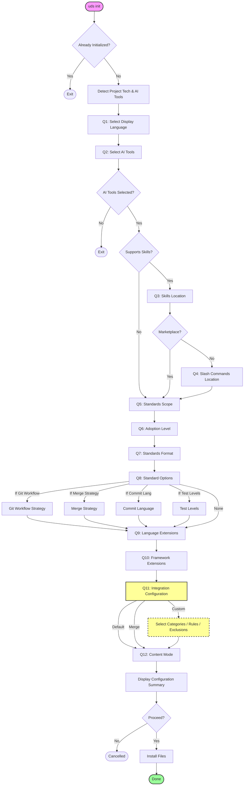
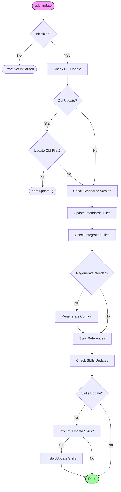
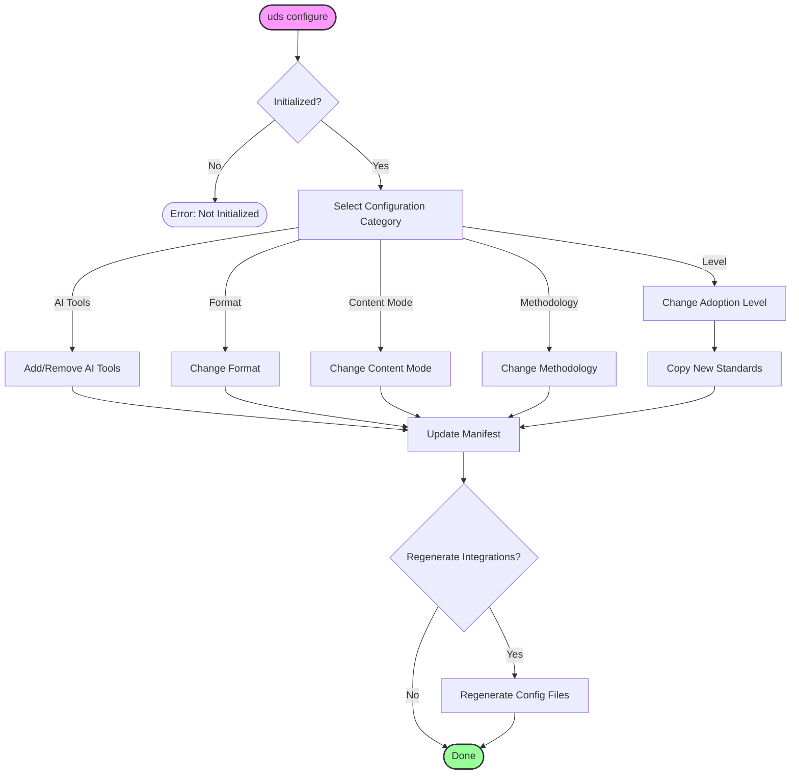

# CLI Command Flows

This document visualizes the interactive flows for the Universal Development Standards (UDS) CLI commands.

## 1. Init Command (`uds init`)

The initialization flow sets up standards in a new project.



## 2. Update Command (`uds update`)

The update flow keeps standards and integrations in sync.



## 3. Check Command (`uds check`)

The check flow verifies file integrity and adoption status.

```mermaid
flowchart TD
    Start([uds check]) --> CheckInit{Initialized?}
    CheckInit -- No --> Error([Error: Not Initialized])
    
    CheckInit -- Yes --> VerifyManifest[Verify Manifest]
    VerifyManifest --> CheckHash{Hash Check}
    
    CheckHash -->|Match| Pass([Pass])
    CheckHash -->|Mismatch| DetectChanges[Detect Modified/Missing]
    
    DetectChanges --> Interactive{Interactive Mode?}
    Interactive -- No --> Report[Report Issues]
    Report --> Fail([Exit with Issues])
    
    Interactive -- Yes --> LoopFiles[Loop Each File]
    LoopFiles --> PromptAction[Prompt: Action?]
    
    PromptAction -- View --> ShowDiff[Show Diff]
    ShowDiff --> PromptAction
    
    PromptAction -- Restore --> RestoreFile[Restore Original]
    PromptAction -- Keep --> UpdateHash[Update Hash (Accept Change)]
    PromptAction -- Skip --> SkipFile[Skip]
    
    RestoreFile --> NextFile{More Files?}
    UpdateHash --> NextFile
    SkipFile --> NextFile
    
    NextFile -- Yes --> LoopFiles
    NextFile -- No --> Finish([Done])

    style Start fill:#f9f,stroke:#333,stroke-width:2px
    style Finish fill:#9f9,stroke:#333,stroke-width:2px
    style Fail fill:#f99,stroke:#333,stroke-width:2px
```

## 4. Configure Command (`uds configure`)

The configure flow allows modifying existing settings.


