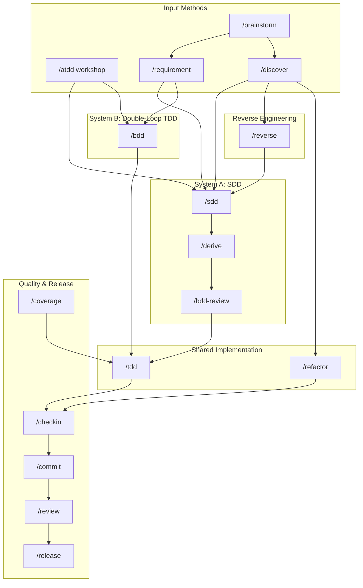

# UDS Workflow Comprehensive Analysis / 工作流綜合分析

**Version**: 1.0.0
**Last Updated**: 2026-02-12

---

## Overview / 總覽

Universal Development Standards provides ~27 independent processes across 4 methodologies (TDD/BDD/ATDD/SDD), quality gates, release management, and more. This document provides a comprehensive map of all workflows, their relationships, and decision guidance.

UDS 提供約 27 個獨立流程，涵蓋 4 大方法論（TDD/BDD/ATDD/SDD）、品質閘門、發布管理等。本文件提供所有工作流的全面概覽、關聯性及決策指引。

---

## Process Inventory / 流程總覽

### By Category / 依類別分類

| Category | Processes | Count |
|----------|-----------|-------|
| **Methodology** | `/sdd`, `/tdd`, `/bdd`, `/atdd`, `/methodology` | 5 |
| **Derivation** | `/derive all`, `/derive bdd`, `/derive tdd`, `/derive atdd` | 4 |
| **Reverse Engineering** | `/reverse spec`, `/reverse bdd`, `/reverse tdd` | 3 |
| **Quality Gates** | `/checkin`, `/review`, `/coverage` | 3 |
| **Release Management** | `/release start`, `/release finish`, `/release changelog`, `/release check` | 4 |
| **Discovery & Planning** | `/discover`, `/brainstorm`, `/requirement` | 3 |
| **Refactoring** | `/refactor decide`, `/refactor execute` | 2 |
| **Utilities** | `/commit`, `/changelog` | 2 |
| **Documentation** | `/docs-generator` | 1 |

**Total**: ~27 processes

---

## Two-System Architecture / 兩套系統架構

### System A: SDD (AI-Era Methodology)

Best for: New projects, AI-assisted development, greenfield features

```
/discover ──► /sdd ──► /derive ──► /bdd-review ──► /tdd ──► /checkin ──► /commit
   │            │         │
   │            │         ├── /derive all  (BDD + TDD)
   │            │         ├── /derive bdd  (BDD only)
   │            │         ├── /derive tdd  (TDD only)
   │            │         └── /derive atdd (ATDD tables)
   │            │
   │            └── Optional: /atdd workshop as input
   │
   └── /brainstorm (ideation before discovery)
```

### System B: Double-Loop TDD (Traditional)

Best for: Legacy systems, manual development, established codebases

```
/discover ──► /bdd ──► /tdd ──► /checkin ──► /commit ──► /review
                │        │
                │        └── RED → GREEN → REFACTOR cycle
                │
                └── /atdd workshop as optional input
```

### Legacy Modernization Path

```
/discover ──► /reverse spec ──► /sdd (review) ──► /refactor ──► /tdd ──► /commit
```

### Release Path

```
/release check ──► /release changelog ──► /release start ──► /release finish
```

---

## Command Decision Quick Reference / 指令決策速查表

| Scenario / 場景 | Minimum Viable Flow / 最小流程 | Full Flow / 完整流程 |
|----------|------|------|
| **New feature (AI-assisted)** | `/sdd` → `/derive` → implement → `/commit` | `/discover` → `/sdd` → `/derive` → `/tdd` → `/checkin` → `/commit` → `/review` |
| **Bug fix** | `/tdd` → `/commit` | `/tdd` → `/checkin` → `/commit` → `/review` |
| **Refactoring** | `/refactor decide` → implement → `/commit` | `/discover` → `/refactor decide` → `/tdd` → `/checkin` → `/commit` |
| **Legacy code update** | `/reverse spec` → implement → `/commit` | `/discover` → `/reverse spec` → `/sdd` → `/derive` → `/tdd` → `/commit` |
| **Business logic feature** | `/bdd` → `/tdd` → `/commit` | `/atdd` → `/bdd` → `/tdd` → `/checkin` → `/commit` → `/review` |
| **Release preparation** | `/release check` → `/release changelog` → `/release start` | `/release check` → `/release changelog` → `/release start` → `/release finish` |
| **Ideation / exploration** | `/brainstorm` | `/brainstorm` → `/requirement` → `/sdd` |
| **Code review** | `/review` | `/review` → `/commit` |

---

## Methodology Integration / 方法論整合視覺化



---

## Adoption Roadmap / 採用等級路線圖

### Level 1: Essential (Start Here)

| What to Adopt | Commands | Benefit |
|---------------|----------|---------|
| Conventional Commits | `/commit` | Consistent commit history |
| Basic TDD | `/tdd` | Test-driven bug fixes |
| Code Review | `/review` | Quality assurance |
| Pre-commit Checks | `/checkin` | Prevent regressions |

### Level 2: Structured Development

| What to Adopt | Commands | Benefit |
|---------------|----------|---------|
| SDD Workflow | `/sdd` → `/derive` | Spec-first development |
| Project Discovery | `/discover` | Informed decision-making |
| Release Process | `/release check` → `/release` | Controlled releases |
| Test Coverage | `/coverage` | Visibility into test gaps |

### Level 3: Enterprise (Full Integration)

| What to Adopt | Commands | Benefit |
|---------------|----------|---------|
| Double-Loop TDD | `/bdd` → `/tdd` | Behavior-driven development |
| ATDD Workshops | `/atdd` | Stakeholder alignment |
| Reverse Engineering | `/reverse` | Legacy modernization |
| Requirement Engineering | `/requirement` | Formal requirements |
| Refactoring Standards | `/refactor` | Structured refactoring |
| Full Methodology Tracking | `/methodology` | Phase-aware guidance |

---

## Workflow Prerequisite Summary / 工作流前置條件總覽

| Command | Entry Point | Hard Prerequisite | Soft Prerequisite |
|---------|-------------|-------------------|-------------------|
| `/discover` | Yes | — | — |
| `/brainstorm` | Yes | — | — |
| `/requirement` | Yes | — | — |
| `/sdd` | Yes | — | `/discover` |
| `/derive` | **No** | **Approved SPEC** | — |
| `/bdd-review` | **No** | **Derived tests** | — |
| `/bdd` | Yes | — | — |
| `/tdd` | Yes | — | — |
| `/atdd` | Yes | — | — |
| `/reverse` | Yes | — | `/discover` |
| `/refactor` | Yes | — | `/discover` |
| `/checkin` | Yes | — | — |
| `/commit` | Yes | — | — |
| `/review` | Yes | — | — |
| `/coverage` | Yes | — | — |
| `/changelog` | Yes | — | — |
| `/release check` | Yes | — | — |
| `/release` | **No** | **Changelog updated** | `/release check` |

See `methodologies/workflow-prerequisites.yaml` for machine-readable definitions.

---

## Cross-Command Handoff Points / 跨指令銜接點

These are the key transition points where one command's output feeds into another:

| From | To | Handoff Artifact | 銜接工件 |
|------|-----|-----------------|----------|
| `/discover` | `/sdd` | Discovery report with recommendations | 專案評估報告 |
| `/discover` | `/reverse` | Architecture understanding | 架構理解 |
| `/discover` | `/refactor` | Complexity hotspots identified | 複雜度熱點 |
| `/sdd` | `/derive` | Approved SPEC-XXX.md | 已核准規格文件 |
| `/derive` | `/bdd-review` | Generated .feature files | 產生的 .feature 檔案 |
| `/derive` | `/tdd` | Generated .test.ts scaffolds | 產生的測試骨架 |
| `/reverse spec` | `/sdd` | Reverse-engineered SPEC | 逆向工程規格 |
| `/bdd` | `/tdd` | Gherkin scenarios for implementation | Gherkin 場景 |
| `/tdd` | `/checkin` | All tests passing | 全部測試通過 |
| `/checkin` | `/commit` | Quality gate passed | 品質閘門通過 |
| `/release check` | `/release` | Pre-release verification passed | 發布前檢查通過 |
| `/brainstorm` | `/requirement` | Ideation output | 構想輸出 |
| `/requirement` | `/sdd` | User stories with AC | 使用者故事與 AC |

---

## Related Documents / 相關文件

- [Workflow Prerequisites](../methodologies/workflow-prerequisites.yaml) — Machine-readable prerequisite definitions
- [Prerequisite Check Protocol](../skills/methodology-system/prerequisite-check.md) — AI behavior for checking prerequisites
- [Integrated Flow Guide](../skills/methodology-system/integrated-flow.md) — Detailed methodology system description
- [Workflow Gaps](./WORKFLOW-GAPS.md) — Known gaps and planned improvements

---

## Version History

| Version | Date | Changes |
|---------|------|---------|
| 1.0.0 | 2026-02-12 | Initial comprehensive workflow analysis |
