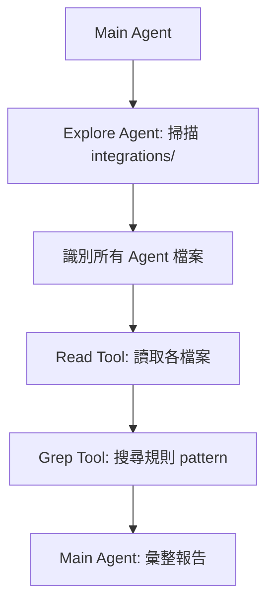

# AI Agent 同步檢查標準作業程序 (SOP)

> **Language**: 繁體中文 | [English](../../integrations/README.md)

**Version**: 1.0.0
**Last Updated**: 2026-01-26
**Maintainer**: UDS Team

---

## 概述

本文件定義 AI Agent 執行跨 AI Agent 同步檢查的標準作業程序。此 SOP 設計為可由 AI Agent（如 Claude Code、OpenCode 等）自主重複執行的工作流程。

### 目標

1. 確保所有 AI Agent 整合檔案維持一致的核心規則
2. 自動偵測規則缺失並生成修復建議
3. 提供可重複執行的標準化流程

### 適用範圍

- 11 個支援的 AI Agent 整合檔案
- 7 個核心同步規則
- 4 個支援層級（complete, partial, preview, minimal）

---

## 核心同步規則

### 必要規則（ERROR 級別）

缺失這些規則將導致同步檢查失敗。

| 規則 ID | 名稱 | 說明 | 來源 |
|---------|------|------|------|
| AH-001 | Evidence-Based Analysis | 必須先讀取檔案再進行分析 | core/anti-hallucination.md |
| AH-002 | Source Attribution | 所有事實陳述必須標注來源 | core/anti-hallucination.md |
| SDD-001 | SDD Tool Detection | 偵測 OpenSpec/Spec Kit 整合 | core/spec-driven-development.md |

### 建議規則（WARNING 級別）

缺失這些規則會產生警告，但不會導致失敗。

| 規則 ID | 名稱 | 說明 | 來源 |
|---------|------|------|------|
| AH-003 | Certainty Classification | 使用 [Confirmed]/[Inferred]/[Assumption]/[Unknown] 標籤 | core/anti-hallucination.md |
| AH-004 | Recommendation Required | 提供選項時必須包含推薦選項 | core/anti-hallucination.md |
| SDD-002 | SDD Command Priority | SDD 工具命令優先於手動編輯 | core/spec-driven-development.md |
| CMT-001 | Conventional Commits | 遵循 type(scope): subject 格式 | core/commit-message-guide.md |

---

## 支援層級與必要規則

| 層級 | 說明 | 必要規則 |
|------|------|----------|
| complete | 完全支援（Skills、Agents、Workflows） | AH-001~004, SDD-001~002, CMT-001 |
| partial | 部分支援（基本規則） | AH-001~004, SDD-001, CMT-001 |
| preview | 預覽版（實驗性） | AH-001~003 |
| minimal | 最小支援（基本指南） | AH-001~002 |

---

## 標準作業流程

### 階段 1：探索分析

**目標**: 識別所有需要檢查的 AI Agent 整合檔案

**步驟**:

1. 讀取 `integrations/REGISTRY.json` 取得 Agent 清單
2. 根據 tier 過濾排除 `planned` 和 `tool` 類型的 Agent
3. 確認每個 Agent 的 instructionFile 路徑

**使用 Explore Agent**:

```
請掃描 integrations/ 目錄：
1. 列出所有子目錄
2. 識別各 Agent 的規則檔案
3. 確認檔案是否存在
```

### 階段 2：規則驗證

**目標**: 檢查每個整合檔案是否包含必要規則

**步驟**:

1. 對每個 Agent 的 instructionFile：
   - 根據其 tier 取得必要規則清單
   - 使用正則表達式匹配每個規則的 pattern
   - 記錄通過/失敗/警告狀態

2. 規則 Pattern 參考：

```javascript
// AH-001: Evidence-Based Analysis
/read.*file.*before|must.*read|MUST read files before|Evidence-Based/i

// AH-002: Source Attribution
/\[Source:|Source Attribution|cite.*source/i

// AH-003: Certainty Classification
/\[Confirmed\]|\[Inferred\]|\[Assumption\]|\[Unknown\]|Certainty Classification/i

// AH-004: Recommendation Required
/recommend.*option|Recommended.*choice|MUST.*recommend/i

// SDD-001: SDD Tool Detection
/OpenSpec|Spec Kit|openspec\/|specs\/|\.speckit/i

// SDD-002: SDD Command Priority
/prioritize.*command|MUST prioritize|SDD.*Priority/i

// CMT-001: Conventional Commits
/type.*scope.*subject|<type>.*<scope>|Conventional Commits/i
```

### 階段 3：報告生成

**目標**: 產生清晰的同步狀況報告

**報告格式**:

```
==========================================
  AI Agent Sync Report
  AI Agent 同步報告
==========================================

Compliance: 91%

Agent Results:
┌─────────────┬──────────┬────────┬──────────┐
│ Agent       │ Tier     │ Passed │ Status   │
├─────────────┼──────────┼────────┼──────────┤
│ claude-code │ complete │ 6/7    │ ⚠ WARN   │
│ opencode    │ complete │ 7/7    │ ✓ PASS   │
│ cursor      │ partial  │ 6/6    │ ✓ PASS   │
│ ...         │ ...      │ ...    │ ...      │
└─────────────┴──────────┴────────┴──────────┘

Missing Rules:
- claude-code: SDD-002 (SDD Command Priority)
- cline: CMT-001 (Conventional Commits)

Recommendations:
1. Add SDD Priority section to CLAUDE.md
2. Add Commit Format section to .clinerules
```

---

## 自動化腳本使用

### 基本執行

**macOS / Linux:**
```bash
./scripts/check-ai-agent-sync.sh
```

**Windows PowerShell:**
```powershell
.\scripts\check-ai-agent-sync.ps1
```

### 詳細模式

顯示每個規則的匹配狀態：

**macOS / Linux:**
```bash
./scripts/check-ai-agent-sync.sh --verbose
```

**Windows PowerShell:**
```powershell
.\scripts\check-ai-agent-sync.ps1 -Verbose
```

### JSON 輸出

適合程式化處理：

**macOS / Linux:**
```bash
./scripts/check-ai-agent-sync.sh --json
```

**Windows PowerShell:**
```powershell
.\scripts\check-ai-agent-sync.ps1 -Json
```

---

## SubAgent 協作模式

當需要多個 SubAgent 協作處理時，使用以下模式：

### 任務分配

| SubAgent | 職責 |
|----------|------|
| Explore Agent | 掃描目錄結構、識別檔案 |
| Read Tool | 讀取整合檔案內容 |
| Grep Tool | 搜尋規則 pattern |
| Main Agent | 彙整結果、生成報告 |

### 協作流程



---

## AI Agent 可重複執行的 Prompt 範本

### 完整檢查 Prompt

```
請執行 UDS 專案的「跨 AI Agent 同步檢查」作業：

1. 讀取 integrations/REGISTRY.json 取得 Agent 清單
2. 對每個 active Agent（排除 tier=planned 和 tier=tool）：
   - 讀取其 instructionFile
   - 驗證是否包含該 tier 所需的核心規則
3. 生成同步狀況報告，包含：
   - 整體合規率（百分比）
   - 各 Agent 的規則通過狀態
   - 缺失規則清單
   - 修復建議
4. 如有錯誤級別的缺失，列出需要優先修復的項目

參考文件：
- integrations/REGISTRY.json（Agent 和規則定義）
- core/anti-hallucination.md（AH 規則來源）
- core/spec-driven-development.md（SDD 規則來源）
```

### 快速檢查 Prompt

```
執行 ./scripts/check-ai-agent-sync.sh 並分析結果：
- 如果有 FAIL，說明哪些 Agent 缺少哪些規則
- 如果有 WARN，說明建議改善的項目
- 如果全部 PASS，確認目前的合規狀態
```

### 修復 Prompt

```
根據 AI Agent 同步檢查結果，修復以下缺失規則：

Agent: [agent-name]
缺失規則: [rule-id]

請：
1. 讀取該 Agent 的整合檔案
2. 參考 REGISTRY.json 中該規則的 patterns
3. 參考其他已合規 Agent 的實作方式
4. 在適當位置新增該規則的內容
5. 再次執行同步檢查確認修復成功
```

---

## 疑難排解

### 常見問題

#### Q1: 腳本找不到 REGISTRY.json

**原因**: 未在專案根目錄執行腳本

**解決**:
```bash
cd /path/to/universal-dev-standards
./scripts/check-ai-agent-sync.sh
```

#### Q2: 規則 pattern 未匹配但檔案確實包含該規則

**原因**: 規則內容的措辭與 pattern 不完全相符

**解決**:
1. 檢查 REGISTRY.json 中該規則的 patterns
2. 確認檔案中使用的措辭
3. 如有需要，擴展 pattern 涵蓋更多變體

#### Q3: 新增的 Agent 未被檢查

**原因**: 未在 REGISTRY.json 和腳本中註冊

**解決**:
1. 在 `integrations/REGISTRY.json` 的 `agents` 區塊新增 Agent
2. 在 `scripts/check-ai-agent-sync.sh` 的 `get_agent_file()` 函數新增對應
3. 在 `scripts/check-ai-agent-sync.ps1` 的 `$AgentFiles` 新增對應

---

## 維護指南

### 新增規則

1. 在 `integrations/REGISTRY.json` 的 `syncRules` 新增規則定義
2. 更新相關 tier 的 `requiredRules` 清單
3. 在腳本中新增對應的 pattern 函數
4. 更新單元測試 `cli/tests/unit/utils/ai-agent-sync.test.js`
5. 更新本文件的規則表格

### 新增 Agent

1. 在 `integrations/REGISTRY.json` 的 `agents` 新增 Agent 定義
2. 在腳本的 Agent 清單中新增對應
3. 建立整合檔案（如 `.xxxrules` 或 `AGENTS.md`）
4. 執行同步檢查確認設定正確

### 版本更新

當修改同步檢查機制時：
1. 更新 `integrations/REGISTRY.json` 的 `version` 和 `lastUpdated`
2. 更新本文件的版本資訊
3. 在 CHANGELOG.md 記錄變更

---

## 相關文件

- [integrations/REGISTRY.json](../../integrations/REGISTRY.json) - Agent 和規則定義
- [core/anti-hallucination.md](../../core/anti-hallucination.md) - Anti-Hallucination 規則來源
- [core/spec-driven-development.md](../../core/spec-driven-development.md) - SDD 規則來源
- [core/commit-message-guide.md](../../core/commit-message-guide.md) - Commit Format 規則來源
- [scripts/check-ai-agent-sync.sh](../../scripts/check-ai-agent-sync.sh) - Bash 檢查腳本
- [scripts/check-ai-agent-sync.ps1](../../scripts/check-ai-agent-sync.ps1) - PowerShell 檢查腳本

---

## 版本歷史

| 版本 | 日期 | 變更 |
|------|------|------|
| 1.0.0 | 2026-01-26 | 初始版本：包含完整 SOP、SubAgent 協作模式、Prompt 範本 |

---

## 授權

本文件依據 [CC BY 4.0](https://creativecommons.org/licenses/by/4.0/) 授權釋出。
