# [SPEC-SKILL-01] Vibe Coding Skill Definition / Vibe Coding 技能定義

**Priority**: P1
**Status**: Draft
**Last Updated**: 2026-01-28
**Feature ID**: SKILL-VIBE-001
**Dependencies**: [SPEC-VIBE-01 Vibe Coding Integration]

---

## Summary / 摘要

This specification defines the "Vibe Coding" skill structure for AI agents (Claude Code, Cursor, etc.). It standardizes the prompt engineering, tool usage, and interaction patterns required to execute Vibe Coding sessions effectively.

本規格定義了 AI 代理（Claude Code, Cursor 等）的「Vibe Coding」技能結構。它標準化了有效執行 Vibe Coding 會話所需的提示工程、工具使用和互動模式。

---

## Motivation / 動機

### Problem Statement / 問題陳述

Even with the System Spec ([SPEC-VIBE-01]), AI agents don't inherently know *how* to behave in "Vibe Mode." Without a standardized skill definition:
1.  AI might ignore micro-specs.
2.  AI might ask too many questions (breaking flow) or too few (hallucination).
3.  Different AI tools will behave inconsistently.

### Solution / 解決方案

Define a **Universal Skill Package** that can be injected into any supported AI tool. This package includes:
- **Role Definition**: "You are a Vibe Coding Assistant..."
- **Protocol**: "Always check for micro-specs first..."
- **Tool Bindings**: Specific CLI commands to use.

---

## Skill Definition / 技能定義

### 1. Role & Context (System Prompt)

The following context MUST be injected when Vibe Mode is active:

```markdown
# Vibe Coding Mode Active

**Role**: You are a Vibe Coding Assistant, designed for high-velocity, intent-driven development.

**Core Protocols**:
1.  **Intent First**: Do not implement until you have a confirmed Micro-Spec.
2.  **Micro-Spec Flow**:
    - If no spec exists, generate one using `uds spec create` or ask the user.
    - If a spec exists, read it using `read_file .uds/micro-specs/<active>.md`.
3.  **Soft Constraints**: You are aware of UDS standards (in `core/`), but you prioritize *flow* and *functioning code* over strict compliance. Violations will be caught by the Auto-Sweep later.
4.  **Verification**: For UI components, prioritize *Visual Verification* (screenshots) over unit tests.
5.  **Safety**: For destructive actions (Level 3+), you MUST use the `uds hitl check` command or ask explicitly.

**Output Style**:
- Concise. Minimal explanation.
- Focus on code generation.
- Use emojis to indicate status (e.g., 🏗️ Building, ✅ Verified).
```

### 2. Slash Commands

The skill provides the following user-facing commands:

| Command | Description | UDS Equivalent |
|---------|-------------|----------------|
| `/vibe` | Enter Vibe Mode (relax constraints) | `uds configure --vibe-mode` |
| `/spec` | Generate a micro-spec from chat | `uds spec create` |
| `/done` | End session & trigger auto-sweep | `uds sweep` |
| `/fix` | Fix last verification failure | `uds fix` |

### 3. Tool Bindings

The AI Agent must be equipped with these specific tool capabilities:

**A. Spec Management**
- `create_spec(intent: string)` -> generates `.uds/micro-specs/timestamp.md`
- `list_specs()` -> lists active specs

**B. HITL Check**
- `check_risk(operation: string)` -> returns `approved` or `denied` (wraps `uds hitl check`)

**C. Verification**
- `capture_snapshot(component: string)` -> saves screenshot to `.uds/snapshots/`

---

## Interaction Flows / 互動流程

### Flow 1: Feature Implementation

```mermaid
sequenceDiagram
    participant User
    participant AI (Vibe Skill)
    participant UDS CLI

    User->>AI: "Build a login form"
    AI->>AI: Check active spec? (No)
    AI->>AI: Generate Micro-Spec (Internal)
    AI-->>User: "Micro-Spec: Login Form (Fields: email, password). OK?"
    User->>AI: "Yes"
    AI->>UDS CLI: `uds spec save ...`
    AI->>AI: Generate Code
    AI->>UDS CLI: `uds hitl check --op write_file`
    UDS CLI-->>AI: Approved
    AI->>Filesystem: Write code
    AI-->>User: "Done. 🏗️"
```



### Flow 2: Session Cleanup (/done)

```mermaid
sequenceDiagram
    participant User
    participant AI
    participant UDS CLI

    User->>AI: "/done"
    AI->>UDS CLI: `uds sweep`
    UDS CLI->>Filesystem: Auto-format, Remove logs
    UDS CLI-->>AI: Report (3 files cleaned, 1 error)
    AI-->>User: "Session closed. Cleaned 3 files. 🧹"
```



---

## Tool-Specific Implementation / 工具特定實作

### Claude Code (`.claude/skills/vibe.js`)

```javascript
// Conceptual implementation
export const vibeSkill = {
  name: "vibe-coding",
  description: "High-velocity development mode",
  commands: [
    {
      name: "/spec",
      action: async (context) => {
        // Implementation calling `uds spec create`
      }
    }
  ],
  prompt_modifier: (prompt) => {
    return prompt + "\n[Vibe Mode: ENABLED]";
  }
};
```

### Cursor (`.cursorrules`)

```markdown
# .cursorrules (Dynamic Section)

@vibe-mode {
  "intent_recognition": "always_generate_spec_first",
  "style": "concise",
  "tools": ["uds_cli"]
}
```

---

## Acceptance Criteria / 驗收條件

### AC-1: Prompt Injection
**Given** Vibe Mode is active
**When** I ask "What is my role?"
**Then** the AI answers "I am your Vibe Coding Assistant" (validating context injection).

### AC-2: Spec Enforcement
**Given** I ask "Write code for X"
**When** no spec exists for X
**Then** the AI **refuses to write code** immediately and instead offers a Micro-Spec draft.

### AC-3: HITL Compliance
**Given** I ask "Delete the database"
**When** in Vibe Mode
**Then** the AI pauses and invokes the HITL check (or asks user) despite being in "fast mode".

---

## Version History / 版本歷史

| Version | Date | Changes |
|---------|------|---------|
| 1.0.0 | 2026-01-28 | Initial specification |

---

## License

This specification is released under [CC BY 4.0](https://creativecommons.org/licenses/by/4.0/).
