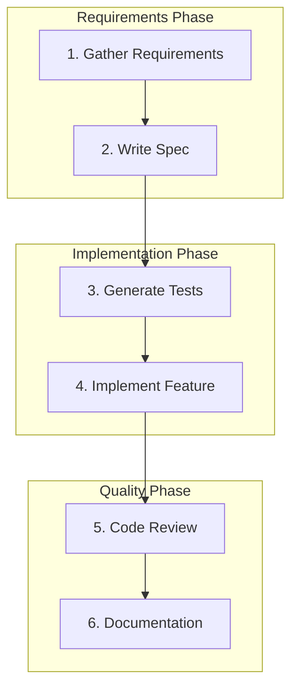
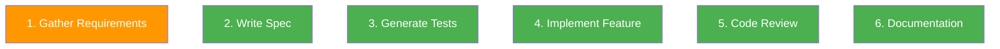
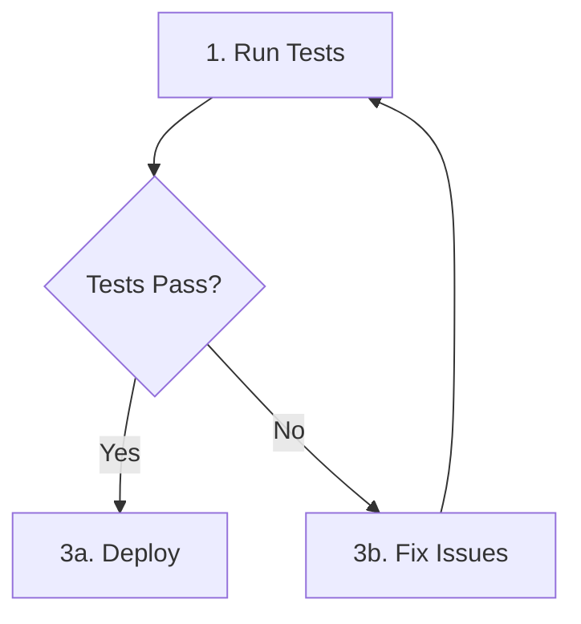
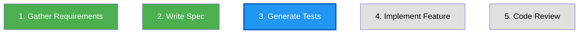

# [SPEC-VIZ-01] Workflow Visualization / 工作流程視覺化

**Priority**: P2
**Status**: Draft
**Last Updated**: 2026-01-28
**Feature ID**: SYS-VIZ-001
**Dependencies**: [CLI-AGENT-001 Agents & Workflows System]

---

## Summary / 摘要

Workflow Visualization provides Mermaid diagram generation from workflow definitions, enabling visual documentation and understanding of complex multi-step workflows. It also provides interactive step navigation and progress tracking.

工作流程視覺化提供從工作流程定義生成 Mermaid 圖表的功能，實現複雜多步驟工作流程的視覺化文件和理解。它還提供互動式步驟導航和進度追蹤。

---

## Motivation / 動機

### Problem Statement / 問題陳述

1. **Complex Workflows**: Multi-step workflows are hard to understand from YAML
2. **No Visual Overview**: Can't quickly grasp workflow structure
3. **Documentation Gap**: No automatic diagram generation
4. **Progress Tracking**: Hard to visualize where you are in a workflow

### Solution / 解決方案

A visualization system that:
- Generates Mermaid diagrams from workflow YAML
- Provides interactive step navigation
- Shows real-time progress during execution
- Exports to multiple formats (SVG, PNG, markdown)

---

## User Stories / 使用者故事

### US-1: Workflow Overview

```
As a developer learning a new workflow,
I want to see a visual diagram of all steps,
So that I can understand the flow at a glance.

作為學習新工作流程的開發者，
我想要看到所有步驟的視覺圖表，
讓我一眼就能理解流程。
```

### US-2: Documentation Generation

```
As a technical writer documenting workflows,
I want to generate diagrams automatically,
So that documentation stays in sync with code.

作為撰寫工作流程文件的技術寫手，
我想要自動生成圖表，
讓文件與程式碼保持同步。
```

### US-3: Progress Tracking

```
As a developer running a long workflow,
I want to see my current progress visually,
So that I know how many steps remain.

作為執行長工作流程的開發者，
我想要視覺化看到我的當前進度，
讓我知道還剩多少步驟。
```

---

## Acceptance Criteria / 驗收條件

### AC-1: Basic Diagram Generation

**Given** a workflow YAML file
**When** I run `uds workflow viz feature-dev`
**Then** Mermaid diagram is generated:



### AC-2: Agent Indicators

**Given** workflow steps have agent types
**When** diagram is generated
**Then** agent types are visually indicated:



### AC-3: Conditional Branching

**Given** workflow has conditional steps
**When** diagram is generated
**Then** branches are shown:



### AC-4: Progress Visualization

**Given** a workflow is in progress
**When** I run `uds workflow viz --progress`
**Then** completed/current steps are highlighted:



### AC-5: Export Formats

**Given** I generate a diagram
**When** I specify output format
**Then** supported formats include:

| Format | Command | Output |
|--------|---------|--------|
| Mermaid | `--format mermaid` | `.mmd` file |
| SVG | `--format svg` | `.svg` file |
| PNG | `--format png` | `.png` file |
| Markdown | `--format md` | `.md` with embedded diagram |
| Terminal | `--format terminal` | ASCII art (simplified) |

### AC-6: Interactive Navigation

**Given** I run `uds workflow viz --interactive`
**When** in interactive mode
**Then** I can:
- Navigate between steps with arrow keys
- View step details by pressing Enter
- Start step execution by pressing 'r'
- Exit with 'q'

---

## Technical Design / 技術設計

### Diagram Generator / 圖表生成器

```javascript
// visualization/diagram-generator.js
export class DiagramGenerator {
  constructor(workflow) {
    this.workflow = workflow;
  }

  toMermaid() {
    const lines = ['flowchart TD'];

    // Group steps by phase
    const phases = this.groupByPhase(this.workflow.steps);

    for (const [phase, steps] of Object.entries(phases)) {
      lines.push(`    subgraph ${this.sanitize(phase)}[${phase}]`);
      for (const step of steps) {
        const shape = this.getStepShape(step);
        lines.push(`        ${step.id}${shape}`);
      }
      lines.push('    end');
    }

    // Add connections
    for (let i = 0; i < this.workflow.steps.length - 1; i++) {
      const current = this.workflow.steps[i];
      const next = this.workflow.steps[i + 1];
      lines.push(`    ${current.id} --> ${next.id}`);
    }

    // Add style classes
    lines.push(...this.generateStyles());

    return lines.join('\n');
  }

  getStepShape(step) {
    const label = `${step.index}. ${step.name}`;
    switch (step.type) {
      case 'conditional':
        return `{${label}}`;
      case 'manual':
        return `([${label}])`;
      default:
        return `[${label}]`;
    }
  }
}
```

### CLI Commands / CLI 命令

```bash
# Generate diagram
uds workflow viz <workflow-name>
uds workflow viz feature-dev --format svg
uds workflow viz feature-dev --output ./docs/diagrams/

# With progress tracking
uds workflow viz --progress

# Interactive mode
uds workflow viz --interactive

# Include in documentation
uds workflow viz feature-dev --format md >> README.md
```

### Terminal Rendering / 終端渲染

```
┌─────────────────────────────────────────────────────────────────────────┐
│                      Workflow: feature-dev                               │
├─────────────────────────────────────────────────────────────────────────┤
│                                                                         │
│  [Requirements Phase]                                                    │
│  ┌──────────────────┐    ┌──────────────────┐                           │
│  │ 1. Gather Reqs   │───▶│ 2. Write Spec    │                           │
│  │   ◉ manual       │    │   ◎ agent        │                           │
│  └──────────────────┘    └────────┬─────────┘                           │
│                                   │                                      │
│  [Implementation Phase]           │                                      │
│  ┌──────────────────┐    ┌───────▼──────────┐                           │
│  │ 4. Implement     │◀───│ 3. Generate Tests│                           │
│  │   ◎ agent        │    │   ◎ agent        │                           │
│  └────────┬─────────┘    └──────────────────┘                           │
│           │                                                              │
│  [Quality Phase]                                                         │
│  ┌────────▼─────────┐    ┌──────────────────┐                           │
│  │ 5. Code Review   │───▶│ 6. Documentation │                           │
│  │   ◎ agent        │    │   ◎ agent        │                           │
│  └──────────────────┘    └──────────────────┘                           │
│                                                                         │
│  Legend: ◉ manual  ◎ agent  ◇ conditional                              │
│  Status: ✓ completed  ▶ current  ○ pending                             │
│                                                                         │
└─────────────────────────────────────────────────────────────────────────┘
```

### File Structure / 檔案結構

```
cli/src/
├── commands/
│   └── workflow.js           # Extended with 'viz' subcommand
├── visualization/
│   ├── diagram-generator.js  # Mermaid generation
│   ├── terminal-renderer.js  # ASCII art rendering
│   ├── interactive-nav.js    # Interactive navigation
│   └── exporters/
│       ├── svg.js
│       ├── png.js
│       └── markdown.js
```

---

## Integration with Other Tools / 與其他工具整合

| Tool | Integration |
|------|-------------|
| **GitHub** | Mermaid renders natively in markdown |
| **VS Code** | Mermaid preview extension |
| **Confluence** | Mermaid macro available |
| **Notion** | Embed as code block |

---

## Risks / 風險

| Risk | Impact | Mitigation |
|------|--------|------------|
| Complex workflows hard to render | Medium | Collapsible phases, zoom |
| External dependencies for PNG | Low | SVG as fallback |
| ASCII art limitations | Low | Simplified representation |

---

## Out of Scope / 範圍外

- Real-time collaborative editing
- Web-based visualization dashboard
- 3D workflow visualization
- Animation of workflow execution

---

## Sync Checklist

### Starting from System Spec
- [ ] Create visualization module
- [ ] Add viz subcommand to workflow.js
- [ ] Implement Mermaid generator
- [ ] Implement terminal renderer
- [ ] Update translations (zh-TW, zh-CN)

---

## References / 參考資料

- [Mermaid Documentation](https://mermaid.js.org/)
- [Agents & Workflows System](./agents-workflows-system.md)

---

## Version History / 版本歷史

| Version | Date | Changes |
|---------|------|---------|
| 1.0.0 | 2026-01-28 | Initial specification |

---

## License

This specification is released under [CC BY 4.0](https://creativecommons.org/licenses/by/4.0/).
