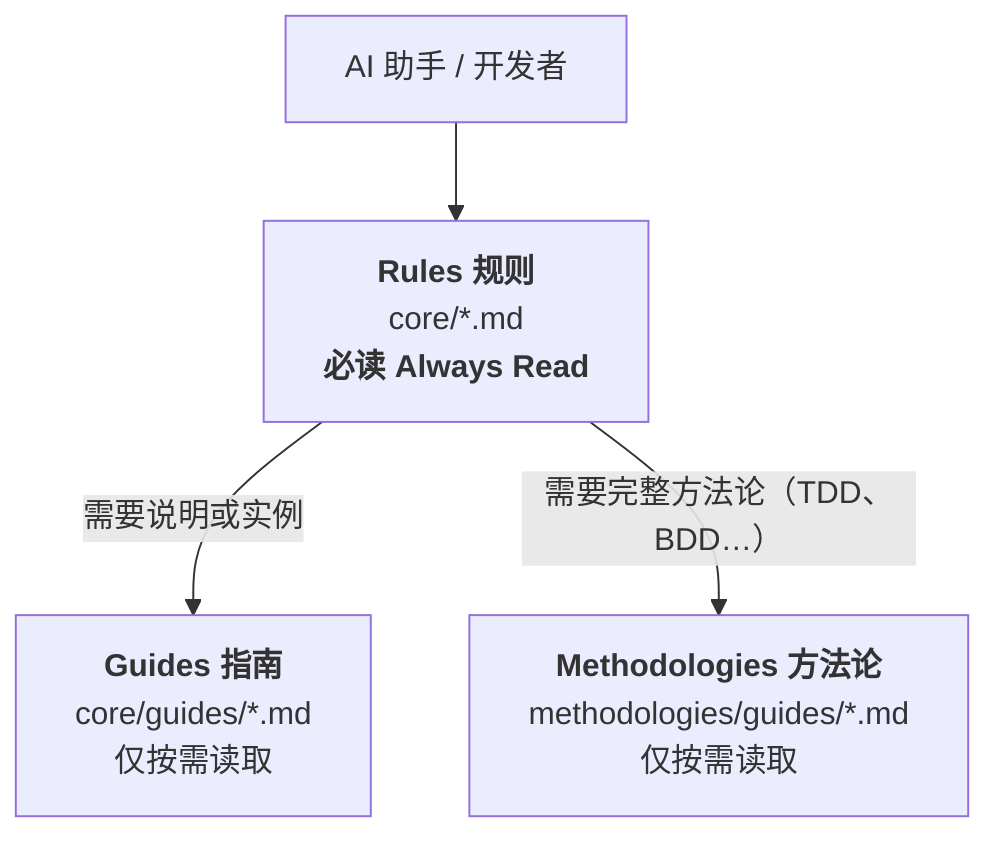

# Universal Development Standards

[](https://www.npmjs.com/package/universal-dev-standards)
[](../../LICENSE)
[](https://nodejs.org/)

> **语言**: [English](../../README.md) | [繁體中文](../zh-TW/README.md) | 简体中文

**版本**: 6.1.1 | **发布日期**: 2026-07-18 | **授权**: [双重授权](../../LICENSE) (CC BY 4.0 + MIT)

语言无关、框架无关的软件项目文档标准。通过 AI 原生工作流，确保不同技术栈之间的一致性、质量和可维护性。

---

## 🚀 快速开始

### 通过 npm 安装（推荐）

```bash
# 全局安装（稳定版）
npm install -g universal-dev-standards

# 初始化项目
uds init
```

> 寻找 beta 或 RC 版本？请参阅 [预发布版本](../../docs/PRE-RELEASE.md)。

### 或使用 npx（无需安装）

```bash
npx universal-dev-standards init
```

> **注意**：仅复制标准文件不会启用 AI 协助功能。请使用 `uds init` 自动配置 AI 工具，或手动在工具配置文件中引用标准。

### 🗺️ 安装后下一步

| 我想要... | 命令 |
| :--- | :--- |
| **理解现有代码库** | `/discover` |
| **用规格驱动开发新功能** | `/sdd` |
| **处理遗留代码** | `/reverse` |
| **选择开发方法论** | `/methodology` |
| **编写规范化的 commit** | `/commit` |

> **提示**：输入 `/dev-workflow` 获取完整的开发阶段指南与所有可用命令。
>
> 另请参阅：[每日开发工作流程指南](adoption/DAILY-WORKFLOW-GUIDE.md)

### 📚 文档

| 我想要... | 文档 |
|---|---|
| **UDS 新手？** 5 分钟快速上手 | [docs/user/GETTING-STARTED.md](docs/user/GETTING-STARTED.md) |
| 按 Tier & Category 浏览全部 55 个技能 | [docs/user/SKILLS-INDEX.md](../../docs/user/SKILLS-INDEX.md) |
| 查看所有斜线命令 | [docs/user/COMMANDS-INDEX.md](../../docs/user/COMMANDS-INDEX.md) |
| 快速参考卡片 | [docs/user/CHEATSHEET.md](docs/CHEATSHEET.md) |
| 常见问题 | [docs/user/FAQ.md](docs/user/FAQ.md) |
| 排查问题 | [docs/user/TROUBLESHOOTING.md](docs/user/TROUBLESHOOTING.md) |
| 了解 UDS 术语 | [docs/user/GLOSSARY.md](docs/user/GLOSSARY.md) |

---

## ✨ 功能特色

<!-- UDS_STATS_TABLE_START -->
| 类别 | 数量 | 说明 |
|----------|-------|-------------|
| **核心标准** | 149 | 通用开发准则 |
| **AI Skills** | 55 | 互动式技能 |
| **斜线命令** | 51 | 快速操作 |
| **CLI 命令** | 21 | 项目设置与维护 |
<!-- UDS_STATS_TABLE_END -->

> **5.0 新功能？** 请参阅[预发布说明](../../docs/PRE-RELEASE.md)了解新功能详情。

---

## 🏗️ 系统架构

UDS 的内容沿**两条彼此独立的轴**组织。两者回答的是不同问题，把它们混为一谈是误读本架构
最常见的原因，因此分开陈述。

### 轴一 — 深度：哪些内容必须常驻加载

这条轴是一份**行为契约**：它告诉 AI 代理什么要一开始就读、什么留到被问时再读。
影响 context 成本的是这条轴。



| 层级 | 位置 | 内容 | AI 行为 |
| :--- | :--- | :--- | :--- |
| **Rules 规则** | `core/*.md` | 可执行规则、检查清单、阈值 | **必读 (Always Read)** |
| **Guides 指南** | `core/guides/*.md` | 说明、教学、范例 | 仅按需读取 |
| **Methodologies 方法论** | `methodologies/guides/*.md` | 完整方法论指南 | 仅按需读取 |

### 轴二 — 格式：同一份标准的两种编码

这条轴**不带任何深度含义**。同一份标准的 `.ai.yaml` 与 `.md` 是同一份材料的两种编码，
依读者是谁而选用。

| 面向 | `ai/standards/*.ai.yaml` | `core/*.md` |
| :--- | :--- | :--- |
| **编码** | 结构化 YAML | 散文式 Markdown |
| **适用于** | 机器确定性查询 | 人类阅读与审查 |
| **相对体积** | 约为 Markdown 版的 69%——是**换一种格式，不是压缩层**<sup>†</sup> | 基准 |

<sup>†</sup> 2026-07-23 实测，涵盖同时具备两种形式的 135 份标准：YAML 872,380 bytes，
Markdown 1,271,471 bytes。重现指令见
[Content Architecture §7](../../docs/reference/CONTENT-ARCHITECTURE.md#7-how-to-re-measure)。

> 📐 深度契约的完整定义、它在各集成工具中的落实情况，以及契约与现况之间已量测到的落差，
> 记于 **[docs/reference/CONTENT-ARCHITECTURE.md](../../docs/reference/CONTENT-ARCHITECTURE.md)**。

---

## 🤖 AI 工具支持

| AI 工具 | 状态 | Skills | 斜线命令 | 配置文件 |
| :--- | :--- | :---: | :---: | :--- |
| **Claude Code** | ✅ 完整支持 | **55** | **51** | `CLAUDE.md` |
| **OpenCode** | ✅ 完整支持 | **55** | **51** | `AGENTS.md` |
| **Cursor** | ✅ 完整支持 | **核心** | **模拟支持** | `.cursorrules` |
| **Roo Code** | ✅ 完整支持 | **核心** | **工作流** | `.roo/rules/` |
| **Cline** | 🔶 部分支持 | **核心** | **工作流** | `.clinerules` |
| **Windsurf** | 🔶 部分支持 | **核心** | **规则书** | `.windsurfrules` |
| **GitHub Copilot** | 🔶 部分支持 | **核心** | **提示词** | `.github/copilot-instructions.md` |
| **OpenAI Codex** | 🔶 部分支持 | **核心** | — | `AGENTS.md` |
| **Aider** | 🔶 部分支持 | — | — | `AGENTS.md` |
| **Continue.dev** | 🔶 部分支持 | — | — | `.continue/config.json` |
| **Google Antigravity** | ⚠️ 最低限度 | 🔬 未验证<sup>‡</sup> | — | `.antigravity/rules.md` |
| **Gemini CLI** | ⛔ 已停止服务<sup>†</sup> | — | — | `GEMINI.md`（已冻结） |

> **状态图例**：✅ 完整支持 | 🔶 部分支持 | ⚠️ 最低限度 | 🔬 未验证 | ⏳ 计划中 | ⛔ 已停止服务

<sup>†</sup> Google 已于 **2026-06-18** 终止 Gemini CLI（2026-05-19 I/O 宣布，30 天迁移窗），
由 Antigravity CLI 接手。`integrations/gemini-cli/` 与 `.gemini/` 两棵树已**冻结**——
保留供参考、排除于同步检查之外、不再维护。见 [`.gemini/DEPRECATED.md`](../../.gemini/DEPRECATED.md)。

<sup>‡</sup> Antigravity 支持 skills，但正确的安装路径**尚未对实际的 Antigravity CLI 验证**。
两个候选互相冲突：`~/.gemini/antigravity-cli/plugins/<name>/skills/`（官方 plugin 文档）
与 `.agent/skills/`（UDS 自己 2026-02 的 spec，写于 Gemini CLI 时代）。
因此在确认之前，`uds init` **不会**为此目标安装 skills——
路径填错会是静默失败，比不安装更糟。

---

## 📦 安装方式

### CLI 工具（主要方式）

**npm（推荐）**
```bash
npm install -g universal-dev-standards
uds init        # 交互式初始化
uds check       # 检查采用状态
uds update      # 更新至最新版本
uds config      # 管理偏好设置（语言、模式）
uds uninstall   # 从项目移除标准
```

---

## ⚙️ 设置

使用 `uds config` 管理您的偏好设置：

| 参数 | 命令 | 说明 |
| :--- | :--- | :--- |
| **提交语言** | `uds config --lang zh-CN` | 设置 AI 提交消息的偏好语言 |
| **标准** | `uds init` | 安装所有可用标准 |
| **工具模式** | `uds config --mode skills` | 在 Skills、Standards 或两者之间切换 |

---

## 👥 贡献

1. **建议改进**：开立 issue 说明问题与解决方案。
2. **添加示例**：提交实际使用示例。
3. **扩展标准**：贡献语言/框架/领域扩展。

详细准则请参阅 [CONTRIBUTING.md](../../CONTRIBUTING.md)。

---

## 📄 授权

| 组件 | 授权 |
| :--- | :--- |
| **文档内容** | [CC BY 4.0](https://creativecommons.org/licenses/by/4.0/) |
| **CLI 工具** | [MIT](../../cli/LICENSE) |

## 致谢

UDS 的架构灵感来自以下杰出的开源项目：

| 项目 | 借鉴概念 | 授权 |
|------|---------|------|
| [Superpowers](https://github.com/obra/superpowers) | 系统性调试、代理调度、验证证据 | MIT |
| [GSD](https://github.com/gsd-build/get-shit-done) | 结构化任务定义、可追溯性矩阵、验证循环上限 | MIT |
| [PAUL](https://github.com/ChristopherKahler/paul) | Plan-Apply-Unify 循环、验收驱动开发 | MIT |
| [CARL](https://github.com/ChristopherKahler/carl) | 上下文感知加载、动态规则注入 | MIT |
| [CrewAI](https://github.com/crewAIInc/crewAI) | 多代理通信协议、上下文预算追踪 | MIT |
| [LangGraph](https://github.com/langchain-ai/langgraph) | 工作流状态协议、HITL 中断检查点 | MIT |
| [OpenHands](https://github.com/All-Hands-AI/OpenHands) | 事件溯源、动作-观察流模式 | MIT |
| [DSPy](https://github.com/stanfordnlp/dspy) | 代理签名、结构化 I/O 契约 | MIT |

> **注意**：UDS 仅借鉴概念与方法论，不包含上述项目的任何源代码。

---

**由开源社区用 ❤️ 维护**
