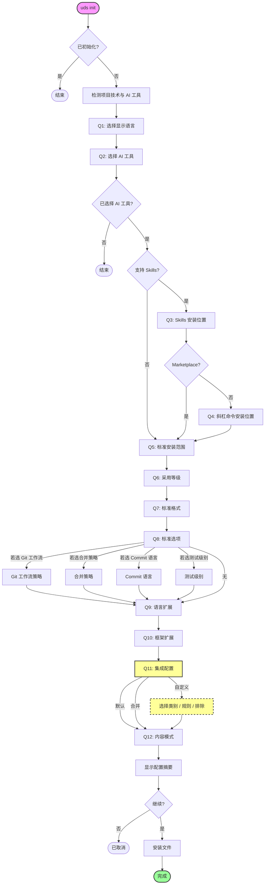
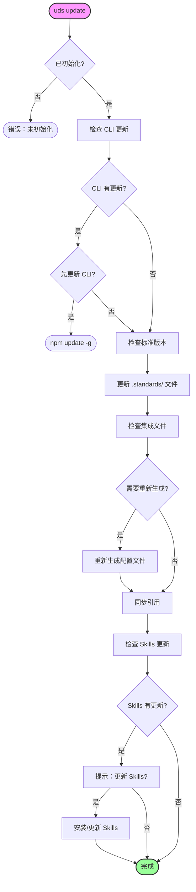
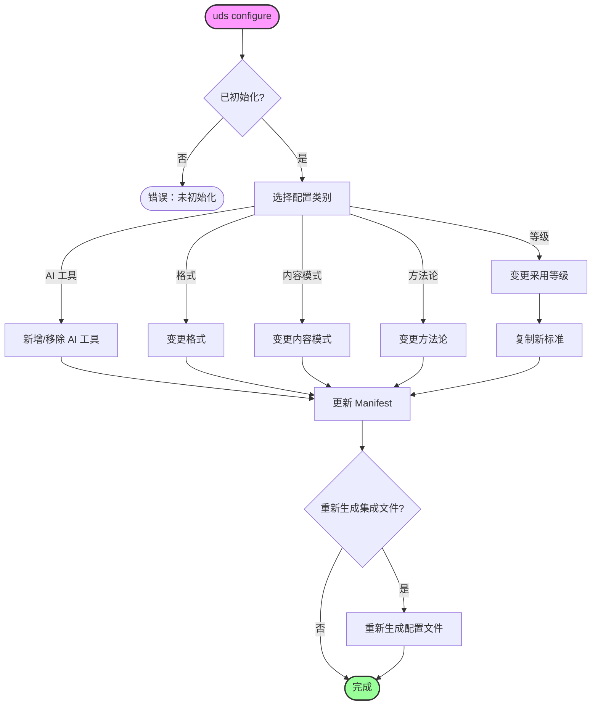
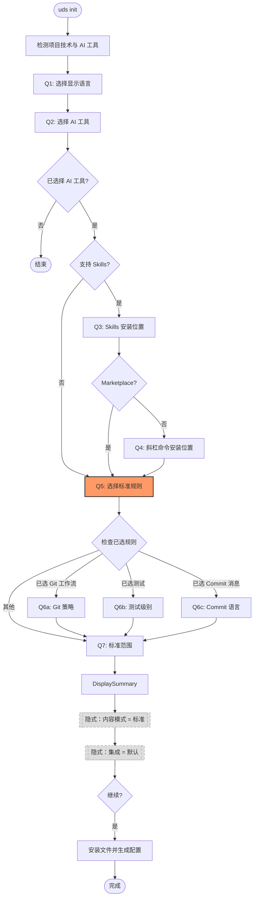

# CLI 命令流程

> **Language**: [English](../../../docs/CLI-FLOW.md) | [繁體中文](../../zh-TW/docs/CLI-FLOW.md) | 简体中文

本文档呈现 Universal Development Standards (UDS) CLI 命令的交互流程图。

## 1. 初始化命令 (`uds init`)

初始化流程用于在从未初始化的项目中设定标准。



## 2. 更新命令 (`uds update`)

更新流程用于保持标准与集成文件同步。



## 3. 检查命令 (`uds check`)

检查流程用于验证文件完整性与采用状态。

```mermaid
flowchart TD
    Start([uds check]) --> CheckInit{已初始化?}
    CheckInit -- 否 --> Error([错误：未初始化])
    
    CheckInit -- 是 --> VerifyManifest[验证 Manifest]
    VerifyManifest --> CheckHash{Hash 检查}
    
    CheckHash -->|相符| Pass([通过])
    CheckHash -->|不符| DetectChanges[检测 已修改/缺失]
    
    DetectChanges --> Interactive{交互模式?}
    Interactive -- 否 --> Report[报告问题]
    Report --> Fail([结束并显示问题])
    
    Interactive -- 是 --> LoopFiles[循环处理每个文件]
    LoopFiles --> PromptAction[提示：动作?]
    
    PromptAction -- 查看 --> ShowDiff[显示差异]
    ShowDiff --> PromptAction
    
    PromptAction -- 还原 --> RestoreFile[还原原始文件]
    PromptAction -- 保留 --> UpdateHash[更新 Hash (接受变更)]
    PromptAction -- 跳过 --> SkipFile[跳过]
    
    RestoreFile --> NextFile{还有文件?}
    UpdateHash --> NextFile
    SkipFile --> NextFile
    
    NextFile -- 是 --> LoopFiles
    NextFile -- 否 --> Finish([完成])

    style Start fill:#f9f,stroke:#333,stroke-width:2px
    style Finish fill:#9f9,stroke:#333,stroke-width:2px
    style Fail fill:#f99,stroke:#333,stroke-width:2px
```

## 4. 配置命令 (`uds configure`)

配置流程允许修改现有的配置。



## 5. 未来架构 (SPEC-009)

提议简化流程，以规则选择取代采用等级。


