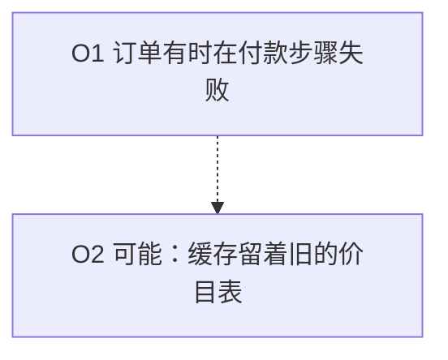

# 理解阶梯

> **语言**: [English](../../../../skills/comprehension-ladder/SKILL.md) | [繁體中文](../../../zh-TW/skills/comprehension-ladder/SKILL.md) | 简体中文

**版本**: 1.0.0 | **最后更新**: 2026-10-05 | **适用**: Claude Code Skills

把一段难懂的 AI 输出换成较好懂的形式。形式会变，事实不会变。

## 目的

现在慢的不是拿到答案，而是看懂答案并判断它。本技能帮忙这一步。它拿一份原文，最多做出三种形式，每一种叫一「阶」。

本技能的文字依 [ai-response-navigation](../../core/ai-response-navigation.md) 第 12 条（受控语言）写成。它自己也遵守自己的防护。

## 阶梯

阶梯正好有三阶。每一阶都从同一份大纲产生（见[大纲](#大纲)）。任何一阶都不得在大纲之外加东西。

| 阶 | 形式 | 适合 | 产出 |
|----|------|------|------|
| 1 | 受控文字 | 任何原文。永远是第一阶 | 短句或编号列，放在对话或文件里 |
| 2 | Mermaid 图 | 有流程、先后顺序、多个角色，或 3 个以上选项的原文 | 一个 Mermaid 代码区块，外加一份画不出来的项目文字清单 |
| 3 | 单文件 HTML 解说页 | 需要探索或核准的读者 | 一个可离线打开的 `.html` 文件 |

先问用户要哪几阶。用户没说，就先做第 1 阶，再提议另外两阶。

没有视频阶。视频需要语音服务，而且会把原文送给第三方。

## 三条防护

这三条防护**必须**遵守。破坏任何一条的那一阶，就还没做完。不得交出去。

| 编号 | 防护 | 等级 |
|------|------|------|
| G1 | `no-new-facts`：不加原文没有的事实 | **必须（Required）** |
| G2 | `keep-hedges`：保留每一个不确定语气。不得把不确定的说法改成确定 | **必须（Required）** |
| G3 | `trace-and-gaps`：每一项都附「对应原文哪一段」与「没涵盖什么」 | **必须（Required）** |

G2 与 [ai-response-navigation](../../core/ai-response-navigation.md) 的 12.1 条是同一条规则。这里把它用在本技能的三阶。

### G1 `no-new-facts`（必须）

每一阶的每一个说法都必须来自原文。不要加原因、数字、名字、日期或「已确认」。不要加你知道、但原文没写的背景。

**正例**——原文写：「订单有时会在付款步骤失败。」

```text
O1  订单有时会在付款步骤失败。
```

**反例**——同一份原文：

```text
O1  订单会在付款步骤失败。这也会让退款坏掉。
```

「退款」是添加的事实。「有时」也不见了，所以 G2 同时被破坏。

### G2 `keep-hedges`（必须）

不确定语气告诉读者，一个说法可以信到什么程度。例如：可能、推断、大概、尚未确认、might、could、probably。它是信息，不是赘字。

- 原文写「可能」，这一阶就写「可能」。
- 图里也要保留。不确定的项目用虚线画，标签里留下那个词。
- HTML 里也要保留。不确定的项目要显示看得见的「尚未确认」标记。
- 只有在原文自己说这个说法已经验证时，才可以拿掉不确定语气。这时要写出检查了什么。

**正例**——原文写：「原因可能是缓存留着旧的价目表。」

```text
O2  原因可能是缓存留着旧的价目表。   [hedge: 可能]
```

**反例**——同一份原文：

```text
O2  原因是缓存留着旧的价目表。
```

反例比较短，也比较好读。但它与原文不符。读的人若凭这一行核准修复，就被误导了。

### G3 `trace-and-gaps`（必须）

每一项都带两个注记：

- **对应原文**：这一项出自原文的哪个位置。用段落与句子编号，或文件名与行号，再加一段 12 个词以内的引文（中文约 20 字以内）。
- **没涵盖**：这一项没说到什么，或它证明不了什么。原文没有更多内容时，写「原文没有更多内容」。

最后一项之后，加一份清单，叫做**这份大纲没有收的部分**。它列出原文中所有没变成项目的部分。

**正例**

```text
O3  我们尚未在测试环境重现这个问题。
    对应原文：第 1 段第 3 句——「尚未在测试环境重现」
    没涵盖：为什么没有重现。原文没有给理由。
```

**反例**

```text
O3  这个问题已在测试环境重现。
    对应原文：那份报告。
```

「那份报告」没有指向某个位置。这个说法也与原文相反。而且没有「没涵盖」注记。

## 大纲

大纲是唯一共享的事实来源。先做大纲，再做任何一阶。不要直接从原文写某一阶。

每个大纲项目有一个编号和一个种类。

| 种类 | 意思 |
|------|------|
| `claim` | 原文提出的说法 |
| `mechanism` | 一个步骤、一个原因，或两件事之间的关联 |
| `uncertainty` | 原文说不知道或尚未确认的事 |
| `example` | 原文拿来说明某个说法的案例 |

每个项目写成这个样子：

```text
O<编号> | 种类 | 文字 | hedge: <原文的不确定用词，或 none>
  对应原文：<位置> — 「<引文，12 个词以内>」
  没涵盖：<这一项没说到的事>
```

依原文的顺序编号。编号不得重复使用。三阶都用同一组编号。

## 工作流程

### 步骤 1——读原文

读完整份原文。原文是文件，就读那个文件。读完之前，不要开始做大纲。

### 步骤 2——创建大纲

抽出项目。一项一个事实。每个不确定用词都要原样抄下。

### 步骤 3——为每一项标出处

为每一项写「对应原文」与「没涵盖」。再写「这份大纲没有收的部分」清单。

### 步骤 4——把大纲给用户看

项目超过 5 个，或用户要求时，就把大纲给用户看。让用户删除或修正项目。用户否决的大纲，不要拿去做任何一阶。

### 步骤 5——做出各阶

用户要哪几阶，就做哪几阶。照下面各阶的规则做。

#### 第 1 阶：受控文字

照 [ai-response-navigation](../../core/ai-response-navigation.md) 的 12.2 条：

- 一句一件事。英文约 15 到 25 个词，中文约 25 到 40 个字。
- 一物一名。不要为了文采换名称。
- 写清楚谁做什么。
- 一步一动作。流程写成编号列表。
- 少用分号。
- 数字要带单位。

每一行开头保留项目编号，读的人才找得到它在大纲里的位置。

#### 第 2 阶：Mermaid 图

1. 步骤与因果用 `flowchart TD`。角色与交接用 `flowchart LR`。
2. 每个 `mechanism` 项目画一个节点。用项目编号当节点编号。
3. 节点标签取自项目文字。标签里要留下不确定用词。
4. 不确定的项目画成虚线节点或虚线边（`-.->`）。
5. 不要画没有大纲编号的节点。
6. 在图的下面，用文字列出你没有画的每一项，并各附一个理由。



#### 第 3 阶：单文件 HTML 解说页

页面必须是一个文件。必须能离线打开。不得从网络加载任何东西。

页面**必须**符合：

- 所有 CSS 都放在一个 `<style>` 元素里。
- 所有脚本（若有）都放在一个内嵌的 `<script>` 元素里。关掉脚本，页面仍要能用。
- `src`、`href`、`action`、`@import`、`url()` 里不得有 `http://`、`https://` 或 `//` 开头的网址。只允许页内的 `#` 锚点链接。
- 不得有 `<link>` 元素。不得有网络字体、CDN 或外部图片。
- 不得调用 `fetch`、`XMLHttpRequest`、`WebSocket` 或 `import()`。
- 不要加载 Mermaid 函数库。把图画成内嵌 SVG，或画成有样式的清单。
- 原文中 HTML 会当成标记的字符，都要跳脱。

页面依序包含：

1. 标题，加一句话说明原文是什么。
2. 图（若用户要了第 2 阶）。
3. 每个大纲项目一张卡片。卡片显示编号、文字、有不确定语气时的「尚未确认」标记、对应原文，以及没涵盖注记。
4. 「这份大纲没有收的部分」清单。

最小骨架：

```html
<!doctype html>
<html lang="zh-Hant">
<head>
<meta charset="utf-8">
<meta name="viewport" content="width=device-width, initial-scale=1">
<title>解说页：原文的简短名称</title>
<style>
  body { font: 16px/1.6 system-ui, sans-serif; max-width: 46rem; margin: 2rem auto; padding: 0 1rem; }
  .card { border: 1px solid #8884; border-radius: 8px; padding: .75rem 1rem; margin: .75rem 0; }
  .badge { background: #fd0; color: #000; border-radius: 4px; padding: 0 .4rem; font-size: .85em; }
</style>
</head>
<body>
<h1>解说页</h1>
<p>一句话：原文是什么。</p>
<section class="card" id="O2">
  <strong>O2</strong> 原因可能是缓存留着旧的价目表。
  <span class="badge">尚未确认：可能</span>
  <p><em>对应原文：</em>第 1 段第 2 句</p>
  <p><em>没涵盖：</em>是哪一个缓存。原文没有说。</p>
</section>
</body>
</html>
```

### 步骤 6——交出之前先检查

五项检查都要跑。有一项没过，就修好那一阶，再跑一次。

1. **数量**：每一阶的项目数，等于大纲的项目数，减去你列为「没有画」的项目。原文有 5 个步骤，每一阶就是 5 个步骤。不是 4，也不是 6。
2. **没有新项目**：每一阶的每个项目都有大纲编号。找找看有没有项目没有编号。
3. **不确定语气比对**：`hedge:` 不是 `none` 的每一项，每一阶都要有同一个不确定用词。比对的是该阶与原文。任何语言都做得到。
4. **出处**：每一项都有指向某个位置的「对应原文」，也有「没涵盖」注记。
5. **离线**（只用于第 3 阶）：在文件里搜索 `http`、`//`、`<link`、`fetch(` 与 `XMLHttpRequest`。每一项搜索，除了你从原文引用的文字，都必须是零命中。

### 步骤 7——回报

结尾放这张表。没有这张表，不要交出任何一阶。

| 项目 | 第 1 阶 | 第 2 阶 | 第 3 阶 | 保留不确定语气 | 对应原文 | 没涵盖 |
|------|---------|---------|---------|----------------|----------|--------|
| O1 | 有 | 有 | 有 | 不适用 | 第 1 段第 1 句 | 「有时」的频率 |

有任何一项防护检查没过、又修不好，就说是哪一项、为什么。不要回报成功。

## 什么时候不要用

- 原文不到约 150 字。用 [ai-response-navigation](../../core/ai-response-navigation.md) 的 12.2 条改写，并保留不确定语气。不要做各阶。
- 读者是专家，需要密度高的原形。
- 任务是找出新的事实。本技能不做这件事。

## 衡量它有没有帮助

本技能还没有被证明有帮助。[eval-cases.md](eval-cases.md) 有 5 段原文，各附理解题与标准答案，并附一套跑法，会产出两个数字：前后的答对率，以及防护违反次数。实跑需要模型调用，目前还没做。实跑完成之前，不要宣称本技能有效。

## 相关

- [ai-response-navigation](../../core/ai-response-navigation.md)：第 12 条，受控语言。12.1 条是防护 G2 的基础。
- [documentation-guide](../documentation-guide/SKILL.md)：Mermaid 图在项目文档中该放哪里。
- [brainstorm-assistant](../brainstorm-assistant/SKILL.md)：相反方向，还没有原文时用。

## 版本历史

| 版本 | 日期 | 变更 |
|------|------|------|
| 1.0.0 | 2026-10-05 | 首次发布。从同一份大纲做出三阶。三条必须遵守的防护。评估案例。落实 dev-platform XSPEC-450 / DEC-125 D4。 |
