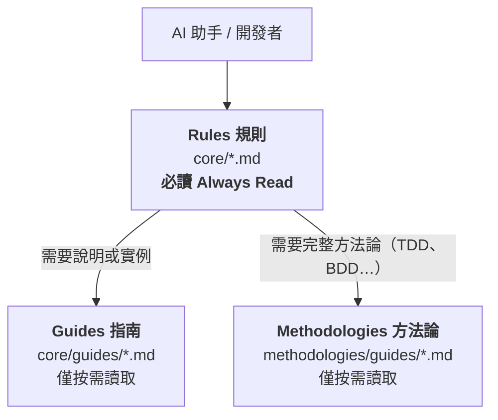

# Universal Development Standards

[](https://www.npmjs.com/package/universal-dev-standards)
[](../../LICENSE)
[](https://nodejs.org/)

> **語言**: [English](../../README.md) | 繁體中文 | [简体中文](../zh-CN/README.md)

**版本**: 6.1.1 | **發布日期**: 2026-07-18 | **授權**: [雙重授權](../../LICENSE) (CC BY 4.0 + MIT)

語言無關、框架無關的軟體專案文件標準。透過 AI 原生工作流，確保不同技術堆疊之間的一致性、品質和可維護性。

---

## 🚀 快速開始

### 透過 npm 安裝（推薦）

```bash
# 全域安裝（穩定版）
npm install -g universal-dev-standards

# 初始化專案
uds init
```

> 尋找 beta 或 RC 版本？請參閱 [預發布版本](../../docs/PRE-RELEASE.md)。

### 或使用 npx（無需安裝）

```bash
npx universal-dev-standards init
```

> **注意**：僅複製標準文件不會啟用 AI 協助功能。請使用 `uds init` 自動設定 AI 工具，或手動在工具設定檔中引用標準。

### 🗺️ 安裝後下一步

| 我想要... | 指令 |
| :--- | :--- |
| **理解既有程式碼** | `/discover` |
| **用規格驅動開發新功能** | `/sdd` |
| **處理舊有程式碼** | `/reverse` |
| **選擇開發方法論** | `/methodology` |
| **撰寫規範化的 commit** | `/commit` |

> **提示**：輸入 `/dev-workflow` 取得完整的開發階段指南與所有可用指令。
>
> 另請參閱：[每日開發工作流程指南](adoption/DAILY-WORKFLOW-GUIDE.md)

### 📚 文件

| 我想要... | 文件 |
|---|---|
| **UDS 新手？** 5 分鐘快速入門 | [docs/user/GETTING-STARTED.md](../../docs/user/GETTING-STARTED.md) |
| 依 Tier 和分類瀏覽所有 55 個 Skills | [docs/user/SKILLS-INDEX.md](../../docs/user/SKILLS-INDEX.md) |
| 查看所有斜線命令 | [docs/user/COMMANDS-INDEX.md](../../docs/user/COMMANDS-INDEX.md) |
| 快速參考卡 | [docs/user/CHEATSHEET.md](../../docs/user/CHEATSHEET.md) |
| 常見問題 | [docs/user/FAQ.md](../../docs/user/FAQ.md) |
| 疑難排解 | [docs/user/TROUBLESHOOTING.md](../../docs/user/TROUBLESHOOTING.md) |
| 了解 UDS 術語 | [docs/user/GLOSSARY.md](../../docs/user/GLOSSARY.md) |

---

## ✨ 功能特色

<!-- UDS_STATS_TABLE_START -->
| 類別 | 數量 | 說明 |
|----------|-------|-------------|
| **核心標準** | 149 | 通用開發準則 |
| **AI Skills** | 55 | 互動式技能 |
| **斜線命令** | 51 | 快速操作 |
| **CLI 指令** | 21 | 專案設定與維護 |
<!-- UDS_STATS_TABLE_END -->

> **5.0 新功能？** 請參閱[預發布說明](../../docs/PRE-RELEASE.md)了解新功能詳情。

---

## 🏗️ 系統架構

UDS 的內容沿**兩條彼此獨立的軸**組織。兩者回答的是不同問題，把它們混為一談是誤讀本架構
最常見的原因，因此分開陳述。

### 軸一 — 深度：哪些內容必須常駐載入

這條軸是一份**行為契約**：它告訴 AI 代理什麼要一開始就讀、什麼留到被問時再讀。
影響 context 成本的是這條軸。



| 層級 | 位置 | 內容 | AI 行為 |
| :--- | :--- | :--- | :--- |
| **Rules 規則** | `core/*.md` | 可執行規則、檢查清單、門檻值 | **必讀 (Always Read)** |
| **Guides 指南** | `core/guides/*.md` | 說明、教學、範例 | 僅按需讀取 |
| **Methodologies 方法論** | `methodologies/guides/*.md` | 完整方法論指南 | 僅按需讀取 |

### 軸二 — 格式：同一份標準的兩種編碼

這條軸**不帶任何深度含意**。同一份標準的 `.ai.yaml` 與 `.md` 是同一份材料的兩種編碼，
依讀者是誰而選用。

| 面向 | `ai/standards/*.ai.yaml` | `core/*.md` |
| :--- | :--- | :--- |
| **編碼** | 結構化 YAML | 散文式 Markdown |
| **適用於** | 機器確定性查詢 | 人類閱讀與審查 |
| **相對體積** | 約為 Markdown 版的 69%——是**換一種格式，不是壓縮層**<sup>†</sup> | 基準 |

<sup>†</sup> 2026-07-23 實測，涵蓋同時具備兩種形式的 135 份標準：YAML 872,380 bytes，
Markdown 1,271,471 bytes。重現指令見
[Content Architecture §7](../../docs/reference/CONTENT-ARCHITECTURE.md#7-how-to-re-measure)。

> 📐 深度契約的完整定義、它在各整合工具中的落實情形，以及契約與現況之間已量測到的落差，
> 記於 **[docs/reference/CONTENT-ARCHITECTURE.md](../../docs/reference/CONTENT-ARCHITECTURE.md)**。

---

## 🤖 AI 工具支援

UDS 提供 **11 個現行工具的整合，其中 1 個已通過行為驗證。**

這是刻意分開的兩個數字。**狀態**說的是**我們寫的那份整合**有多完整；
**驗證**說的是**有沒有人確認過該工具真的讀得到、且行為確實照做**——
靠實際跑探針並留下輸出紀錄。在今天之前，第二個問題從來沒有被問過，
所以它的答案不能被假設。探針設計與驗證排程（Antigravity → Codex → Claude Code → 其餘）
見 XSPEC-357。

| AI 工具 | 狀態 | 驗證 | Skills | 斜線命令 | 設定檔 |
| :--- | :--- | :---: | :---: | :---: | :--- |
| **Claude Code** | ✅ 完整支援 | 🔬 —<sup>◆</sup> | **55** | **51** | `CLAUDE.md` |
| **OpenCode** | ✅ 完整支援 | 🔬 — | **55** | **51** | `AGENTS.md` |
| **Cursor** | ✅ 完整支援 | 🔬 — | **核心** | **模擬支援** | `.cursorrules` |
| **Roo Code** | ✅ 完整支援 | 🔬 — | **核心** | **工作流** | `.roo/rules/` |
| **Cline** | 🔶 部分支援 | 🔬 — | **核心** | **工作流** | `.clinerules` |
| **Windsurf** | 🔶 部分支援 | 🔬 — | **核心** | **規則書** | `.windsurfrules` |
| **GitHub Copilot** | 🔶 部分支援 | 🔬 — | **核心** | **提示詞** | `.github/copilot-instructions.md` |
| **OpenAI Codex** | 🔶 部分支援 | ✅ 2026-07-23 | **核心** | — | `AGENTS.md` |
| **Aider** | 🔶 部分支援 | 🔬 — | — | — | `AGENTS.md` |
| **Continue.dev** | 🔶 部分支援 | 🔬 — | — | — | `.continue/config.json` |
| **Google Antigravity** | ⚠️ 最低限度 | 🔬 — | —<sup>‡</sup> | — | `.antigravity/rules.md` |
| **Gemini CLI** | ⛔ 已停止服務<sup>†</sup> | — | — | — | `GEMINI.md`（已凍結） |

> **狀態圖例**（我們寫的整合有多完整）：
> ✅ 完整支援 | 🔶 部分支援 | ⚠️ 最低限度 | ⏳ 計畫中 | ⛔ 已停止服務
>
> **驗證圖例**（是否有探針實跑確認該工具行為確實照做）：
> ✅ *日期* 已驗證 | 🔬 — 尚未驗證 | ⌛ 已過期 | ❌ 未通過

<sup>◆</sup> Claude Code 是維護者每日實際使用的工具，這也是它的整合最完整的原因——
但**每日使用不等於一次留下紀錄的驗證**，且工具不能當自己的裁判。
它跟其他工具一樣排在佇列裡。

<sup>†</sup> Google 已於 **2026-06-18** 終止 Gemini CLI（2026-05-19 I/O 宣布，30 天遷移窗），
由 Antigravity CLI 接手。`integrations/gemini-cli/` 與 `.gemini/` 兩棵樹已**凍結**——
保留供參考、排除於同步檢查之外、不再維護。見 [`.gemini/DEPRECATED.md`](../../.gemini/DEPRECATED.md)。

<sup>‡</sup> Antigravity 支援 skills，但正確的安裝路徑**尚未對實際的 Antigravity CLI 驗證**。
兩個候選互相衝突：`~/.gemini/antigravity-cli/plugins/<name>/skills/`（官方 plugin 文件）
與 `.agent/skills/`（UDS 自己 2026-02 的 spec，寫於 Gemini CLI 時代）。
因此在確認之前，`uds init` **不會**為此目標安裝 skills——
路徑填錯會是靜默失敗，比不安裝更糟。

---

## 📦 安裝方式

### CLI 工具（主要方式）

**npm（推薦）**
```bash
npm install -g universal-dev-standards
uds init        # 互動式初始化
uds check       # 檢查採用狀態
uds update      # 更新至最新版本
uds config      # 管理偏好設定（語言、模式）
uds uninstall   # 從專案移除標準
```

---

## ⚙️ 設定

使用 `uds config` 管理您的偏好設定：

| 參數 | 指令 | 說明 |
| :--- | :--- | :--- |
| **提交語言** | `uds config --lang zh-TW` | 設定 AI 提交訊息的偏好語言 |
| **標準** | `uds init` | 安裝所有可用標準 |
| **工具模式** | `uds config --mode skills` | 在 Skills、Standards 或兩者之間切換 |

---

## 👥 貢獻

1. **建議改進**：開立 issue 說明問題與解決方案。
2. **新增範例**：提交實際使用範例。
3. **擴展標準**：貢獻語言/框架/領域擴展。

詳細準則請參閱 [CONTRIBUTING.md](../../CONTRIBUTING.md)。

---

## 📄 授權

| 元件 | 授權 |
| :--- | :--- |
| **文件內容** | [CC BY 4.0](https://creativecommons.org/licenses/by/4.0/) |
| **CLI 工具** | [MIT](../../cli/LICENSE) |

## 致謝

UDS 的架構靈感來自以下傑出的開源專案：

| 專案 | 借鑑概念 | 授權 |
|------|---------|------|
| [Superpowers](https://github.com/obra/superpowers) | 系統性除錯、代理人派遣、驗證證據 | MIT |
| [GSD](https://github.com/gsd-build/get-shit-done) | 結構化任務定義、可追蹤性矩陣、驗證迴圈上限 | MIT |
| [PAUL](https://github.com/ChristopherKahler/paul) | Plan-Apply-Unify 迴圈、驗收驅動開發 | MIT |
| [CARL](https://github.com/ChristopherKahler/carl) | 情境感知載入、動態規則注入 | MIT |
| [CrewAI](https://github.com/crewAIInc/crewAI) | 多代理人通訊協定、情境預算追蹤 | MIT |
| [LangGraph](https://github.com/langchain-ai/langgraph) | 工作流程狀態協定、HITL 中斷檢查點 | MIT |
| [OpenHands](https://github.com/All-Hands-AI/OpenHands) | 事件溯源、動作-觀察串流模式 | MIT |
| [DSPy](https://github.com/stanfordnlp/dspy) | 代理人簽名、結構化 I/O 契約 | MIT |

> **注意**：UDS 僅借鑑概念與方法論，不包含上述專案的任何原始碼。

---

**由開源社群用 ❤️ 維護**
