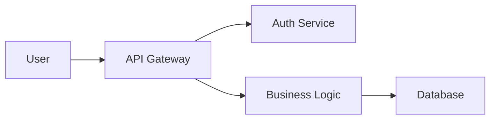
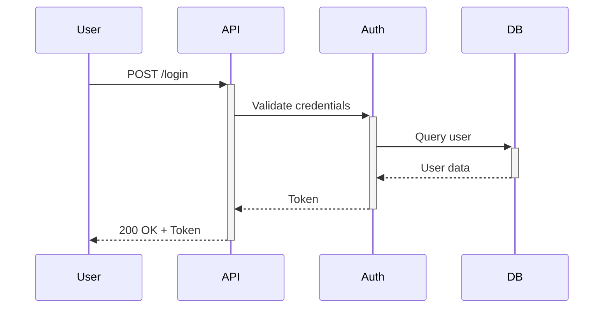

# 文件結構標準

> **語言**: [English](../../../core/documentation-structure.md) | 繁體中文

**版本**: 1.3.0
**最後更新**: 2026-01-24
**適用範圍**: 所有需要文件的軟體專案

---

## 目的

本標準定義軟體專案的一致文件結構，確保資訊的組織性、可發現性與可維護性。

---

## 標準文件結構

```
project-root/
├── README.md                    # Project overview (REQUIRED)
├── CONTRIBUTING.md              # Contribution guidelines
├── CHANGELOG.md                 # Version history
├── LICENSE                      # License file
├── .claude/ or .standards/      # Development standards
│   ├── anti-hallucination.md
│   ├── checkin-standards.md
│   ├── commit-guide.md
│   └── ...
├── docs/                        # Detailed documentation
│   ├── index.md                 # Documentation index
│   ├── getting-started.md       # Quick start guide
│   ├── architecture.md          # System architecture
│   ├── api-reference.md         # API documentation
│   ├── deployment.md            # Deployment guide
│   ├── troubleshooting.md       # Common issues
│   ├── specs/                   # Specification documents
│   │   ├── README.md            # Specification index
│   │   ├── system/              # System design specifications
│   │   │   └── *.md             # High-level architecture designs
│   │   └── {component}/         # Component-specific specifications
│   │       ├── design/          # Design specifications
│   │       └── {module}/        # Implementation specifications
│   ├── flows/                   # Flow documentation
│   │   ├── README.md            # Flow index (REQUIRED when >5 flows)
│   │   ├── templates/
│   │   │   └── flow-template.md
│   │   └── {module}/
│   │       └── {module}-flow.md
│   ├── ADR/                     # Architecture Decision Records
│   │   ├── README.md
│   │   └── NNN-title.md
│   └── diagrams/                # Architecture diagrams
│       ├── system-overview.mmd
│       ├── data-flow.mmd
│       └── README.md
└── examples/                    # Code examples
    ├── basic-usage/
    ├── advanced-usage/
    └── README.md
```

---

## 檔案命名規範

### 根目錄檔案

根目錄的文件檔案應使用**大寫**命名，以便 GitHub/GitLab 自動識別：

| File | Naming | Reason |
|------|--------|--------|
| `README.md` | UPPERCASE | GitHub/GitLab auto-displays on repo page |
| `CONTRIBUTING.md` | UPPERCASE | GitHub auto-links in PR creation |
| `CHANGELOG.md` | UPPERCASE | Keep a Changelog convention |
| `LICENSE` | UPPERCASE (no extension) | GitHub auto-detects license type |
| `CODE_OF_CONDUCT.md` | UPPERCASE | GitHub community standard |
| `SECURITY.md` | UPPERCASE | GitHub security advisory standard |

### docs/ 目錄檔案

`docs/` 目錄內的所有檔案應使用 **lowercase-kebab-case** 以確保 URL 友善：

✅ **正確**:
```
docs/
├── index.md
├── getting-started.md
├── api-reference.md
└── user-guide.md
```

❌ **錯誤**:
```
docs/
├── INDEX.md           # Inconsistent casing
├── GettingStarted.md  # PascalCase not URL-friendly
├── API_Reference.md   # snake_case inconsistent
└── User Guide.md      # Spaces cause URL issues
```

**理由**:
- Lowercase avoids case-sensitivity issues across OS (Windows vs Linux)
- Kebab-case produces clean URLs: `docs/getting-started` vs `docs/GettingStarted`
- Consistent naming improves discoverability and automation

---

## 文件需求矩陣

> **另見**：完整的文件需求矩陣及詳細內容需求與專案類型說明，請參閱 [documentation-writing-standards.md](documentation-writing-standards.md#document-requirements-matrix)。

本標準定義文件「放在哪裡」（檔案結構）。撰寫標準定義每個文件「應包含什麼內容」。

**快速參考**（完整矩陣請參閱撰寫標準）：

| 文件 | 主要位置 |
|------|---------|
| README.md | 專案根目錄 |
| ARCHITECTURE.md | `docs/` |
| API.md | `docs/` |
| DATABASE.md | `docs/` |
| DEPLOYMENT.md | `docs/` |
| MIGRATION.md | `docs/` |
| ADR/ | `docs/adr/` |
| CHANGELOG.md | 專案根目錄 |
| flows/ | `docs/flows/` |

---

## 文件交叉連結規範 (NEW)

### 為何需要交叉連結

孤立的文件會造成導覽問題。交叉連結可以：
- 提供上下文發現
- 減少重複內容
- 確保資訊一致性

### 必要連結矩陣

新增文件時，必須更新相關文件的參考資料區段：

| When Adding... | Must Update |
|----------------|-------------|
| `flows/*.md` | ARCHITECTURE.md, index.md, related API.md / DATABASE.md |
| `ADR/*.md` | index.md, ARCHITECTURE.md, MIGRATION.md |
| Any new document | docs/index.md |

### 連結方向原則

1. **Upward Links**: Flow docs should link to ARCHITECTURE.md (overall view)
2. **Horizontal Links**: Related flows should link to each other (e.g., sms-flow → credit-flow)
3. **Downward Links**: Architecture docs should link to flow index

### 參考資料區段格式

每份文件結尾應有參考資料區段：

```markdown
## 參考資料

- [ARCHITECTURE.md](../ARCHITECTURE.md) - System architecture
- [Related Flow](flows/xxx-flow.md) - Related flow documentation
- [API Reference](api-reference.md) - API specifications
```

---

## 流程文件 (NEW)

### 目的

流程文件描述系統的動態行為—特定操作中資料如何在元件間流動。

### 何時建立流程文件

| Priority | Flow Type | Criteria | Examples |
|:--------:|-----------|----------|----------|
| **P0** | Financial | Involves billing, credits, refunds | Credit deduction, fee calculation |
| **P0** | Integration | External system API interaction | SSO login, gateway integration |
| **P1** | Core Business | Main functional flows | Message sending, report queries |
| **P2** | Batch Processing | Background services, scheduled jobs | Daemon services, cleanup jobs |
| **P3** | Management | Admin and maintenance functions | Account management, system config |

### 流程文件結構

```
docs/flows/
├── README.md               # Flow index (REQUIRED when >5 flows)
├── templates/
│   └── flow-template.md    # Standard template
└── {module}/
    └── {module}-flow.md
```

### 流程索引必要內容

當流程文件超過 5 份時，`flows/README.md` 為**必要**，且必須包含：

| Section | Description | Required |
|---------|-------------|:--------:|
| System Architecture Overview | ASCII or Mermaid diagram | ✅ |
| Flow Document List | With status (✅ Complete / 🚧 In Progress / ⏳ Planned) | ✅ |
| Module Relationship Diagram | Mermaid flowchart showing module interactions | ✅ |
| Status Code Reference | Centralized definitions to avoid duplication | ⚪ |
| Directory Structure | File organization | ✅ |

### 流程文件必要章節

| Section | Description | Required |
|---------|-------------|:--------:|
| Overview | Purpose, scope, pre/post conditions | ✅ |
| Triggers | What initiates this flow | ✅ |
| Components | Component list, relationships, code links | ✅ |
| Flow Diagram | Sequence diagram for main flow | ✅ |
| Step Details | Input/output/code location per step | ✅ |
| Error Handling | Error codes, retry mechanisms | ✅ |
| Data Changes | Affected tables + DFD diagram | ✅ |
| Performance | TPS, response time, bottlenecks | ⚪ |
| Monitoring | Log points, metrics | ⚪ |
| References | Links to API.md, DATABASE.md | ✅ |

### 狀態碼集中管理

**問題**：狀態碼散落在各流程文件中容易不一致。

**解決方案**:

1. **Define centrally** in `flows/README.md` or `DATABASE.md`
2. **Reference in flow docs**: List only relevant codes, with note:
   > Complete definitions at [flows/README.md](../README.md#status-codes)
3. **Version control**: Status code changes must be recorded in CHANGELOG.md

**狀態碼定義格式**:

```markdown
### 狀態碼

| Code | Name | Description | Used By |
|------|------|-------------|---------|
| 0000 | Success | Operation successful | All modules |
| 9997 | AuthFailed | Authentication failed | API, WebService |
| 9998 | NotFound | Resource not found | All modules |
```

---

## 規格文件

### 目的

規格文件定義**實作前**的設計與實作細節。它們與一般文件的差異：

| 類型 | 目的 | 受眾 | 撰寫時機 | 位置 |
|------|------|------|----------|------|
| **規格** | 定義要建什麼及如何建 | 開發者 | 實作前 | `docs/specs/` |
| **文件** | 說明建了什麼 | 使用者、開發者 | 實作後 | `docs/` |

### 規格目錄結構

```
docs/specs/
├── README.md               # 規格索引（必要）
├── system/                 # 系統層級設計規格
│   └── {feature}.md        # 高階架構設計
└── {component}/            # 元件特定規格
    ├── design/             # 設計規格（實作前）
    ├── shared/             # 跨模組共用規格
    └── {module}/           # 實作規格
```

### 規格類型

| 層級 | 說明 | 範例 | 位置 |
|------|------|------|------|
| **系統規格** | 跨領域架構 | agents-workflows-system.md | `specs/system/` |
| **設計規格** | 元件設計決策 | ui-language-option.md | `specs/{component}/design/` |
| **實作規格** | 模組實作細節 | init/00-init-overview.md | `specs/{component}/{module}/` |
| **共用規格** | 跨模組工具 | manifest-schema.md | `specs/{component}/shared/` |

### 何時建立規格

| 情境 | 建立規格？ | 類型 |
|------|----------|------|
| 具有多個元件的新功能 | 是 | 系統或設計 |
| 新 CLI 命令 | 是 | 實作 |
| 跨領域工具 | 是 | 共用 |
| 錯誤修復 | 否 | - |
| 重構（相同行為） | 否 | - |

### 規格檔案格式

每份規格文件應包含：

```markdown
# 功能名稱規格

**Feature ID**: COMPONENT-FEATURE-NNN
**Version**: 1.0.0
**Last Updated**: YYYY-MM-DD
**Status**: Draft | In Review | Approved | Implemented

## 概述
[此規格涵蓋內容的簡要說明]

## 驗收條件
[AC-1、AC-2、... 使用 Given-When-Then 格式]

## 技術設計
[實作細節]

## 參考資料
[相關規格和文件]
```

### specs/README.md 要求

規格索引（`specs/README.md`）必須包含：

| 章節 | 說明 | 必要 |
|------|------|:----:|
| 目錄結構 | 規格樹狀圖 | ✅ |
| 系統規格 | 含說明和狀態的清單 | ✅ |
| 元件規格 | 按元件組織 | ✅ |
| 規格類型 | 類型定義和位置 | ⚪ |
| 相關文件 | 連結至 docs/ | ✅ |

---

## 索引文件規範

### docs/index.md 必要章節

| Section | Description | Required |
|---------|-------------|:--------:|
| Directory Structure | Document tree (ASCII or table) | ✅ |
| By Role | Developer/Reviewer/Admin/QA perspectives | ⚪ |
| By Topic | Architecture/API/Database/Flows/Migration/ADR | ✅ |
| Flow Documentation | flows/ directory index | ✅ (when flows exist) |
| External Resources | Related tech doc links | ⚪ |
| Maintenance Guide | Update principles, contribution guidelines | ⚪ |
| Last Updated | Index maintenance date | ✅ |

### 索引範本

```markdown
# 文件導覽

## 目錄結構
[Document tree diagram]

## 依主題分類

### 架構文件
- [architecture.md](architecture.md) - System architecture
- [ADR/](ADR/) - Architecture Decision Records

### 系統流程文件
Located in `flows/`, full index at [flows/README.md](flows/README.md):

| Module | Document | Description |
|--------|----------|-------------|
| SMS | [sms-flow.md](flows/sms/sms-flow.md) | Message sending flow |
| Auth | [auth-flow.md](flows/auth/auth-flow.md) | Authentication flow |

---
*Last Updated: YYYY-MM-DD*
```

---

## CHANGELOG 文件變更整合 (NEW)

### 何時記錄文件變更

| Change Type | Record In | Example |
|-------------|-----------|---------|
| New document | Added | New flow documentation `docs/flows/xxx.md` |
| Major update | Changed | Updated `docs/API.md` with v2 API specs |
| Restructure | Changed | Reorganized `docs/` directory structure |
| Deprecated | Deprecated | `docs/old-api.md` marked as deprecated |
| Removed | Removed | Removed outdated `docs/legacy.md` |

### 不需記錄

- Typo fixes
- Formatting adjustments (indentation, spacing)
- Link repairs
- Date stamp updates

### 記錄格式

```markdown
## [Unreleased]

### 新增
- New flow documentation (Mermaid sequence/flowchart/DFD)
  - `docs/flows/README.md` - Flow index with module relationship diagram
  - `docs/flows/sms/sms-flow.md` - SMS sending flow

### 變更
- Updated existing documents with flow references
  - `docs/ARCHITECTURE.md` - Added flow index link in references
  - `docs/index.md` - Added flow documentation section
```

---

## 核心文件檔案

### 1. README.md (必要)

**目的**: 第一印象、快速概覽

**範本**:
```markdown
# Project Name

Brief one-liner description

## Features

- Feature 1
- Feature 2
- Feature 3

## Quick Start

```bash
# Installation
npm install your-package

# Usage
npm start
```

## Documentation

See [docs/](docs/) for full documentation.

## Contributing

See [CONTRIBUTING.md](CONTRIBUTING.md).

## License

[License Name](LICENSE)
```

**必須包含**:
- [ ] Project name and description
- [ ] Quick start / installation
- [ ] Link to full docs
- [ ] License information

---

### 2. CONTRIBUTING.md (建議)

**目的**: 如何貢獻專案

**範本**:
```markdown
# Contributing Guidelines

## Development Setup

```bash
git clone https://github.com/org/repo
cd repo
npm install
```

## Workflow

1. Fork the repository
2. Create feature branch: `git checkout -b feature/my-feature`
3. Commit changes: `git commit -m "feat: add feature"`
4. Push branch: `git push origin feature/my-feature`
5. Create pull request

## Coding Standards

- Follow [.claude/csharp-style.md](.claude/csharp-style.md)
- Run `npm run lint` before committing
- Ensure tests pass: `npm test`

## Commit Message Format

See [.claude/commit-guide.md](.claude/commit-guide.md)

## Code Review Process

See [.claude/code-review-checklist.md](.claude/code-review-checklist.md)
```

**必須包含**:
- [ ] Development setup instructions
- [ ] Contribution workflow
- [ ] Coding standards reference
- [ ] Testing requirements

---

### 3. CHANGELOG.md (建議)

**目的**: 追蹤版本間變更

**格式**: Follow [Keep a Changelog](https://keepachangelog.com/)

```markdown
# Changelog

## [Unreleased]

### Added
- New feature X

### Fixed
- Bug fix Y

## [1.2.0] - 2025-11-12

### Added
- OAuth2 authentication support

### Changed
- Updated API response format

### Deprecated
- Old API endpoint (will be removed in v2.0)

## [1.1.0] - 2025-10-01

### Added
- Email notification system

[Unreleased]: https://github.com/org/repo/compare/v1.2.0...HEAD
[1.2.0]: https://github.com/org/repo/compare/v1.1.0...v1.2.0
[1.1.0]: https://github.com/org/repo/releases/tag/v1.1.0
```

---

### 4. LICENSE (開源必要)

**常見授權**:
- MIT: Permissive
- Apache 2.0: Permissive with patent grant
- GPL v3: Copyleft
- BSD: Permissive
- CC BY 4.0: Documentation/content

---

## 文件版本對齊

### 原則

**文件版本必須與軟體版本對齊。**

文件中的版本號代表「適用於軟體版本 X.Y.Z」，而非獨立的文件修訂號。

### 理由

| Approach | Problems |
|----------|----------|
| Independent doc version | Requires tracking "which doc version maps to which software version"; confusing |
| **Aligned version** ✓ | Clear: doc v1.2.0 = applies to software v1.2.0 |

### 文件標頭範本

```markdown
# 文件標題

**適用版本**: 1.2.0    ← Aligned with software version
**文件類型**: [指南/參考/規格]
**目標讀者**: [開發者/維運/使用者]
**文件更新日期**: 2025-12-11     ← Date of last edit

---
```

### 欄位定義

| Field | Required | Description |
|-------|----------|-------------|
| 適用版本 | ✅ Yes | The software version this document applies to |
| 文件類型 | Recommended | Category: Guide, Reference, Specification, Tutorial |
| 目標讀者 | Recommended | Intended readers |
| 文件更新日期 | ✅ Yes | Date of last edit |

### 何時更新版本

| Scenario | Action |
|----------|--------|
| Software releases new version with feature changes | Update doc version to match |
| Minor doc typo fix (no software change) | Keep version, update Last Updated date only |
| Doc updated for upcoming release | Use new version number |

### 範例

✅ **正確**:
```markdown
# Upgrade Guide

**適用版本**: 1.2.0
**文件更新日期**: 2025-12-11
```
This means: "Use this guide when upgrading to v1.2.0"

❌ **錯誤**:
```markdown
# Upgrade Guide

**Version**: 1.1        ← Ambiguous: document revision or software version?
**Updated**: 2025-12-11
```

---

## 詳細文件 (`docs/`)

### docs/index.md

**目的**: 所有文件的導覽中心

**範本**:
```markdown
# Documentation Index

## By Role

### For Users
- [Getting Started](getting-started.md)
- [User Guide](user-guide.md)
- [FAQ](faq.md)

### For Developers
- [Architecture](architecture.md)
- [API Reference](api-reference.md)
- [Development Guide](development-guide.md)

### For Operators
- [Deployment Guide](deployment.md)
- [Configuration](configuration.md)
- [Troubleshooting](troubleshooting.md)

## By Topic

### Authentication
- [Architecture](architecture.md#authentication)
- [API Endpoints](api-reference.md#authentication)

### Database
- [Schema](architecture.md#database-schema)
- [Migrations](development-guide.md#database-migrations)

### Flow Documentation
See [flows/README.md](flows/README.md) for complete index.

## Quick Links

- [GitHub Repository](https://github.com/org/repo)
- [Issue Tracker](https://github.com/org/repo/issues)
- [Changelog](../CHANGELOG.md)
```

---

### docs/getting-started.md

**目的**: 新使用者快速入門

**結構**:
1. Prerequisites
2. Installation
3. Basic Configuration
4. First Example
5. Next Steps

---

### docs/architecture.md

**目的**: 系統設計與技術架構

**結構**:
1. Overview
2. System Components
3. Data Flow
4. Design Decisions
5. Technology Stack
6. Security Architecture
7. Performance Considerations

**包含圖表**:
- System overview diagram
- Component diagram
- Data flow diagram
- Deployment diagram

**必須包含在參考資料中**:
- Link to `flows/README.md` for detailed flow documentation

---

### docs/api-reference.md

**目的**: 完整 API 文件

**結構**:
1. API Overview
2. Authentication
3. Endpoints (grouped by resource)
4. Request/Response Examples
5. Error Codes
6. Rate Limiting

**Endpoint 範本**:
```markdown
## POST /api/users/authenticate

Authenticates a user and returns access token.

### Request

**Headers**:
```
Content-Type: application/json
```

**Body**:
```json
{
  "username": "string",
  "password": "string"
}
```

### Response

**Success (200 OK)**:
```json
{
  "accessToken": "string",
  "expiresIn": 3600
}
```

**Error (401 Unauthorized)**:
```json
{
  "error": "INVALID_CREDENTIALS",
  "message": "Invalid username or password"
}
```

### Examples

```bash
curl -X POST https://api.example.com/api/users/authenticate \
  -H "Content-Type: application/json" \
  -d '{"username":"user@example.com","password":"secret"}'
```
```

**必須包含在參考資料中**:
- Link to relevant flow documentation (e.g., `flows/auth/auth-flow.md`)

---

### docs/deployment.md

**目的**: 如何部署應用程式

**結構**:
1. Prerequisites
2. Environment Setup
3. Configuration
4. Deployment Steps
5. Verification
6. Rollback Procedure
7. Monitoring

**必須包含在參考資料中**:
- Link to relevant daemon/service flow documentation

---

### docs/troubleshooting.md

**目的**: 常見問題與解決方案

**結構**:
```markdown
# Troubleshooting Guide

## Installation Issues

### Problem: npm install fails with EACCES error

**Symptoms**:
```
Error: EACCES: permission denied
```

**Solution**:
```bash
sudo chown -R $(whoami) ~/.npm
npm install
```

---

## Runtime Issues

### Problem: Application crashes with "Cannot find module"

**Symptoms**:
- Error: Cannot find module 'express'
- Application exits immediately

**Solution**:
1. Check node_modules exists
2. Run `npm install`
3. Verify package.json dependencies

**Prevention**:
- Always run `npm install` after pulling changes
- Commit package-lock.json to version control
```

---

## 圖表文件

### 流程與圖表分離

理解 `flows/` 與 `diagrams/` 目錄的區別：

- **`docs/diagrams/`**: Static architecture diagrams (DFD, ER, C4 Model, Deployment, Class diagrams)
- **`docs/flows/`**: Dynamic flow documentation (Sequence Diagrams, API call flows, Job scheduling flows)

| Type | Description | Directory | Examples |
|------|-------------|-----------|----------|
| **Flow** | Dynamic behavior: how data flows, step sequences | `docs/flows/` | Sequence diagrams, API call flows, job scheduling |
| **Diagram** | Static structure: system composition, relationships, data models | `docs/diagrams/` | DFD, ER diagrams, C4 architecture, deployment diagrams |

**理由**:
- Clear separation reduces confusion about where to place new documentation
- Static diagrams rarely change; dynamic flows may update with feature changes
- Different audiences: diagrams for architects, flows for developers and operators

### 建議工具

- **Mermaid**: Text-based diagrams (GitHub/GitLab native support)
- **PlantUML**: UML diagrams from text
- **Draw.io / Excalidraw**: Visual diagram editors
- **ASCII Art**: Simple text diagrams

### Mermaid 範例

**System Flow**:


**Sequence Diagram**:


### DFD 規範

Flow documents should include DFD diagrams:

| DFD Level | Description | Required |
|-----------|-------------|:--------:|
| Context Diagram | System and external entity relationships | ✅ |
| Level 0 DFD | Main processes and data stores | ✅ |
| Level 1 DFD | Expanded sub-processes | ⚪ (based on complexity) |
| Physical DFD | Implementation mapping (technology stack, DB tables, API endpoints) | ⚪ (advanced) |

**邏輯與實體 DFD**:

| Type | Describes | Audience | Example Content |
|------|-----------|----------|-----------------|
| **Logical DFD** (Level 0/1) | WHAT the system does (business processes) | Business analysts, PMs, new developers | Process names, data flows, business rules |
| **Physical DFD** | HOW it's implemented (technology details) | Operations engineers, DBAs, system integrators | Database tables, API endpoints, file paths, config parameters |

**DFD Symbol Standards (Mermaid)**:

| Symbol | Represents | Mermaid Syntax |
|--------|------------|----------------|
| Rectangle | External Entity | `[Name]` |
| Double Circle | Process | `((ID<br/>Name))` |
| Cylinder | Data Store | `[(D# Name)]` |
| Solid Arrow | Data Flow | `-->｜label｜` |
| Dashed Arrow | Error/Exception | `-.->｜label｜` |

**DFD Color Standards**:

| Color | Usage | Mermaid Style |
|-------|-------|---------------|
| 🟦 Blue | External Entity | `fill:#e3f2fd,stroke:#1976d2` |
| 🟩 Green | Primary Data Table | `fill:#c8e6c9,stroke:#388e3c` |
| 🟨 Yellow | Cache/Tracking Data | `fill:#fff9c4,stroke:#f9a825` |
| 🟧 Orange | Updated Data | `fill:#ffccbc,stroke:#e64a19` |

---

## 程式碼範例 (`examples/`)

### 結構

```
examples/
├── README.md                   # Overview of examples
├── basic-usage/
│   ├── simple-auth.js         # Simple authentication example
│   ├── README.md              # Explanation
│   └── package.json           # Dependencies
├── advanced-usage/
│   ├── custom-auth.js         # Advanced authentication
│   ├── README.md
│   └── package.json
└── integration-tests/
    └── ...
```

### 範例 README 範本

```markdown
# Basic Usage Examples

## Simple Authentication

Demonstrates basic user authentication flow.

### Prerequisites

- Node.js 18+
- npm 9+

### Setup

```bash
cd examples/basic-usage
npm install
```

### Run

```bash
node simple-auth.js
```

### Expected Output

```
User authenticated successfully!
Token: eyJhbGc...
```

### Code Walkthrough

```javascript
// 1. Import library
const { AuthClient } = require('your-lib');

// 2. Create client
const client = new AuthClient({
  apiUrl: 'https://api.example.com'
});

// 3. Authenticate
const token = await client.authenticate('user', 'pass');
console.log('Token:', token);
```
```

---

## 文件維護

### 文件更新檢查清單

When making code changes, update documentation:

- [ ] **README.md** if:
  - Installation process changed
  - Quick start example changed
  - New major feature added

- [ ] **API Reference** if:
  - API endpoints added/changed/removed
  - Request/response format changed
  - New error codes introduced

- [ ] **Architecture Docs** if:
  - System design changed
  - New components added
  - Technology stack changed

- [ ] **Flow Documentation** if:
  - Business logic changed
  - New integration added
  - Data flow modified

- [ ] **CHANGELOG.md** (always):
  - Add entry for every release
  - Document breaking changes
  - List new features and fixes
  - **Record documentation additions/changes**

- [ ] **Cross-References**:
  - Update related documents' reference sections
  - Update index.md if new documents added

---

## 文件品質標準

### 可讀性

- [ ] Clear, concise language
- [ ] Short paragraphs (≤5 sentences)
- [ ] Active voice preferred
- [ ] Technical jargon explained

### 準確性

- [ ] Code examples tested and working
- [ ] Screenshots/diagrams up-to-date
- [ ] Version numbers correct
- [ ] Links not broken

### 完整性

- [ ] Prerequisites listed
- [ ] All steps documented
- [ ] Expected outcomes described
- [ ] Troubleshooting included

### 交叉連結

- [ ] Related documents linked
- [ ] Index updated
- [ ] References section complete

---

## 本地化

### 雙語文件

For international projects:

```
docs/
├── en/                        # English documentation
│   ├── README.md
│   ├── getting-started.md
│   └── ...
├── zh-tw/                     # Traditional Chinese
│   ├── README.md
│   ├── getting-started.md
│   └── ...
└── README.md                  # Language selector
```

**Language Selector (root docs/README.md)**:
```markdown
# Documentation

Select your language:
- [English](en/README.md)
- [繁體中文](zh-tw/README.md)
- [日本語](ja/README.md)
```

---

## 文件自動化

### API 文件自動生成

**工具**:
- **Swagger/OpenAPI**: REST API documentation
- **GraphQL**: Auto-generated schema docs
- **JSDoc**: JavaScript API docs
- **Doxygen**: C/C++ documentation
- **Sphinx**: Python documentation
- **Docusaurus**: Full documentation sites

### Example: Swagger Integration

```yaml
# openapi.yaml
openapi: 3.0.0
info:
  title: User API
  version: 1.0.0

paths:
  /users/authenticate:
    post:
      summary: Authenticate user
      requestBody:
        required: true
        content:
          application/json:
            schema:
              type: object
              properties:
                username:
                  type: string
                password:
                  type: string
      responses:
        '200':
          description: Success
          content:
            application/json:
              schema:
                type: object
                properties:
                  accessToken:
                    type: string
```

---

## 文件托管

### 選項

| Platform | Best For | Cost |
|----------|----------|------|
| **GitHub Pages** | Open source projects | Free |
| **GitLab Pages** | GitLab projects | Free |
| **Read the Docs** | Python projects | Free |
| **Docusaurus** | Full documentation sites | Free (self-hosted) |
| **GitBook** | Beautiful docs UI | Free tier available |

### GitHub Pages Setup

```bash
# 1. Create docs branch
git checkout --orphan gh-pages

# 2. Add documentation
cp -r docs/* .

# 3. Push to GitHub
git add .
git commit -m "docs: initial documentation"
git push origin gh-pages

# 4. Enable in GitHub Settings → Pages
# Choose gh-pages branch
```

---

## 相關標準

- [Documentation Writing Standards](documentation-writing-standards.md) - 文件撰寫規範
- [Changelog Standards](changelog-standards.md) - 變更日誌標準
- [Project Structure Standard](project-structure.md) - 專案結構標準
- [Spec-Driven Development](spec-driven-development.md) - 規格驅動開發

---

## 版本歷史

| Version | Date | Changes |
|---------|------|---------|
| 1.3.0 | 2026-01-24 | Added: 規格文件標準與 specs/ 目錄結構 |
| 1.2.2 | 2025-12-24 | Added: Related Standards section |
| 1.2.1 | 2025-12-12 | Added: Physical DFD layer, Flows vs Diagrams separation clarification |
| 1.2.0 | 2025-12-11 | Added: Flow documentation standards, Cross-reference standards, Index document standards, CHANGELOG documentation integration, Document requirements matrix, DFD standards |
| 1.1.0 | 2025-12-11 | Added: File naming conventions, Document version alignment standard |
| 1.0.0 | 2025-11-12 | Initial documentation structure standard |

---

## 參考資料

- [Write the Docs](https://www.writethedocs.org/)
- [Google Developer Documentation Style Guide](https://developers.google.com/style)
- [Microsoft Writing Style Guide](https://docs.microsoft.com/en-us/style-guide/)

---

## 授權

本標準以 [CC BY 4.0](https://creativecommons.org/licenses/by/4.0/) 授權發布。
