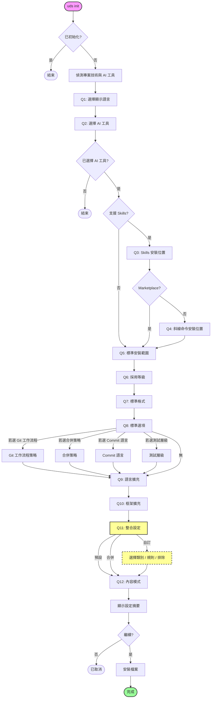
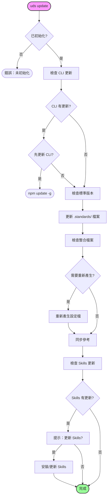
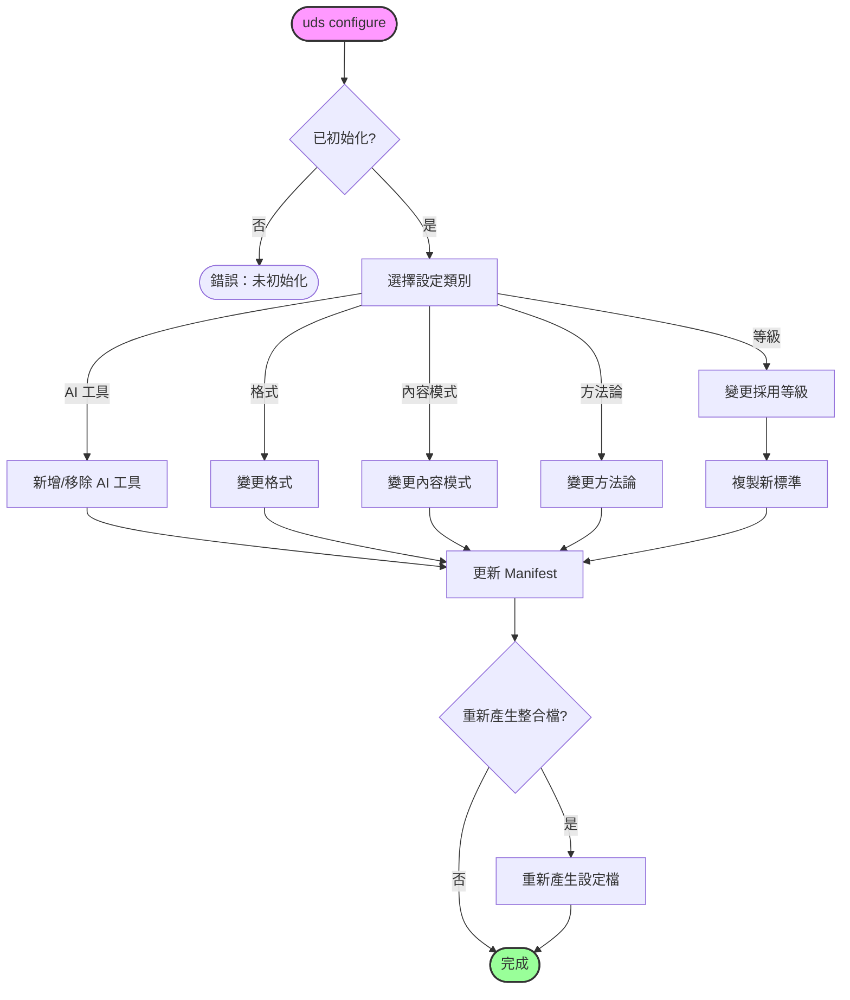

# CLI 指令流程

> **Language**: [English](../../../docs/CLI-FLOW.md) | 繁體中文 | [简体中文](../../zh-CN/docs/CLI-FLOW.md)

本文件呈現 Universal Development Standards (UDS) CLI 指令的互動流程圖。

## 1. 初始化指令 (`uds init`)

初始化流程用於在從未初始化的專案中設定標準。



## 2. 更新指令 (`uds update`)

更新流程用於保持標準與整合檔案同步。



## 3. 檢查指令 (`uds check`)

檢查流程用於驗證檔案完整性與採用狀態。

```mermaid
flowchart TD
    Start([uds check]) --> CheckInit{已初始化?}
    CheckInit -- 否 --> Error([錯誤：未初始化])
    
    CheckInit -- 是 --> VerifyManifest[驗證 Manifest]
    VerifyManifest --> CheckHash{Hash 檢查}
    
    CheckHash -->|相符| Pass([通過])
    CheckHash -->|不符| DetectChanges[偵測 已修改/遺失]
    
    DetectChanges --> Interactive{互動模式?}
    Interactive -- 否 --> Report[報告問題]
    Report --> Fail([結束並顯示問題])
    
    Interactive -- 是 --> LoopFiles[迴圈處理每個檔案]
    LoopFiles --> PromptAction[提示：動作?]
    
    PromptAction -- 檢視 --> ShowDiff[顯示差異]
    ShowDiff --> PromptAction
    
    PromptAction -- 還原 --> RestoreFile[還原原始檔]
    PromptAction -- 保留 --> UpdateHash[更新 Hash (接受變更)]
    PromptAction -- 跳過 --> SkipFile[跳過]
    
    RestoreFile --> NextFile{還有檔案?}
    UpdateHash --> NextFile
    SkipFile --> NextFile
    
    NextFile -- 是 --> LoopFiles
    NextFile -- 否 --> Finish([完成])

    style Start fill:#f9f,stroke:#333,stroke-width:2px
    style Finish fill:#9f9,stroke:#333,stroke-width:2px
    style Fail fill:#f99,stroke:#333,stroke-width:2px
```

## 4. 設定指令 (`uds configure`)

設定流程允許修改現有的設定。


