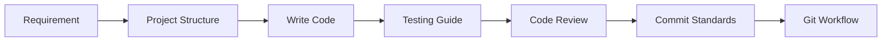
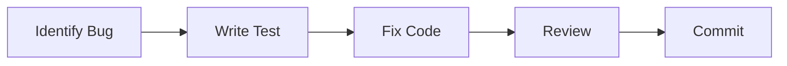
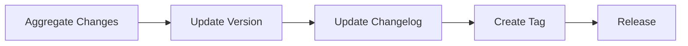

# Skills Integration Guide

This guide explains how to use multiple skills together in development workflows.

## Overview

Universal Development Standards provides 14 Claude Code skills that work together to support the full development lifecycle:

```
Planning → Coding → Testing → Review → Commit → Release
    │         │         │        │        │        │
    ▼         ▼         ▼        ▼        ▼        ▼
Requirement  Project   Testing  Code   Commit  Release
Assistant   Structure   Guide  Review Standards Standards
```

## Skill Interaction Matrix

| From Skill → | To Skill | Interaction |
|--------------|----------|-------------|
| Requirement Assistant | All | Requirements inform all decisions |
| Project Structure | Testing Guide | Test location follows structure |
| Testing Guide | Code Review | Review checks test coverage |
| Code Review | Commit Standards | Review approval enables commit |
| Commit Standards | Release Standards | Commits determine version |
| Git Workflow | All | Branch strategy affects all |

## Workflow Scenarios

### Scenario 1: New Feature Development



**Skills Used**:
1. **Requirement Assistant** - Clarify feature requirements
2. **Project Structure** - Determine where to add files
3. **Testing Guide** - Write tests for new feature
4. **Code Review** - Get code reviewed
5. **Commit Standards** - Write proper commit message
6. **Git Workflow** - Merge via correct branch strategy

### Scenario 2: Bug Fix



**Skills Used**:
1. **Testing Guide** - Write failing test first
2. **Code Review** - Quick review of fix
3. **Commit Standards** - Use `fix:` type
4. **Git Workflow** - Create `fix/` branch

### Scenario 3: Release Preparation



**Skills Used**:
1. **Commit Standards** - Review commit history
2. **Release Standards** - Determine version bump
3. **Documentation Guide** - Update changelog
4. **Git Workflow** - Tag and release

## Skill Priority Resolution

When multiple skills apply, use this priority:

| Priority | Category | Skills |
|----------|----------|--------|
| 1 | Security | AI Collaboration (anti-hallucination) |
| 2 | Correctness | Testing Guide, Code Review |
| 3 | Process | Git Workflow, Commit Standards |
| 4 | Documentation | Documentation Guide, Release Standards |
| 5 | Guidance | Requirement Assistant, Project Structure |

## Common Skill Combinations

### Code Quality Combo

Use together for high-quality code:
- **Testing Guide** + **Code Review**
- Ensures tests exist AND code is reviewed

### Release Combo

Use together for proper releases:
- **Commit Standards** + **Release Standards** + **Git Workflow**
- Ensures proper versioning and changelog

### New Project Combo

Use together when starting projects:
- **Project Structure** + **Documentation Guide** + **Git Workflow**
- Sets up proper foundation

## Conflict Resolution

### Testing vs Speed

**Conflict**: Need to ship fast but testing guide requires coverage

**Resolution**:
1. Write critical path tests (Testing Guide)
2. Document technical debt (Documentation Guide)
3. Use appropriate commit type (Commit Standards)

### Review vs Urgency

**Conflict**: Critical fix needs immediate deployment

**Resolution**:
1. Use expedited review (Code Review - emergency process)
2. Create hotfix branch (Git Workflow)
3. Document exception (Documentation Guide)

## Skill Triggers by Activity

| Activity | Primary Skill | Supporting Skills |
|----------|---------------|-------------------|
| Start new project | Project Structure | Git Workflow, Documentation |
| Add feature | Requirement Assistant | Testing, Code Review |
| Fix bug | Testing Guide | Code Review, Commit |
| Write tests | Testing Guide | Code Review |
| Code review | Code Review | Testing, AI Collaboration |
| Commit code | Commit Standards | Git Workflow |
| Create PR | Git Workflow | Code Review, Documentation |
| Release | Release Standards | Git Workflow, Documentation |
| Write docs | Documentation Guide | - |

## Best Practices

### 1. Start with Requirements

Always begin with clear requirements before other skills:
```
User Story → Acceptance Criteria → Implementation → Test → Review
```

### 2. Test Early

Invoke Testing Guide before code review:
```
Write Code → Write Tests → Self Review → Request Review
```

### 3. Consistent Commits

Use Commit Standards throughout, not just at the end:
```
Each logical change = One commit with proper format
```

### 4. Document Decisions

Use Documentation Guide to record important decisions:
```
Decision Made → Document in ADR → Reference in Code
```

## Quick Reference

### Daily Development

| Task | Skill |
|------|-------|
| Start coding | Project Structure |
| Write tests | Testing Guide |
| Review code | Code Review |
| Commit changes | Commit Standards |
| Push to remote | Git Workflow |

### Weekly/Sprint Tasks

| Task | Skill |
|------|-------|
| Plan features | Requirement Assistant |
| Review progress | Code Review |
| Update docs | Documentation Guide |

### Release Tasks

| Task | Skill |
|------|-------|
| Determine version | Release Standards |
| Update changelog | Release Standards |
| Create release | Git Workflow |

## Version History

| Version | Date | Changes |
|---------|------|---------|
| 1.0.0 | 2025-12-30 | Initial integration guide |
