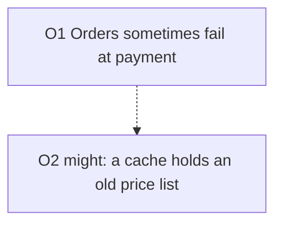

# Comprehension Ladder | 理解階梯

> **Language**: English | [繁體中文](../../locales/zh-TW/skills/comprehension-ladder/SKILL.md) | [简体中文](../../locales/zh-CN/skills/comprehension-ladder/SKILL.md)

**Version**: 1.0.0 | **Last Updated**: 2026-10-05 | **Applicability**: Claude Code Skills

Turn one AI output that is hard to follow into forms that are easier to follow. The form changes. The facts do not.

## Purpose

The slow step is no longer getting an answer. The slow step is understanding the answer and judging it. This skill helps with that step. It takes one source text and builds up to three forms of it, called rungs.

This skill is written in controlled language, as described in [ai-response-navigation](../../core/ai-response-navigation.md) Rule 12. It follows its own guards.

## The ladder

There are exactly three rungs. Each rung is built from the same outline (see [The outline](#the-outline)). No rung adds anything to the outline.

| Rung | Form | Best for | Output |
|------|------|----------|--------|
| 1 | Controlled text | Any source. Always the first rung. | Short sentences or numbered lines, in the chat or a file |
| 2 | Mermaid diagram | A source with a flow, a time order, several parties, or 3 or more options | One Mermaid code block, plus a text list of items that cannot be drawn |
| 3 | Single-file HTML explainer | A reader who must explore or approve | One `.html` file that opens offline |

Ask which rungs the user wants. If the user does not say, build rung 1 and offer the other two.

There is no video rung. Video needs a voice service, and it sends the source to a third party.

## The three guards

These three guards are **Required**. A rung that breaks one is not finished. Do not deliver it.

| ID | Guard | Priority |
|----|-------|----------|
| G1 | `no-new-facts`: add no fact the source does not state | **Required** |
| G2 | `keep-hedges`: keep every hedge. Do not turn an uncertain claim into a certain one | **Required** |
| G3 | `trace-and-gaps`: give every item a source pointer and a "not covered" note | **Required** |

G2 is the same rule as clause 12.1 in [ai-response-navigation](../../core/ai-response-navigation.md). The wording here is applied to this skill's three rungs.

### G1 `no-new-facts` (Required)

Every claim in every rung must come from the source. Do not add a cause, a number, a name, a date or a "confirmed". Do not add background that you know but the source does not say.

**Good** — the source says: "Orders sometimes fail at the payment step."

```text
O1  Orders sometimes fail at the payment step.
```

**Bad** — the same source:

```text
O1  Orders fail at the payment step. This also breaks refunds.
```

The word "refunds" is a new fact. The word "sometimes" is gone as well, so G2 is broken too.

### G2 `keep-hedges` (Required)

A hedge tells the reader how far to trust a claim. Examples: might, could, probably, appears to, not yet confirmed, 可能, 推斷, 尚未確認. A hedge is information, not padding.

- If the source says "might", the rung says "might".
- Keep the hedge in the diagram too. Draw a hedged item with a dashed edge and keep the hedge word in its label.
- Keep the hedge in the HTML too. Show a visible "not confirmed" badge on the item.
- A hedge may go only when the source itself says the claim is now verified. Then state what was checked.

**Good** — the source says: "The cause might be a cache that holds an old price list."

```text
O2  The cause might be a cache that holds an old price list.   [hedge: might]
```

**Bad** — the same source:

```text
O2  The cause is a cache that holds an old price list.
```

The bad version is shorter and easier to read. It is also untrue to the source. A reader who approves a fix on this line has been misled.

### G3 `trace-and-gaps` (Required)

Every item carries two notes:

- **Source**: the place in the source where the item comes from. Use a paragraph and sentence number, or a file and line number, plus a quote of 12 words or fewer.
- **Not covered**: what the item leaves out, or what it cannot prove. If the source says nothing more, write "Nothing further in the source."

After the last item, add one list called **Left out of this outline**. It names every part of the source that became no item.

**Good**

```text
O3  We have not yet reproduced this in staging.
    Source: paragraph 1, sentence 3 — "not yet reproduced this in staging"
    Not covered: Why it was not reproduced. The source gives no reason.
```

**Bad**

```text
O3  The problem was reproduced in staging.
    Source: the report.
```

"The report" does not point to a place. The claim also reverses the source. There is no "not covered" note.

## The outline

The outline is the one shared source of truth. Build it before any rung. Never write a rung from the source directly.

Each outline item has one id and one kind.

| Kind | Meaning |
|------|---------|
| `claim` | A statement the source makes |
| `mechanism` | A step, a cause, or a link between two things |
| `uncertainty` | Something the source says is unknown or unconfirmed |
| `example` | A case the source gives to show a claim |

Write each item in this shape:

```text
O<number> | kind | text | hedge: <exact hedge words, or none>
  Source: <pointer> — "<quote, 12 words or fewer>"
  Not covered: <what the item leaves out>
```

Number the items in the order of the source. Never reuse a number. All three rungs use the same ids.

## Workflow

### Step 1 — Read the source

Read the whole source. If the source is a file, read the file. Do not start the outline before you finish reading.

### Step 2 — Build the outline

Extract the items. One fact per item. Copy each hedge word exactly.

### Step 3 — Trace every item

Write the Source and Not covered notes for every item. Then write the **Left out of this outline** list.

### Step 4 — Show the outline to the user

Show the outline when it has more than 5 items, or when the user asks. Let the user remove or correct items. Do not render a rung from an outline the user has rejected.

### Step 5 — Render the rungs

Render each rung the user asked for. Follow the rules below for that rung.

#### Rung 1: controlled text

Follow [ai-response-navigation](../../core/ai-response-navigation.md) clause 12.2:

- One idea per sentence. About 15 to 25 words in English, or about 25 to 40 characters in Chinese.
- One name per thing. Do not vary a name for style.
- Name who does what.
- One step, one action. Put a procedure in a numbered list.
- Use few semicolons.
- Put units on numbers.

Keep the item id at the start of each line, so the reader can find the item in the outline.

#### Rung 2: Mermaid diagram

1. Pick `flowchart TD` for steps and causes. Pick `flowchart LR` for parties and hand-offs.
2. Draw one node for each `mechanism` item. Use the item id as the node id.
3. Take the node label from the item text. Keep the hedge word in the label.
4. Draw a hedged item as a dashed node or a dashed edge (`-.->`).
5. Do not draw a node that has no outline id.
6. List every item you did not draw, under the diagram, as text. Give each one a reason.



#### Rung 3: single-file HTML explainer

The page must be one file. It must open offline. It must not load anything from the network.

**Required** for the page:

- All CSS is inside one `<style>` element.
- All script, if any, is inside one inline `<script>` element. The page must work with script turned off.
- No `http://`, `https://` or `//` URL in `src`, `href`, `action`, `@import` or `url()`. The only links allowed are `#` anchors inside the page.
- No `<link>` element. No web font. No CDN. No external image.
- No `fetch`, `XMLHttpRequest`, `WebSocket` or `import()` call.
- Do not load the Mermaid library. Draw the diagram as inline SVG or as a styled list.
- Escape every character of the source text that HTML treats as markup.

The page holds, in this order:

1. A title and one sentence that says what the source is.
2. The diagram, if rung 2 was asked for.
3. One card for each outline item. Each card shows the id, the text, a "not confirmed" badge if the item has a hedge, the Source, and the Not covered note.
4. The **Left out of this outline** list.

A minimal skeleton:

```html
<!doctype html>
<html lang="en">
<head>
<meta charset="utf-8">
<meta name="viewport" content="width=device-width, initial-scale=1">
<title>Explainer: short name of the source</title>
<style>
  body { font: 16px/1.6 system-ui, sans-serif; max-width: 46rem; margin: 2rem auto; padding: 0 1rem; }
  .card { border: 1px solid #8884; border-radius: 8px; padding: .75rem 1rem; margin: .75rem 0; }
  .badge { background: #fd0; color: #000; border-radius: 4px; padding: 0 .4rem; font-size: .85em; }
</style>
</head>
<body>
<h1>Explainer</h1>
<p>One sentence: what the source is.</p>
<section class="card" id="O2">
  <strong>O2</strong> The cause might be a cache that holds an old price list.
  <span class="badge">not confirmed: might</span>
  <p><em>Source:</em> paragraph 1, sentence 2</p>
  <p><em>Not covered:</em> Which cache. The source does not say.</p>
</section>
</body>
</html>
```

### Step 6 — Check before you deliver

Run all five checks. Fix the rung and run them again if one fails.

1. **Count**: the items in each rung equal the items in the outline, minus the items you listed as not drawn. A source with 5 steps gives 5 steps in every rung. Not 4. Not 6.
2. **No new item**: every item in a rung has an outline id. Look for an item without one.
3. **Hedge compare**: for each item with `hedge:` not `none`, the same hedge word is in every rung. The comparison is between the rung and the source. It works in any language.
4. **Trace**: every item has a Source that points to a place and a Not covered note.
5. **Offline** (rung 3 only): search the file for `http`, `//`, `<link`, `fetch(` and `XMLHttpRequest`. Each search must find nothing outside the text you quoted from the source.

### Step 7 — Report

End with this table. Never deliver a rung without it.

| Item | Rung 1 | Rung 2 | Rung 3 | Hedge kept | Source | Not covered |
|------|--------|--------|--------|------------|--------|-------------|
| O1 | yes | yes | yes | n/a | para 1, s1 | The frequency of "sometimes" |

If any guard check failed and you could not fix it, say which one and why. Do not report success.

## When not to use this skill

- The source has fewer than about 150 words. Rewrite it with [ai-response-navigation](../../core/ai-response-navigation.md) clause 12.2 and keep the hedges. Do not build rungs.
- The reader is an expert and needs the dense form.
- The task is to find new facts. This skill never does that.

## Measuring whether it helps

This skill is not proven to help. [eval-cases.md](eval-cases.md) holds 5 source texts, each with comprehension questions and an answer key, and a procedure that gives two numbers: the correct-answer rate before and after, and the number of guard violations. The run needs model calls and has not been done. Do not claim that this skill works until it is done.

## Related

- [ai-response-navigation](../../core/ai-response-navigation.md): Rule 12, controlled language. Clause 12.1 is the base of guard G2.
- [documentation-guide](../documentation-guide/SKILL.md): where Mermaid diagrams belong in project docs.
- [brainstorm-assistant](../brainstorm-assistant/SKILL.md): for the opposite direction, when you have no source yet.

## Version History

| Version | Date | Changes |
|---------|------|---------|
| 1.0.0 | 2026-10-05 | First release. Three rungs built from one outline. Three Required guards. Evaluation cases. Implements dev-platform XSPEC-450 / DEC-125 D4. |
